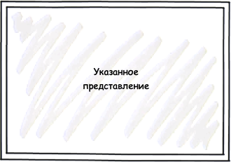

Контейнер элементов представления в виде прямоугольной области, в которую помещается указанное представление.

 



 

|Name|Description|
|----|-----------|
| | |

|Name|Description|
|----|-----------|
| | |

  

```
{
	"id": "ViewPanel",
	"description": "Контейнер элементов представления в виде прямоугольной области, в которую помещается указанное представление",
	"type": "object",
	"extends": {
		"$ref": "http://demo.infinnity.ru:8081/display/MC/Element"
	},
	"properties": {
		"View": {
			"description": "Ссылка на представление",
			"$ref": "http://demo.infinnity.ru:8081/display/MC/LinkView"
		}
	}
}
```

 

 

