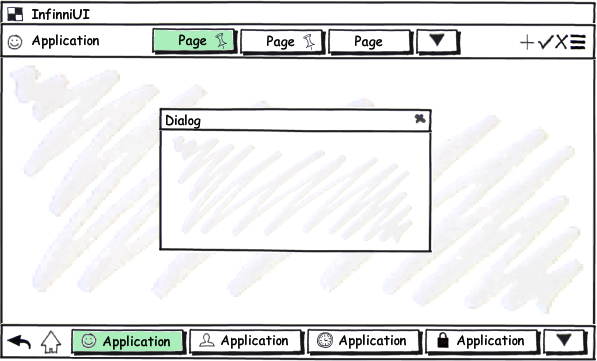

---
layout: default
title: OpenMode
position: 2
categories: 
tags: 
---

Способ открытия представления.

   

#### Sketch



 

|Value|Description|
|-----|-----------|
|Application|Открыть представление как новое приложение системы.|
|Container|Открыть представление в контейнере с заданным именем.|
|Dialog|Открыть представление как модальное диалоговое окно.|
|Page|Открыть представление как страницу приложения.|

   

#### Schema

```
{
  "id": "OpenMode",
  "description": "Способ открытия представления",
  "enum": [
    "Application",
    "Container",
    "Dialog",
    "Page"
  ]
}
```

 

#### Implementation

Представление, открыетое в режиме Application, считается главным окном нового приложения. Все приложения системы отображаются в панели глобальной навигации [[GlobalNavigationBar]]. Открываемое приложение должно отображаться в контейнере с именем **MainContainer**. Если контейнера с таким именем не существует, приложение отображается в корневом контейнере системы, занимая весь экран.

Представление, открытое в режиме Container, отображается в контейнере, имя которого указано в свойстве [[BaseLinkView]].Container. Если данное свойство не установлено или его значение равно `null`, в качестве имени контейнера используется значение по умолчанию - **MainContainer**. Если контейнера с заданным именем не существует, представление отображается в корневом контейнере системы, занимая весь экран. Важно отметить, что поиск контейнера осуществляется во всей системе, а не в рамках родительского представления, из которого осуществляется открытие.

Представление, открытое в режиме Dialog, отображается в модальном диалоге, блокирующем все открытые представления системы. Модальные диалоги следует использовать крайне осторожно, так как диалог является своеобразным прерыванием, которое переключает пользователя на новую задачу и требует от него немедленного ответа. Такие резкие переключения, как правило, приводят к тому, что пользователь теряет контекст, в рамках которого он находился до открытия диалога. По этой же причине крайне не рекомендуется из одного модального диалога открывать другой.

Представление, открытое в режиме Page, отображается рамках новой страницы панели закладок [[TabPanel]], являющейся корневым контейнером родительского представления, из которого осуществляется открытие. Если корневым контейнером родительского представления является не [[TabPanel]], а какой-либо другой элемент, то представление отображаться в контейнере с именем **MainContainer**. Если контейнера с таким именем не существует, приложение отображается в корневом контейнере системы, занимая весь экран.

Режимы открытия должны быть реализованы с использованием системной шины сообщений [[MessageBus]]. Каждый именованный контейнер ([[LayoutPanel]]) подписывается на событие открытия нового представления. При обработке события подписчик должен убедиться, что событие адресовано ему (по имени контейнера), после чего в зависимости от способа открытия представления осуществить необходимые действия, отталкиваясь от логики, описанной выше.

 

 

