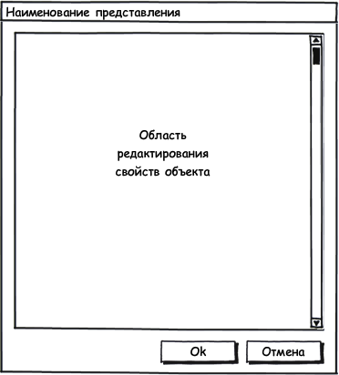

#### Назначение

Редактирование элемента источника данных.

Под элементом имеется ввиду элемент **справочника** или **документ**, а также элемент любой вложенной коллекции справочника или документа.

 

#### Общий вид формы

 

#### Описание формы

* Основную часть экрана занимает область редактирования, в которой расположены элементы представления для отображения и редактирования свойств исходного объекта.
* Область редактирования может выглядеть произвольным образом, например, она может быть представлена в виде [[PropertyGrid]], либо в виде [[TabPanel]], который разделяет свойства объекта на категории.
* Под областью редактирования находятся кнопки (слева на право): "Ok", "Отмена".

 

#### Поведение формы

* Все обращения к серверу должны быть асинхронными и сопровождаться какой-либо анимацией.
* Если пользователь нажал кнопку "Ok", производится корректность заполнения данных; в случае успешной проверки форма закрывается, а соответствующий источник данных обновляется, иначе пользователю выдается сообщение об ошибках.
* Нажатие на кнопку "Отмена" закрывает форму.

 

 

