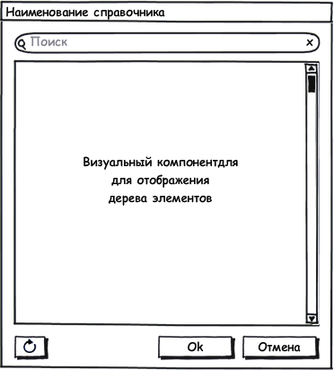

---
layout: default
title: Шаблон формы выбора элементов дерева
position: 5
categories: 
tags: 
---

#### Назначение формы

Выбор одного или нескольких элементов дерева.

Для удобства изложения ниже приводится описание форм выбора для **справочников**, однако все нижесказанное справедливо для любых **документов**.

 

#### Общий вид формы

 

#### Описание формы

* В заголовке диалога выводится наименование формы выбора.
* Над деревом элементов расположена панель для полнотекстового поиска.
* Центральную часть формы занимает дерево, в котором отображаются элементы.
* Под деревом находятся кнопки (слева на право): "Обновить", "Ok", "Отмена".

 

#### Поведение формы

* Все обращения к серверу должны быть асинхронными и сопровождаться какой-либо анимацией.
* При полнотекстовом поиске дерево элементов фильтруется соответствующим образом.
* Если дерево отфильтровано и содержит элементы, то под деревом появляется панель с надписью: "Отображены результаты поиска".
* Если дерево отфильтровано и не содержит ни одного элемента, то под деревом появляется панель с надписью: "По запросу 'Текст строки поиска' ничего не найдено".
* Нажатие на кнопку "Обновить" приводит к повторной загрузке данных из источника (с учетом строки поиска).
* Если пользователь выбрал элемент и нажал кнопку "Ok", то форма закрывается, а вызывающему коду возвращается выбранный элемент (или список выбранных элементов).
* Если пользователь не выбрал элемент и нажал кнопку "Ok", то пользователю выдается предупреждение о необходимости выбора, а форма остается открытой.
* Нажатие на кнопку "Отмена" закрывает форму.

 

#### Основные виды форм

Форма выбора должна быть простой и удобной: пользователь должен легко и быстро находить нужный элемент для выбора, пользователь должен видеть то, что он выбрал. При реализации формы выбора следует учитывать несколько проблем, которые нужно решить. Во-первых, размер дерева элементов может быть очень большим и нужно обеспечить удобный способ фильтрации данных. Во-вторых, наряду с этим, пользователю может понадобится выбрать сразу несколько элементов, но при этом у него должна быть возможность видеть то, что он уже выбрал. В-третьих, в некоторых сценариях пользователь начинает выбор элементов с его поиска, поэтому сразу загружать список элементов, который, скорей всего, никогда не понадобятся, не нужно (например, диалог выбора из справочника МКБ-10). Исходя из вышесказанного выделено три режима формы выбора элементов дерева, которые могут комбинироваться друг с другом (то есть всего 8 различных вариантов представления формы выбора элементов дерева). Вот эти режимы:

 

* **Filtered** - Режим, при котором в дереве не появляются элементы до тех пор, пока пользователь не введет поисковой запрос (как минимум 2 символа).
* **Expandable** - Режим, при котором дочерние элементы загружаются только по требованию (например, когда пользователь впервые нажимает на кнопку "+" напротив соответствующего элемента).
* **Checked** - Режим, при котором в дереве можно выбрать сразу несколько элементов.

 

#### Примеры визуальных форм

 

#### Файлы визуальных шаблонов

[[SelectFormWithTree.zip]]

 

 

