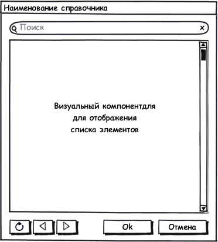

#### Назначение формы

Выбор одного или нескольких элементов списка.

Для удобства изложения ниже приводится описание форм выбора для **справочников**, однако все нижесказанное справедливо для любых **документов**.

 

#### Общий вид формы

 

#### Описание формы

* В заголовке диалога выводится наименование формы выбора.
* Над списком элементов расположена панель для полнотекстового поиска.
* Центральную часть формы занимает список, в котором отображаются элементы.
* Под списком находятся кнопки (слева на право): "Обновить", "Назад", "Вперед", "Ok", "Отмена".

 

#### Поведение формы

* Все обращения к серверу должны быть асинхронными и сопровождаться какой-либо анимацией.
* При полнотекстовом поиске список элементов фильтруется соответствующим образом.
* Если список отфильтрован и содержит элементы, то под списком появляется панель с надписью: "Отображены результаты поиска".
* Если список отфильтрован и не содержит ни одного элемента, то под списком появляется панель с надписью: "По запросу 'Текст строки поиска' ничего не найдено".
* Нажатие на кнопку "Обновить" приводит к повторной загрузке данных из источника (с учетом строки поиска), а в списке отображается первая страница данных.
* Нажатие на кнопки "Назад" и "Вперед" загружает данные предыдущей и следующей страницы соответственно.
* На первой странице кнопка "Назад" неактивна, при переходе на последующие страницы кнопка "Назад" становится активной.
* Если данные на следующей странице отсутствуют, переход на следующую страницу не осуществляется, а кнопка "Вперед" для данной страницы становится неактивной.
* Если пользователь выбрал элемент и нажал кнопку "Ok", то форма закрывается, а вызывающему коду возвращается выбранный элемент (или список выбранных элементов).
* Если пользователь не выбрал элемент и нажал кнопку "Ok", то пользователю выдается предупреждение о необходимости выбора, а форма остается открытой.
* Нажатие на кнопку "Отмена" закрывает форму.

 

#### Основные виды форм

Форма выбора должна быть простой и удобной: пользователь должен легко и быстро находить нужный элемент для выбора, пользователь должен видеть то, что он выбрал. При реализации формы выбора следует учитывать несколько проблем, которые нужно решить. Во-первых, размер списка элементов может быть очень большим и нужно обеспечить удобный способ фильтрации данных. Во-вторых, наряду с этим, пользователю может понадобится выбрать сразу несколько элементов, но при этом у него должна быть возможность видеть то, что он уже выбрал. В-третьих, в некоторых сценариях пользователь начинает выбор элементов с его поиска, поэтому сразу загружать список элементов, который, скорей всего, никогда не понадобятся, не нужно (например, диалог выбора номенклатуры). Исходя из вышесказанного выделено два режима формы выбора из списка, которые могут комбинироваться друг с другом (то есть всего 4 различных варианта представления формы выбора из списка). Вот эти режимы:

 

* **Filtered** - Режим, при котором в списке не появляются элементы до тех пор, пока пользователь не введет поисковой запрос (как минимум 2 символа).
* **Checked** - Режим, при котором из списка можно выбрать сразу несколько элементов.

 

#### Примеры визуальных форм

 

#### Файлы визуальных шаблонов

[[SelectFormWithList.zip]]

 

 

