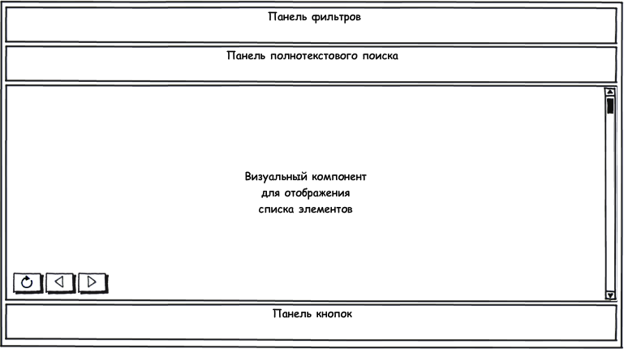

#### Назначение

Отображение списка элементов, возможность производить какие-либо действия над выбранным элементом.

Под элементом имеется ввиду элемент **справочника** или **документ**.

 

#### Общий вид журнала

 

#### Описание журнала

* Панель фильтров (может отсутствовать) - отображает список фильтров, позволяет осуществлять фильтрацию списка элементов, работает совместно с панелью полнотекстового поиска.
* Панель полнотекстового поиска (может отсутствовать) - отображает элемент для ввода строки поиска, позволяет осуществлять фильтрацию списка элементов, работает совместно с панелью фильтров.
* Визуальный компонент для отображения списка элементов (обязательный компонент) - отображает список элементов, которые удовлетворяют установленным фильтрам и/или строке поиска.
* Панель кнопок (может отсутствовать) - отображает кнопки действий, которые могут быть связаны с выбранным элементом в списке, со всеми элементами в списке, либо со всем журналом.

 

#### Поведение журнала

* Все обращения к серверу должны быть асинхронными и сопровождаться какой-либо анимацией.
* При установке фильтров список элементов журнала фильтруется соответствующим образом, при этом учитывается значение строки поиска (если допустимо).
* При полнотекстовом поиске список элементов журнала фильтруется соответствующим образом, при этом учитываются значения фильтров (если допустимо).
* Если список элементов отфильтрован (с использованием фильтров и/или строки поиска) и содержит элементы, пользователь должен визуально видеть, что применен фильтр.
* Если список элементов отфильтрован (с использованием фильтров и/или строки поиска) и не содержит элементы, пользователь должен визуально видеть, что применен фильтр, но элементы не найдены.
* Нажатие на кнопку "Обновить" списка элементов приводит к повторной загрузке данных из источника (с учетом установленных фильтров и строки поиска), а в списке отображается первая страница данных.
* Нажатие на кнопки "Назад" и "Вперед" списка элементов загружает данные предыдущей и следующей страницы соответственно (с учетом установленных фильтров и строки поиска).
* На первой странице кнопка "Назад" неактивна, при переходе на последующие страницы кнопка "Назад" становится активной.
* Если данные на следующей странице отсутствуют, переход на следующую страницу не осуществляется, а кнопка "Вперед" для данной страницы становится неактивной.
* После успешного выполнения какой-либо операции над элементом, которая потенциально могла изменить его свойства, список элементов должен быть обновлен.

 

#### Основные виды журналов

В большинстве случаев список элементов журнала отображается в виде таблицы, в которой отображаются заданные свойства элементов. Панель фильтров и панель полнотекстового поиска, как правило, присутствуют. Панель кнопок чаще всего ограничена типичными операциями: "Создать", "Изменить", "Удалить". Достаточно часто присутствуют кнопки, связанные с определенными бизнес-операциями, как правило, над выбранным элементом журнала, например, "Провести", "Утвердить", "Переместить", "Списать" и т.п. В некоторых случаях присутствуют кнопки, которые могут охватывать несколько записей одновременно, например, "Печать журнала". Помимо этого список журнала может быть только для чтения (**read-only**) или редактируемый (**editable**). В большинстве случаев журнал представлен статической таблицей, элементы которой редактируются либо в отдельном окне, либо в отдельной вкладке, но совершенно не исключены ситуации, когда нужен редактируемый список (обычно это требуется при массовом вводе документов с клавиатуры). Помимо прочего список элементов может работать в двух режимах: **single-select** и **multi-select**. Первый режим (multi-select) позволяет выбирать в списке элементов только один документ; второй режим (multi-select) позволяет выбирать в списке элементов несколько документов (обычно для этого первая колонка таблицы представлена в виде множества ChekBox-ов напротив каждого элемента списка). Режим со множественным выбором требуется, как правило, в ситуациях, когда необходимо за один раз осуществить одно действие сразу над множеством выбранных элементов.

 

#### Примеры визуальных форм

 

#### Файлы визуальных шаблонов

[[List.zip]]

 

 

