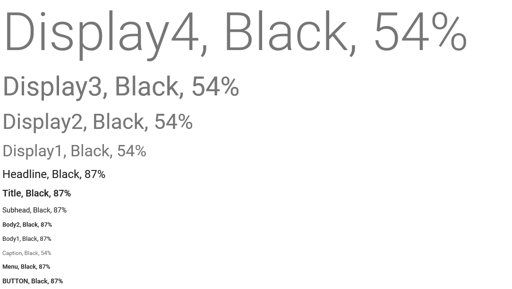
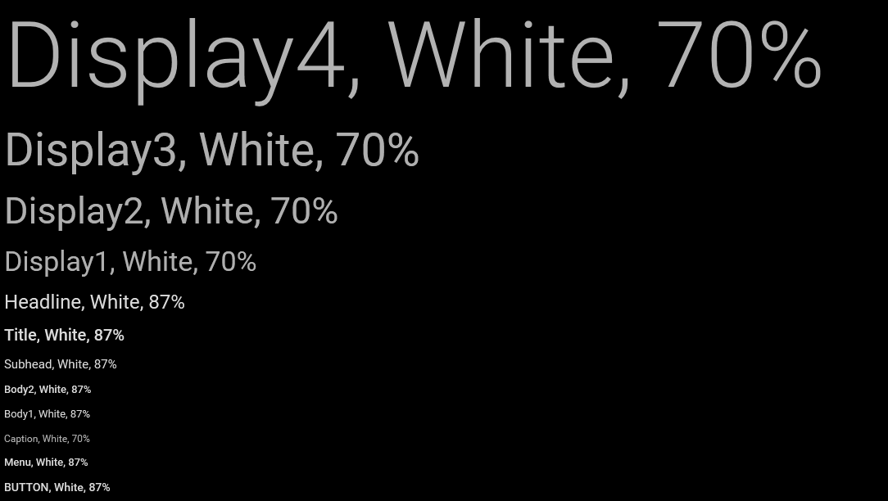

Стиль цвета.

   

#### Description

Определяет цветовое оформление текста, визуального элемента или определенной части визуального элемента.

   

#### Schema

```
{
  "id": "ColorStyle",
  "description": "Стиль цвета",
  "enum": [
    "Transparent",
    "Primary1",
    "Primary2",
    "Primary3",
    "Accent1",
    "Accent2",
    "Accent3",
    "White",
    "Black"
  ]
}
```

  

#### Implementation

В основу цветового оформления положены принципы [Material Design](http://www.google.com/design/spec/style/color.html) и рекоммендации [iOS Human Interface Guidelines](https://developer.apple.com/library/ios/documentation/UserExperience/Conceptual/MobileHIG/ColorImagesText.html). Цветовые стили включают в себя прозрачность (Transparent), три основных цвета (Primary1, Primary2, Primary3), три акцентных цвета (Accent1, Accent2, Accent3), белый (White) и черный (Black). При разработке визуальной темы рекомендуется выбрать три основных цвета из одной палитры (Primary1 ≠ Primary2 ≠ Primary3) и один акцентный цвет из другой палитры (Accent1 = Accent2 = Accent3). Тем не менее, не исключено, что могут потребоваться дополнительные оттенки акцентного цвета (Accent1 ≠ Accent2 = Accent3 или Accent1 ≠ Accent2 ≠ Accent3).

Выбранные цвета должны хорошо смотреться по отдельности и вместе как на светлом, так и на темном фоне. Обратите внимание на цветовой контраст. Например, если цвет текста будет иметь слабую контрастность по отношению к цвету фона, пользователю будет трудно его увидеть. Самый простой способ проверки контрастности выбранных цветов - посмотреть, как выглядит приложение на различных устройствах при разных условиях освещения. Другой способ добиться нужного контраста - использовать спецификацию [WCAG 2.0](http://www.w3.org/TR/WCAG20/#visual-audio-contrast-contrast) или любой доступный [online-калькулятор](http://leaverou.github.io/contrast-ratio/), который позволяет рассчитать соотношение контрастности цветов на основе [яркости](http://en.wikipedia.org/wiki/Relative_luminance). При этом нужно учитывать, что минимальный уровень контрастности составляет 4.5:1, но предпочтительным является соотношение 7:1.

  

```
double CalcContrast(Color color1, Color color2)
{
	// Formula: http://www.w3.org/TR/2008/REC-WCAG20-20081211/#contrast-ratiodef
  
	var alpha = ToNormValue(color1.A);
  
	if (alpha >= 1)
	{
		var a2 = ToNormValue(color2.A);
  
		if (a2 < 1)
		{
			color2 = OverlayColors(color2, color1);
		}
  
		var l1 = CalcLuminance(color1) + 0.05;
		var l2 = CalcLuminance(color2) + 0.05;
		var ratio = l1 / l2;
  
		if (l2 > l1)
		{
			ratio = 1.0 / ratio;
		}
  
		ratio = Math.Round(ratio, 1);
  
		return ratio;
	}
  
	// If we’re here, it means we have a semi-transparent background
	// The text color may or may not be semi-transparent, but that doesn't matter
  
	var onBlack = CalcContrast(OverlayColors(color1, Colors.Black), color2);
	var onWhite = CalcContrast(OverlayColors(color1, Colors.White), color2);
  
	var max = Math.Max(onBlack, onWhite);
	var closest = ClosestColor(color1, color2);
	var min = CalcContrast(OverlayColors(color1, closest), color2);
  
	return Math.Round((min + max) / 2, 2);
}
  
Color ClosestColor(Color color1, Color color2)
{
	var a1 = ToNormValue(color1.A);
	var r3 = Math.Min(Math.Max((color2.R - color1.R * a1) / (1.0 - a1), 0), 255);
	var g3 = Math.Min(Math.Max((color2.G - color1.G * a1) / (1.0 - a1), 0), 255);
	var b3 = Math.Min(Math.Max((color2.B - color1.B * a1) / (1.0 - a1), 0), 255);
	return Color.FromArgb(255, (byte)r3, (byte)g3, (byte)b3);
}
  
Color OverlayColors(Color color1, Color color2)
{
	var overlaid = color1;
  
	var a1 = ToNormValue(color1.A);
  
	if (a1 < 1)
	{
		var a2 = ToNormValue(color2.A);
  
		var a3 = FromNormValue(a1 + a2 * (1.0 - a1));
		var r3 = color1.R * a1 + color2.R * a2 * (1.0 - a1);
		var g3 = color1.G * a1 + color2.G * a2 * (1.0 - a1);
		var b3 = color1.B * a1 + color2.B * a2 * (1.0 - a1);
		overlaid = Color.FromArgb(a3, (byte)r3, (byte)g3, (byte)b3);
	}
  
	return overlaid;
}
  
double CalcLuminance(Color color)
{
	// Formula: http://www.w3.org/TR/2008/REC-WCAG20-20081211/#relativeluminancedef
  
	var nR = CalcNormComponent(color.R);
	var nG = CalcNormComponent(color.G);
	var nB = CalcNormComponent(color.B);
	return 0.2126 * nR + 0.7152 * nG + 0.0722 * nB;
}
  
double CalcNormComponent(byte value)
{
	var normValue = ToNormValue(value);
	return (normValue <= 0.03928) ? normValue / 12.92 : Math.Pow((normValue + 0.055) / 1.055, 2.4);
}
  
byte FromNormValue(double value)
{
	return (byte)Math.Min(Math.Max(255 * value, 0), 255);
}
  
double ToNormValue(byte value)
{
	return value / 255.0;
}
```

     

#### Text & Icons

Приоритетность или иерархичность текстовой или графической информации можно подчеркнуть не только с помощью шрифта ([[TextStyle]]), но и с помощью цвета. Для этого можно использовать различные оттенки выбранных цветов, полученных с помощью регулировки [альфа-канала](http://en.wikipedia.org/wiki/Alpha_compositing). Рекомендуемое значение альфа-канала для основной информации на белом фоне составляет 87%; второстепенной информации, стоящий ниже в визуальной иерархии, 54%; следующий уровень - 26%; и последний уровень - 12%. (Обратите внимание, что приведенные цифры относятся только к белому фону, для другого цвета фона нужно подбирать значение альфа-канала, ориентируясь на достаточный уровень контрастности.)

   

#### Using

Цветовое оформление улучшает взаимодействие, помогает обозначить интерактивные элементы, оживить интерфейс, расставить дополнительные акценты и добиться визуальной целостности. Между тем цветом следует пользоваться с особой осторожностью, как очень тонким инструментом. Не позволяйте цвету отвлекать пользоватля от содержимого и/или выполняемых действий. Не забывайте о пользователях с цветовой слепотой (дальтонизмом), большинству из них трудно отличить красный от зеленого. С этой точки зрения гораздо важней не сами цвета, а обеспечение достаточного уровня контрастности цветов. 

Для интерактивных элементов (кнопки, ссылки и т.п.) желательно выбрать один цвет, который будет использоваться только для этих целей. Если цвет, используемый в интерактивных элементах, будет использован в неинтерактивном элементе, это может вызвать непонимание у пользователя. 

   

#### Examples

 



 

 

 

   

#### Links

[[TextStyle]]

 

 

