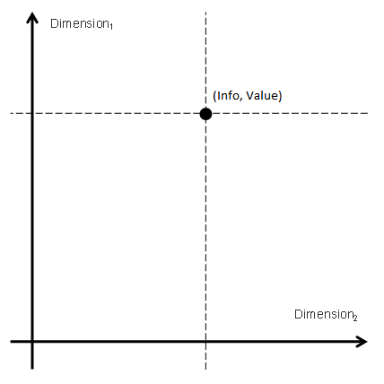

---
layout: default
title: RegisterPropertyType
position: 
categories: 
tags: 
---

Тип свойства регистра.

   

Каждое свойство регистра имеет свой тип, который определяет функциональное назначение свойства. Фактически любой регистр можно представить, как функцию, которая множеству измерений (Dimension) ставит в соответствие множество реквизитов (Info) и значений (Value). Таким образом множество измерений каждой записи регистра формирует уникальный ключ, с которым сопоставляются реквизиты и значения. Если регистр является периодическим, к явно объявленным в метаданных регистра измерениям добавляется еще одно - период.

    



   

|Значение|Описание|
|--------|--------|
|Dimension|Измерение.|
|Info|Реквизит.|
|Value|Ресурс.|

    

```
{
	"id": "RegisterPropertyType",
	"description": "Тип свойства регистра",
	"enum": [
		"Dimension",
		"Info",
		"Value"
	]
}
```

 

 

en  ru, Для которого была создана записьen  ruюen  ruразделитель**имя существительное**: *разделитель данных*