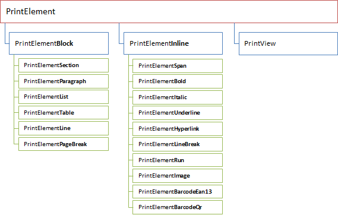

Содержимое печатного представления описывается в виде совокупности элементов и иерархических связей между ними. Элементы могут быть структурообразующими (например, абзац, таблица, список), а могут отображать данные (например, текст, изображение). В совокупности элементы образуют иерархическую связь (например, текст, расположенный внутри абзаца или ячейки таблицы). Каждый из элементов помимо общих настроек может определять собственные правила отображения и возможные связи "родитель - потомок" между элементами. В данном разделе описывается структура метаданных печатного представления и его элементов.

Все элементы печатного представления, включая само печатное представление, расширяют метаданные типа [[PrintElement]]. Наряду с этим их можно разделить на две основные категории: [[блочные|PrintView: Block]] (структурообразующие) и [[однострочные|PrintView: Inline]] (отображающие данные). Блочные элементы расширяют метаданные типа [[PrintElementBlock]], всегда выводятся с новой строки и используются для группировки элементов или для применения к группе общих атрибутов. Однострочные элементы расширяют метаданные типа [[PrintElementInline]], [[в общем случае|PrintElementLineBreak]] выводятся на той же строке и используются в качестве непосредственного контейнера содержимого, отображаемого на экране ([[текст|PrintElementRun]], [[изображение|PrintElementImage]] и т.д.). Например, блочный элемент [[PrintElementParagraph]] (абзац) может содержать однострочный элемент [[PrintElementRun]] (текст), который фактически содержит текст, отображаемый на экране.

   

    

 

 

