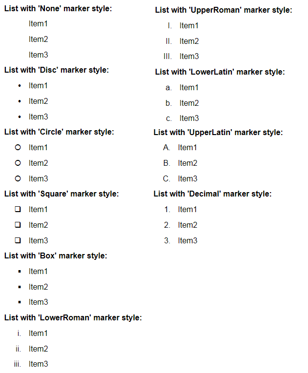

Стиль маркера элементов списка.

   

#### Type

object

   

#### Description  

|Value|Description|
|-----|-----------|
|None|Маркер не отображается.|
|Disc|Маркер отображается в виде закрашенного круга.|
|Circle|Маркер отображается в виде незакрашенного круга.|
|Square|Маркер отображается в виде незакрашенного квадрата.|
|Box|Маркер отображается в виде закрашенного квадрата.|
|LowerRoman|Маркер отображается строчными римскими цифрами (например, i, ii, iii, iv, v).|
|UpperRoman|Маркер отображается прописными римскими цифрами (например, I, II, III, IV, V).|
|LowerLatin|Маркер отображается строчными латинскими буквами (например, a, b, c, d, e, f).|
|UpperLatin|Маркер отображается прописными латинскими буквами (например, A, B, C, D, E, F).|
|Decimal|Маркер отображается арабскими цифрами (например, 1, 2, 3, 4, 5).|

   

#### Schema

```
{
  "id": "PrintElementListMarkerStyle",
  "description": "Стиль маркера элементов списка",
  "enum": [
    "None",
    "Disc",
    "Circle",
    "Square",
    "Box",
    "LowerRoman",
    "UpperRoman",
    "LowerLatin",
    "UpperLatin",
    "Decimal"
  ]
}
```

   

#### Example



 

 

