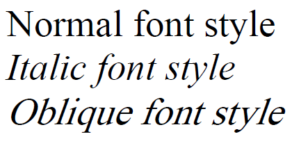

---
layout: default
title: FontStyle
position: 1
categories: 
tags: 
---

Стиль шрифта.

    

Некоторые шрифты могут не поддерживать определенные стили шрифта. Например, курсив - это специальный шрифт имитирующий рукописный, наклонный же образуется путем программного (искусственного) наклона обычных знаков вправо. Таким образом, наклонный обычно используется для имитации курсива в случае, если у используемого шрифта отсутствует курсивное начертание.

   

#### Type

enum

   

#### Description  

|Value|Description|
|-----|-----------|
|Normal|Обычный.|
|Italic|Курсив.|
|Oblique|Наклонный.|

   

#### Schema

```
{
  "id": "FontStyle",
  "description": "Стиль шрифта",
  "enum": [
    "Normal",
    "Italic",
    "Oblique"
  ]
}
```

   

#### Example



 

 

