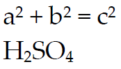

---
layout: default
title: FontVariant
position: 4
categories: 
tags: 
---

Вертикальное выравнивание шрифта.

   

Некоторые шрифты могут не поддерживать вертикальное выравнивание.

   

#### Type

enum

  

#### Description  

|Value|Description|
|-----|-----------|
|Normal|Без выравнивания.|
|Subscript|Подстрочное выравнивание (подстрочный индекс).|
|Superscript|Надстрочное выравнивание (надстрочный индекс).|

   

#### Schema

```
{
  "id": "FontVariant",
  "description": "Вертикальное выравнивание шрифта",
  "enum": [
    "Normal",
    "Subscript",
    "Superscript"
  ]
}
```

   

#### Example



 

 

