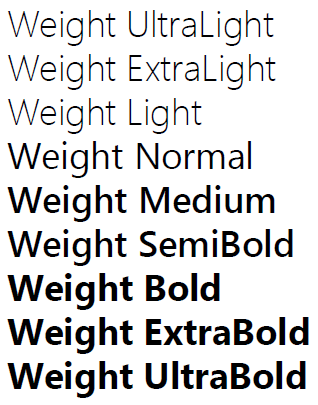

Насыщенность шрифта.

   

Многие шрифты поддерживают не все уровни насыщенности.

   

#### Type

enum

  

#### Description  

|Value|Description|
|-----|-----------|
|UltraLight|Ультра-тонкий (100).|
|ExtraLight|Экстра-тонкий (200).|
|Light|Тонкий (300).|
|Normal|Нормальный (400).|
|Medium|Средний (500).|
|SemiBold|Полужирный (600).|
|Bold|Жирный (700).|
|ExtraBold|Экстра-жирный (800).|
|UltraBold|Ультра-жирный (900).|

   

#### Schema

```
{
  "id": "FontWeight",
  "description": "Насыщенность шрифта",
  "enum": [
    "UltraLight",
    "ExtraLight",
    "Light",
    "Normal",
    "Medium",
    "SemiBold",
    "Bold",
    "ExtraBold",
    "UltraBold"
  ]
}
```

    

#### Example



 

 

