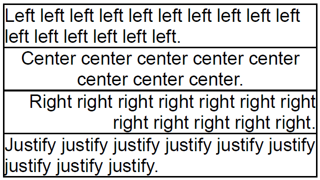

Горизонтальное выравнивание текста элемента печатного представления.

   

#### Type

enum

  

#### Description  

|Value|Description|
|-----|-----------|
|Left|Выравнивание по левому краю родительского блока.|
|Center|Выравнивание по центру родительского блока.|
|Right|Выравнивание по правому краю родительского блока.|
|Justify|Выравнивание по ширине родительского блока.|

   

#### Schema

```
{
  "id": "PrintElementTextAlignment",
  "description": "Горизонтальное выравнивание текста элемента печатного представления",
  "enum": [
    "Left",
    "Center",
    "Right",
    "Justify"
  ]
}
```

   

#### Example



 

 

