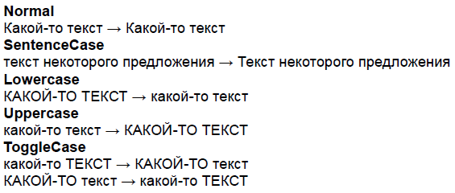

Регистр символов текста элемента печатного представления.

   

#### Type

enum

  

#### Description  

|Value|Description|
|-----|-----------|
|Normal|Текст элемента печатного представления остается без изменений.Пример: "Какой-то текст"  "Какой-то текст".|
|SentenceCase|Текст элемента печатного представления интерпретируется, как предложение, которое должно начинаться с заглавной буквы.Пример: "текст некоторого предложения"  "Текст некоторого предложения".|
|Lowercase|Текст элемента печатного представления приводится к нижнему регистру.Пример: "КАКОЙ-ТО ТЕКСТ"  "какой-то текст".|
|Uppercase|Текст элемента печатного представления приводится к верхнему регистру.Пример: "какой-то текст"  "КАКОЙ-ТО ТЕКСТ".|
|ToggleCase|Текст элемента печатного представления меняет регистр символов.Пример: "какой-то ТЕКСТ"  "КАКОЙ-ТО текст", "КАКОЙ-ТО текст"  "какой-то ТЕКСТ".|

    

#### Schema

```
{
  "id": "PrintElementTextCase",
  "description": "Регистр символов текста элемента печатного представления",
  "enum": [
    "Normal",
    "SentenceCase",
    "Lowercase",
    "Uppercase",
    "ToggleCase"
  ]
}
```

   

#### Example



 

 

