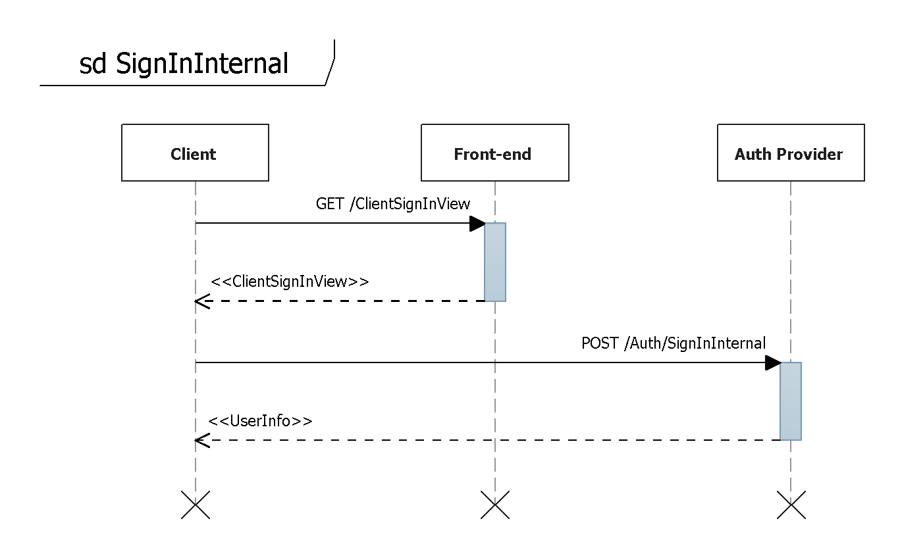
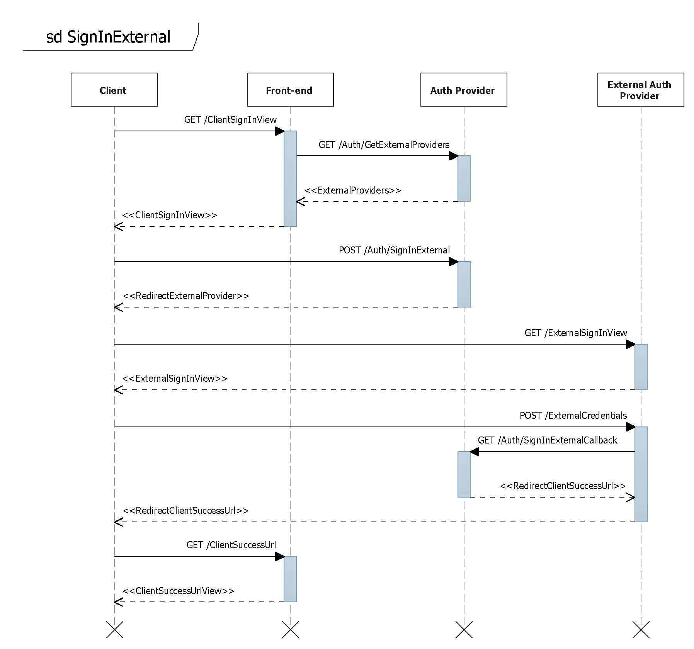

Ниже приведены диаграммы последовательности, для [[внутренней|SignInInternal]] и [[внешней|SignInExternal]] аутентификации с использованием [[существующих сервисов|Сервисы аутентификации]].

   

* Клиент запрашивает страницу входа в систему: GET/ClientSignInView
* Клиент отправляет учетные данные пользователя внутреннему провайдеру аутентификации: POST /Auth/SignInInternal

 

* Клиент запрашивает страницу входа в систему: GET/ClientSignInView
* При формировании страницы входа запрашивается список внешних провайдеров аутентификации: GET /Auth/GetExternalProviders
* Клиент запрашивает страницу входа одного из внешних провайдеров аутентификации: POST /Auth/SignInExternal
* Клиент перенаправляет пользователя на страницу входа внешнего провайдера аутентификации: GET /ExternalSignInView
* Клиент отправляет учетные данные пользователя внешнему провайдеру аутентификации: POST /ExternalCredentials
* Внешний провайдер аутентификации уведомляет внутренний провайдер о входе пользователя в систему: GET /Auth/SignInExternalCallback
* Клиент перенаправляется пользователя на страницу успешного входа в систему: GET /ClientSuccessUrl

 

 

