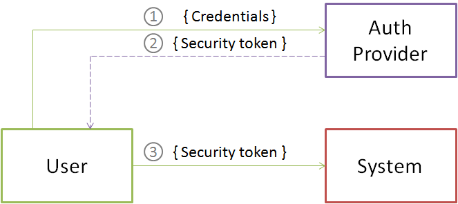

---
layout: default
title: Внешняя аутентификация
position: 1
categories: 
tags: 
---

Внешняя аутентификация реализуется средствами стороннего провайдера и в качестве удостоверения пользователя использует "цифровой ключ", выданный этим провайдером.

   

   

Пользователь отправляет внешнему провайдеру аутентификации удостоверение (в том виде, в котором требует внешний провайдер аутентификации).Если удостоверение корректно внешний провайдер аутентификации отдает пользователю ключ безопасности (маркер безопасности, цифровой ключ).Полученный ключ безопасности передается системе для подтверждения входа. 

 

