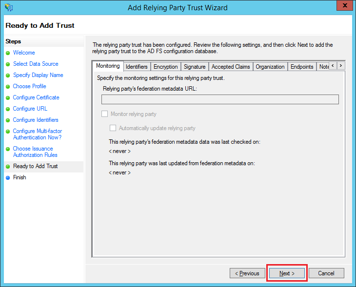

Служба ADFS реализует модель аутентификации на основе утверждений ([Claims-Based Identity Model](http://msdn.microsoft.com/en-us/library/ee517291.aspx)). Соответственно сама служба ADFS выступает в роли сервиса маркеров безопасности (Security Token Service, STS) и предоставляет возможность зарегистрировать защищаемый ресурс (в терминах спецификации [WS-Federation](http://msdn.microsoft.com/en-us/library/bb498017.aspx) - realm) и доверенную сторону (Relying Party Trust, RP), которой будут переданы маркеры безопасности (Security Tokens) в случае успешной аутентификации. Для регистрации защищаемого ресурса и доверенной стороны в ADFS нужно запустить консоль "AD FS Management", выбрать раздел "AD FS / Trust Relationships / Relying Party Trusts" и выполнить действие "Add Relying Party Trust...". Эти действия приведут к запуску мастера "Add Relying Party Trust Wizard", который позволяет сделать необходимые настройки. Ниже наглядно показан процесс добавления доверенной стороны с помощью мастера в Windows Server 2012 R2.

 

1. Окно приветствия.

 

2. Указать "Enter data about the relying party manually".

 

3. Указать отображаемое имя доверенной стороны (например, "InfinniPlatform").

 

4. Указать "AD FS Profile".

 

5. Оставить все как есть и нажать "Next".

 

6. Указать адрес доверенной стороны для отправки маркеров безопасности в формате "https://<InfinniPlatform Server>:<Port>/Auth/SignInExternalCallback".

 

7. Добавить идентификатор ресурса "https://InfinniPlatform".

 

8. Указать "I do not want to configure multi-factor athentication settings for this relying party trust at this time".

Этот шаг выполняется только для Windows Server 2012 с ADFS по умолчанию.

 

 

9. Выбрать "Permit all users to access this relying party".

 

10. Оставить все как есть и нажать "Next".

 

11. Выбрать "Open the Edit Claim Rules dialog for this relying party trust when the wizard closes".

Если в конце выполнения предыдущего шага была выбрана настройка "Open the Edit Claim Rules dialog for this relying party trust when the wizard closes", откроется диалог настройки правил публикации утверждений (claims) для созданной доверенной стороны. Этот же диалог можно запустить, выбрав нужную доверенную сторону в разделе "AD FS / Trust Relationships / Relying Party Trusts" и выполнив действие "Edit Claim Rules...". Ниже наглядно показан процесс добавления правил публикации утверждений с помощью мастера в Windows Server 2012 R2.

 

1. На вкладке "Issuance Transform Rules" нажать кнопку "Add Rule...".

 

2. Выбрать шаблон "Send LDAP Attributes as Claims".

 

3. Задать имя правила "RequiredClaims", выбрать хранилище "Active Directory" и указать правила отображения: "SAM-Account-Name  nameidentifier", "SAM-Account-Name  name", "E-Mail-Addresses  emailaddress".

Вариант для русифицированной Windows Server:

Вариант для англоязычной Windows Server:

Клэйм distinguishedName имеет Outgoing Claim Type = "[http://schemas.xmlsoap.org/ws/2005/05/identity/claims/x500distinguishedname](http://schemas.xmlsoap.org/ws/2005/05/identity/claims/x500distinguishedname)" (без кавычек). Через него ADFS сообщит информацию об организационной единице (ogranizational unit), к которой принадлежит пользователь.

 

 

4. Нажать кнопку "Apply" и закрыть диалог.

На сервере ADFS открыть консоль IIS.Найти приложение adfs > ls.Открыть Authentication настройки для Windows Authentication.Отключить Extended Protection.  
В некоторых случаях (например, для FF > 30) необходимо отключить Windows Authentication и включить Basic Authentication (подробнее см. [здесь](http://stackoverflow.com/questions/24245357/unable-to-log-in-to-adfs-using-firefox-30-0)).