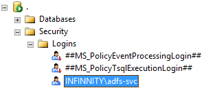

Создать учетную запись пользователя домена или групповую учетную запись, от имени которой будет работать служба ADFS.

 

```
INFINNITY\adfs-svc
```

Служба ADFS в качестве хранилища может использовать [WID (Windows Internal Database)](http://technet.microsoft.com/en-us/library/cc754405.aspx) или MS SQL Server. Соответственно перед установкой ADFS нужно создать и/или настроить либо то, либо другое. С точки зрения администрирования гораздо проще и удобней использовать обычный MS SQL Server. Если было принято хранить данные в MS SQL Server, нужно убедиться, что сервер базы данных доступен со стороны сервера ADFS для учетной записи службы. То же самое требование касается учетной записи, от имени которой будет устанавливаться служба ADFS.

 




Служба ADFS использует HTTPS, соответственно нуждается в установке сертификата для аутентификации сервера ADFS со стороны клиента. Сертификат должен быть выдан центром сертификации, который является доверенным (Trusted Root Certification Authorities) для всех участников взаимодействия. Разумеется, лучше использовать коммерческий сертификат, но работать будет и сертификат, выданный [корпоративным центром сертификации](http://technet.microsoft.com/en-us/library/cc770357(v=ws.10).aspx). Работать также будет и самоподписанный (self-signed) сертификат, однако его нужно будет установить в "Trusted Root Certification Authorities" на все машины участников взаимодействия.

Общее имя сертификата (Common Name, CN) должно совпадать с доменным именем, по которому будут доступны сервисы ADFS. Например, если сервисы ADFS будут доступны по адресу "https://sso.infinnity.lan", то на сервере ADFS нужно установить сертификат, у которого "CN=sso.infinnity.lan". Если сервисы ADFS доступны не только по адресу "https://sso.infinnity.lan", то сертификат должен содержать список всех [альтернативных имен](http://en.wikipedia.org/wiki/SubjectAltName) (Subject Alternative Name, SAN), например: "DNS.1=sso.infinnity.lan,DNS.2=sso2.infinnity.lan"; либо содержать wildcard в общем имени, например: "CN=*.infinnity.lan". Естественно, что первый способ (SAN) является правильным, а второй способ (wildcard) - наиболее простым. Дополнительные требования к сертификату службы приведены в разделе "[Service Communications Certificates](http://technet.microsoft.com/en-us/library/hh341473.aspx)".

   

Общее имя сертификата (Common Name, CN) не должно совпадать с именем сервера ADFS. Например, если сервер ADFS доступен по имени "adfs.infinnity.lan", то это имя нельзя использовать в качестве имени службы ADFS. Эту проблему можно решить, добавив DNS-синоним для сервера ADFS, например, "sso.infinnity.lan", после чего установить на этот сервер сертификат, у которого "CN=sso.infinnity.lan".

К данной статье прикреплен пример самоподписанного wildcard-сертификата "CN=*.infinnity.lan" (см. [[star.infinnity.lan.pfx]]). Пароль для установки сертификата: "infinnity".

   

Ниже приведена последовательность шагов установки сертификата службы на сервере ADFS:

* Запустить "MMC" от имени администратора: Run / mmc / Enter
* Добавить оснастку "Certificates": File / Add or Remove Snap-ins / Certificates / Add / Computer account
* Импортировать сертификат в "Personal": Certificates / Personal / All Tasks / Import
* Импортировать сертификат в "Trusted Root Certification Authorities": Certificates / Trusted Root Certification Authorities / All Tasks / Import

 

Для установки роли ADFS на сервере нужно выполнить PowerShell-команду с правами локального администратора:

 

```
import-module servermanager
Add-WindowsFeature ADFS-Federation
```

Если после установки роли ADFS запустить "Server Manager", то он выдаст предупреждение, что служба ADFS не настроена. Открыв это предупреждение, в колонке "Actions" будет ссылка, по нажатию на которую запускается мастер настройки службы ADFS. (К сожалению, другого способа запуска этого мастера не нашлось.) Ниже наглядно показан процесс настройки службы ADFS с помощью мастера в Windows Server 2012 R2.

 

1. Окно приветствия.


 

2. Указать учетные данные "Администратора домена".


 

3. Выбрать сертификат аутентификации и указать имя службы ADFS (отличное от имени сервера ADFS).


 

4. Указать учетную запись, от имени которой будет работать служба ADFS.


 

5. Выбрать хранилище данных службы ADFS.


 

6. Убедиться, что предварительная проверка выполнена успешно.


 

7. Убедиться, что служба настроена успешно.


Если служба была настроена корректно, то всем участникам взаимодействия должен быть доступен диалог входа, расположенный по адресу "https://<<ADFS>>/adfs/ls/IdpInitiatedSignon.aspx", где "<<ADFS>>" - имя службы ADFS, указанное при установке (например, "https://sso.infinnity.lan/adfs/ls/IdpInitiatedSignon.aspx"). В качестве теста работоспособности нужно нажать кнопку входа и ввести учетные данные пользователя домена (можно попытаться зайти под своей учетной записью). Если на странице входа появится сообщение, что вы успешно выполнили вход в систему, значит, служба работает корректно. При возникновении любых проблем в первую очередь следует убедиться, что выполнены все вышеуказанные шаги, после чего в "Server Manager" проверить журнал событий (Events) службы ADFS и системный журнал событий (eventvwr).

 


 

 

