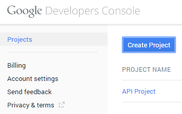

Для аутентификации в Google используется протокол [OAuth 2.0](https://developers.google.com/+/api/oauth). Предварительно в [Google Developers Console](https://console.developers.google.com/project) нужно [создать проект](https://developers.google.com/console/help/#creatingdeletingprojects). Создание проекта можно воспринимать, как процедуру регистрации доверенной стороны (Relying Party Trust, RP), которой будут переданы маркеры безопасности (Security Tokens) в случае успешной аутентификации. Ниже приведена подробная инструкция по созданию проекта (интерфейс экранных форм может измениться, но суть настроек поменяться не должна).

    

Приведенная ниже схема настроек является достаточно распространенной для многих популярных провайдеров, поддерживающих протокол OAuth 2.0, например, Facebook, Twitter, LinkedIn и многих других.

    

   

1. Зайти на страницу [Google Developers Console](https://console.developers.google.com/project)

 

2. Нажать кнопку "Create Project".

 

3. Указать наименование проекта и его идентификатор.

 

4. На вкладке "APIs" включить "Google+ API".

 

5. Убедиться, что "Google+ API" включен.

 

6. На вкладке "Credentials" нажать кнопку "Create new Client ID".

 

7. Выбрать тип приложения "Web application", указать Origins для доверенной стороны, а также адрес доверенной стороны для отправки маркеров безопасности.

Значение Origins должно быть в формате: "https://<InfinniPlatform Server>:<Port>/"

Адрес для отправки маркеров безопасности должен быть в формате: "https://<InfinniPlatform Server>:<Port>/signin-google"

 

8. В дальнейшем, при любых изменениях проекта нужно делать "Reset secret".

 

9. На вкладке "Credentials" будут доступны "Client ID" и "Client Secret", которые будет использовать доверенная сторона при запросе маркеров безопасности.

 

10. На вкладке "Consent screen" можно указать отображаемую информацию о доверенной стороне, но обязательно нужно указать "Email Address" и "Product Name".

 

  
  
