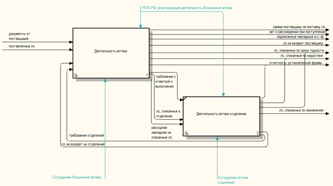
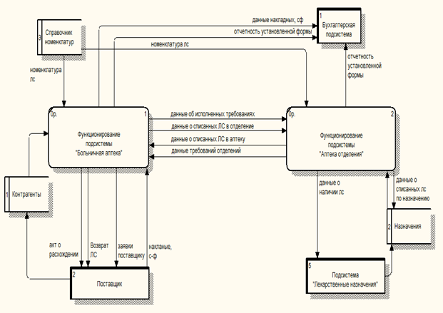
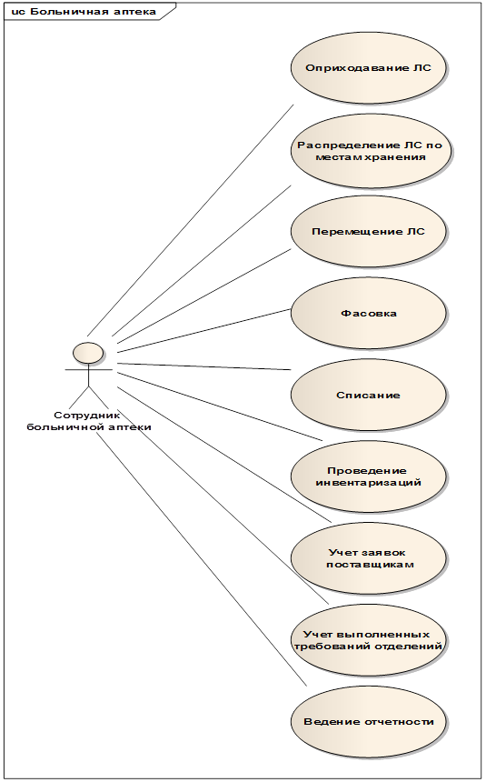
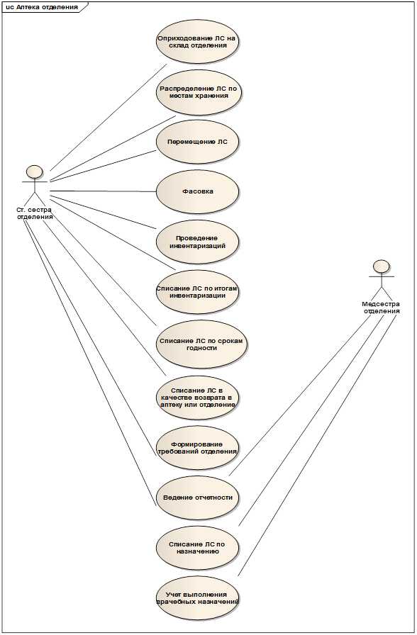

# 

# Модель системы Больничная аптека

## Назначение исследования

Сформировать общую модель системы Больничная аптека.

## Объекты исследования

Объектами исследования являются результаты проведенного ранее:

* Анализа регулирующих документов
* Интервьюирования клиентов
* Анализа основных конкурентов

## Термины  и определения

|**Термин**|**Определение**|
|НСИ|Нормативно-справочная информация|
|Лекарственная пропись|Предписание, регламентирующее состав изготавливаемого лекарственного средства|
|ЛС|Лекарственное средство|
|Формулярный список|Документ, представляющий собой перечень лекарственных препаратов, составленный специалистами формулярной комиссии, носящий ограничительный характер для закупки, распределения и использования|

## Выводы по итогам проведенного исследования

По итогам проведенного исследования нормативно-правовых актов, регулирующих деятельность больничной аптеки, интервьюирования клиентов, а также анализа основных конкурентов была выявлена необходимость разделения системы Больничная аптека на 2 подсистем: Больничная аптека и Аптека отделения. В зависимости от роли пользователя осуществляется вход либо в аптеку отделения, либо в больничную аптеку. Подобное деление обусловлено наличием общих функций для обеих подсистем и функций, характерных только для одной из подсистем.  В таблице 1 указан подобный перечень функций, выполняемый подсистемами.

Таблица 1.

|**Наименование функции**|**Больничная аптека**|**Аптека отделения**|
|Учет контрагентов (поставщиков)|**+**|**-**|
|Учет действующих договоров с поставщиками|**+**|**-**|
|Формирование лекарственных прописей|**+**|**-**|
|Ведение номенклатуры ЛС|**+**|**-**|
|Учет источников финансирования|**+**|**-**|
|Учет складов аптеки|**+**|**+**|
|Учет мест хранения|**+**|**+**|
|Учет пациентов|**-**|**+**|
|Учет врачей|**-**|**+**|
|Ведение формулярных списков номенклатур|**+**|**-**|
|Ведение списка минимально необходимого количества препаратов|**+**|**+**|
|Поиск забракованных серий|**+**|**-**|
|Оприходование по поступлениям от поставщиков|**+**|**-**|
|Оприходование по результатам производства|**+**|**-**|
|Оприходование излишков (по результатам инвентаризации)|**+**|**+**|
|Оприходование по списанию из аптеки|**-**|**+**|
|Оприходование по списанию из отделения|**+**|**+**|
|Списание по сроку годности|**+**|**+**|
|Списание недостач (по результатам инвентаризации)|**+**|**+**|
|Списание на производство|**+**|**-**|
|Списание в отделение|**+**|**+**|
|Списание в аптеку|**-**|**+**|
|Списание на возврат поставщику|**+**|**-**|
|Списание по назначению врача|**-**|**+**|
|Фасовка ЛС|**+**|**+**|
|Проведение инвентаризаций|**+**|**+**|
|Размещение препаратов по местам хранения|**+**|**+**|
|Перемещение по складам аптека/отделения|**+**|**+**|
|Создание заявок поставщику|**+**|**-**|
|Закрытие заявок поставщику|**+**|**-**|
|Создание требований на ЛС|**-**|**+**|
|Закрытие требований на ЛС|**+**|**-**|
|Ведение назначений|**-**|**+**|
|Ведение отчетности|**+**|**+**|
|Учет выполненных врачебных назначений|**-**|**+**|
|Отчет по движению ЛС|**+**|**+**|
|Отчет по срокам годности ЛС|**+**|**+**|
|Отчет по остаткам товаров на складах|**+**|**+**|
|Экспорт-импорт в бухгалтерские системы|**+**|**+**|

** **

Ниже указаны схема взаимодействия больничной аптеки, аптеки отделений выполненная по стандарту IDEF0, а также диаграмма потоков данных с иными подсистемами и контрагентами в нотации DFD

 

 

 

Далее рассмотрим каждую подсистему по отдельности.

**Больничная аптека**

 

Пользователи:

* Бухгалтер
* Лаборант
* Фармацевт
* Фасовщик
* Зав.аптеки
* Зам. зав. аптеки
* Провизор

Подсистему Больничная аптека необходимо разделить на следующие функциональные блоки:

**Движение ЛС. **Блок****Движение ЛС предназначен для учета информации по всем действиям, связанным с движением лекарственного средства, а именно: оприходование ЛС, списание ЛС,  перемещение ЛС по складам больничной аптеки, результатов рецептурно-производственной деятельности.

**Контроль остатков **Предназначен для учета информации по проведенным инвентаризациям за указанный период времени, по наличию ЛС на складах, а также информации по неснижаемому остатку.

**Работа с поставщиками. **Предназначен для учета информации, связанной с поставщиками, а именно  по заказам поставщикам и актам о расхождении при поступлении товаров.

**Работа с отделениями. **Предназначен для учета требований отделения.

**Отчетность. **Предназначен для формирования следующих отчетов: отчет по движению ЛС, отчет по срокам годности ЛС, отчет по наличию ЛС.

**НСИ. **Предназначен для ведения следующих справочников:**  **номенклатура ЛС, места хранения ЛС, склады аптеки, контрагенты, договора с контрагентами, лекарственные прописи, формулярные списки.

Данные функциональные блоки с кратким описанием отображаемой информации указаны ниже в таблице 2.

**Таблица 2.**

|**Блок**|**Журналы**|**Отображаемые документы**|
|Движение ЛС|Приходные документы|Поступление ЛСОприходование излишекПоступление ЛС из отделений/аптекиПоступление ЛС по результатам производственной деятельности|
|Расходные документы|Списание по сроку годностиСписание недостачСписание ЛС в аптеку/отделениеВозврат поставщикуСписание ЛС по внутреннему потреблению.|
|Перемещение|Перемещение|
|Рецептурно-производственная деятельность|Изготовление ЛСФасовка|
|Запрос на производство|Запрос на производство|
|Контроль остатков|Инвентаризация|Инвентаризация|
|Наличие ЛС| |
|Неснижаемый остаток|Неснижаемый остаток|
|Работа с поставщиками|Заказы поставщикам|Заявка поставщику|
|Акты о расхождении при поступлении|Акт о расхождении при поступлении|
|Работа с отделениями|Требования отделений|Требования отделений|
|Отчетность|Предусматривает возможность создания следующих отчетов:* отчет по наличию лекарственных средств на складах аптеки в виде отчета Остатки ТМЦ в разрезе источников финансирования.
* отчет по срокам годности: Система должна отслеживать истечение сроков годности препаратов и выводить информацию о препаратах, у которых срок годности уже истек или истекает в скором времени, в отчет Контроль срока годности
* отчет поступлений лекарственных средств в разрезе поставщиков, отделений, мест хранения, источников финансирования.
* отчет по списанию лекарственных средств в разрезе отделений, источников финансирования, фарм. группе
* сводный отчет по источникам финансирования
* экспорт-импорт

|
|НСИ|НоменклатураКонтрагенты (поставщики)Договора с контрагентамиСкладыМеста храненияЛекарственные прописиФормулярные списки|

** **

Рассмотрим подробнее каждый из указанных блоков.

**Блок Движение ЛС**

Включает в себя ведение следующих журналов:

* Журнал Приходные документы
* Журнал Расходные документы
* Журнал Перемещение
* Журнал Рецептурно-производственная деятельность
* Журнал Запрос на производство

Журнал Приходные документы. 

Журнал предназначен для учета всех поступлений ЛС в больничную аптеку. Журнал отображает все документы по приходу ЛС в больничную аптеку, а именно:

* Поступление ЛС. Документ создается в случае поступления ЛС от поставщиков.
* Оприходование излишек по результатам инвентаризации.
* Поступление ЛС из отделений/аптеки.

 Журнал должен содержать следующие поля:

* Номер
* Дата
* Тип документа
* Отправитель
* Получатель
* Автор

Команды:

* Создать
* Редактировать
* Пометить на удаление
* Создать на основании

На основании любого из документов можно создать документ Размещение ЛС по местам хранения. На основании документа Поступление ЛС можно создать документы Акт о расхождения в количестве и качестве, Возврат поставщику.

Журнал Расходные документы. 

Журнал предназначен для учета всех списаний ЛС из больничной аптеки. Журнал отображает все документы по списанию ЛС, а именно:

Списание по сроку годностиСписание недостач по результатам инвентаризацииСписание в аптеку/отделение.Возврат поставщику.Списание по внутреннему потреблению.Журнал должен содержать следующие поля:

* Номер
* Дата
* Тип документа
* Отправитель
* Получатель
* Автор

Команды:

* Создать
* Редактировать
* Пометить на удаление

На основании документа Списание в аптеку/отделение автоматически создается документ Поступление ЛС из аптеки/отделения

Журнал Перемещение. 

Журнал предназначен учета всех перемещений ЛС по складам больничной аптеки. Журнал отображает все документы Перемещение.

Журнал должен содержать следующие поля:

* Номер
* Дата
* Тип документа
* Отправитель
* Получатель
* Автор

Команды:

* Создать
* Редактировать
* Пометить на удаление
* Создать на основании

На основании документа Перемещение можно создать документ Размещение ЛС по местам хранения.

Журнал Рецептурно-производственная деятельность.

Журнал предназначен для операций рецептурно-производственной деятельности. Журнал отображает следующие документы:

* Изготовление ЛС
* Фасовка  

Журнал должен содержать следующие поля:

* Номер
* Дата
* Тип документа
* Продукция
* Склад
* Автор

Команды:

* Создать
* Редактировать
* Пометить на удаление
* На основании

На основании документов Изготовление или Фасовка можно создать документ Перемещение. При проводке документов Изготовление или Фасовка автоматические создаются документы Списание по внутреннему потреблению, Поступление ЛС по результатам производственной деятельности.

Журнал Запрос на производство (требование Дорожной клинической больницы). 

Журнал предназначен для учета всех запросов на производство с учетом результата их исполнения.

Создаваемые документы: Запрос на производство

Журнал должен содержать следующие поля:

* Номер
* Дата
* Статус
* Автор

Команды:

* Создать
* Редактировать
* Пометить на удаление
* На основании

На основании документа Запрос на производство возможно создание документа Изготовление ЛС.

 

**Блок Контроль остатков**

Включает в себя ведение журналов:

* Инвентаризация
* Наличие ТМЦ
* Неснижаемый остаток

Журнал Инвентаризация

Журнал предназначен учета всех проводимых инвентаризаций. Журнал отображает все документы Инвентаризация за определенный период времени.

Журнал должен содержать следующие поля:

* Номер
* Дата
* Склад
* Статус
* Автор

Команды:

* Создать
* Редактировать
* Пометить на удаление
* На основании

На основании документа Инвентаризация автоматически создаются документы Оприходование излишков и Списание недостач. Возможно создание указанных документов вручную.

Журнал Наличие ЛС

Журнал предназначен для отображения всех ЛС имеющих в наличии на складе. Журнал формируется автоматически для ЛС поступивших на склад и не списанных с него.

Журнал должен содержать следующие поля:

* Наименование ЛС
* Ед. измерения
* Доступное количество
* Срок годности
* Склад
* Место хранения

На основании позиций журнала Наличие ЛС возможно создать документы Перемещение ЛС, Списание ЛС по сроку годности, Списание ЛС в аптеку/отделение, Списание ЛС по внутреннему потреблению.

Журнал Неснижаемый остаток

Журнал предназначен учета списков неснижаемых остатков. В журнале отображаются документы Неснижаемый остаток

Журнал должен содержать следующие поля:

* Номер документы
* Дата документа
* Наименование
* Статус (действует, не действует)

Команды:

* Создать
* Редактировать
* Пометить на удаление
* Проверить остатки ТМЦ

На основании документа Неснижаемый остаток можно создать документ Заявка поставщику

 

**Блок Работа с поставщиками**

Включает в себя ведение следующих журналов:

* Журнал Заявки поставщикам.
* Журнал Акты о расхождении при поступлении.

Журнал Заявки поставщикам. 

Предназначен для учета всех заказов поставщикам с учетом результата их исполнения. Журнал отображает все документы Заявка поставщику.

Журнал должен содержать следующие поля:

* Номер
* Дата
* Контрагент
* Договор
* Сумма
* Статус
* Автор

Команды:

* Создать
* Редактировать
* Пометить на удаление
* На основании

На основании документа Заявка поставщику можно создать документ Поступление ЛС.

Журнал Акты о расхождении при поступлении. 

Предназначен для учета всех актов о расхождении при поступлении. Отображает все документы Акт о расхождении при поступлении

Создаваемые документы Акт о расхождении при поступлении. Документ создается на основании Поступление ЛС.

Журнал должен содержать следующие поля:

* Номер
* Дата
* Контрагент
* Поступление
* Автор

Команды:

* Создать
* Редактировать
* Пометить на удаление
* На основании

На основании документа Акт о расхождении при поступлении возможно создание документа Возврат поставщику

**  
**

**Блок Работа с отделениями**

Включает в себя ведение журнала Требования отделений. Журнал предназначен для учета требований отделений с учетом их исполнения.

Журнал должен содержать следующие поля:

* Номер
* Дата
* Отделение
* Статус
* Автор

Команды:

* Редактирование. (Возможно только изменить статус, к примеру, на Исполнено)

 

**Отчетность**

* отчет по наличию лекарственных средств на складах аптеки в виде отчета Остатки ТМЦ в разрезе источников финансирования.
* отчет по срокам годности: Система должна отслеживать истечение сроков годности препаратов и выводить информацию о препаратах, у которых срок годности уже истек или истекает в скором времени, в отчет Контроль срока годности
* отчет поступлений лекарственных средств в разрезе поставщиков, отделений, мест хранения, источников финансирования.
* отчет по списанию лекарственных средств в разрезе отделений, источников финансирования, фарм. группе
* сводный отчет по источникам финансирования
* экспорт-импорт

 

**НСИ**

* Номенклатура
* Контрагенты (поставщики)
* Договора с контрагентами
* Склады
* Места хранения
* Лекарственные прописи
* Формулярные списки

** **

**Аптека отделения**

 

** **Пользователи:

* Зав. отделения
* Зам. Зав. отделения
* Гл. медсестра
* Ст. медсестра
* медсестра

Подсистему Аптека отделения необходимо разделить на следующие функциональные блоки:

**Движение ЛС. **Блок****Движение ЛС предназначен для учета информации по всем действиям, связанным с движением лекарственного средства, а именно: оприходование ЛС, списание ЛС, перемещение ЛС по складам больничной аптеки, фасовка ЛС.

**Контроль остатков **Предназначен для учета информации по проведенным инвентаризациям за указанный период времени, по наличию ЛС на складах, а также информации по неснижаемому остатку.

**Работа отделения. **Предназначен для учета требований отделений и учета врачебных назначений.

**Отчетность. **Предназначен для формирования следующих отчетов: отчет по движению ЛС, отчет по срокам годности ЛС, отчет по наличию ЛС.

**НСИ **Предназначен для ведения следующих справочников:**  **места хранения ЛС, склады отделения, пациенты, врачи

** **Данные функциональные блоки с кратким описанием отображаемой информации указаны ниже в таблице 3.

** ****Таблица 3.**

|**Блок**|**Журналы**|**Отображаемые документы**|
|**Движение ЛС**|**Приходные документы**|Оприходование излишекПоступление ЛС из отделений/аптекиПоступление ЛС по результатам производственной деятельности|
|**Расходные документы**|Списание по сроку годностиСписание недостачСписание ЛС в аптеку/отделениеСписание ЛС по назначениюСписание ЛС по внутреннему потреблению.|
|**Перемещение**|Перемещение|
|**Рецептурно-производственная деятельность**|Фасовка|
|**Контроль остатков**|Инвентаризация|Инвентаризация|
|Наличие ЛС| |
|Неснижаемый остаток|Неснижаемый остаток|
|**Работа отделения**|Требования отделений|Требование отделений|
|Врачебные назначения|Назначение|
|**Отчетность**|* отчет по наличию лекарственных средств на складах аптеки в виде отчета Остатки ТМЦ в разрезе источников финансирования.
* отчет по срокам годности: Система должна отслеживать истечение сроков годности препаратов и выводить информацию о препаратах, у которых срок годности уже истек или истекает в скором времени, в отчет Контроль срока годности
* отчет поступлений лекарственных средств в разрезе поставщиков, отделений, мест хранения, источников финансирования.
* отчет по списанию лекарственных средств в разрезе отделений, источников финансирования, фарм. Группе
* сводный отчет по источникам финансирования
* экспорт-импорт

|
|**НСИ**|* склады отделения
* места хранения ЛС
* пациенты
* врачи

|

** ****Блок Движение ЛС**

Включает в себя ведение следующих журналов:

* Журнал Приходные документы
* Журнал Расходные документы
* Журнал Перемещение
* Журнал Фасовка

Журнал Приходные документы. 

Журнал предназначен учета всех поступлений ЛС в аптеку отделения. Журнал отображает все документы по приходу ЛС в больничную аптеку, а именно:

* Оприходование излишек.
* Поступление ЛС из отделений/аптеки.

 Журнал должен содержать следующие поля:

* Номер
* Дата
* Тип документа
* Отправитель
* Получатель
* Автор

Команды:

* Создать
* Редактировать
* Пометить на удаление
* Создать на основании

На основании любого из документов можно создать документ Размещение ЛС по местам хранения.

Журнал Расходные документы. 

Журнал предназначен для учета всех списаний ЛС из аптеки отделения. Журнал отображает все документы по списанию ЛС, а именно:

Списание ЛС по сроку годностиСписание недостачСписание ЛС в аптеку/отделение.Списание ЛС по назначениюСписание ЛС по внутреннему потреблению.Журнал должен содержать следующие поля:

* Номер
* Дата
* Тип документа
* Отправитель
* Получатель
* Автор

Команды:

* Создать
* Редактировать
* Пометить на удаление

На основании документа Списание ЛС в аптеку/отделение происходит автоматическое создание соответствующего документа Поступление ЛС из отделений/аптеки

Журнал Перемещение. 

Журнал предназначен учета всех перемещений ЛС по складам аптеки отделения. Журнал отображает все документы  Перемещение.

Журнал должен содержать следующие поля:

* Номер
* Дата
* Тип документа
* Отправитель
* Получатель

Команды:

* Создать
* Редактировать
* Пометить на удаление
* Создать на основании

На основании документа Перемещение можно создать документ Размещение ЛС по местам хранения.

Журнал Рецептурно-производственная деятельность.

Журнал предназначен всех фасовочных работ. Журнал отображает документы Фасовка  

Журнал должен содержать следующие поля:

* Номер
* Дата
* Тип документа
* Продукция
* Склад
* Автор

Команды:

* Создать
* Редактировать
* Пометить на удаление
* На основании

На основании документа Фасовка можно создать документ Перемещение. При проводке документа Фасовка автоматические создаются документы Списание по внутреннему потреблению, Поступление ЛС по результатам производственной деятельности.

 

**Блок Контроль остатков**

Включает в себя ведение журналов:

* Инвентаризация
* Наличие ТМЦ
* Неснижаемый остаток

Журнал Инвентаризация

Журнал предназначен учета всех проводимых инвентаризаций. Журнал отображает все документы Инвентаризация за определенный период времени.

Создаваемые документы: Инвентаризация.

Журнал должен содержать следующие поля:

* Номер
* Дата
* Склад
* Статус
* Автор

Команды:

* Создать
* Редактировать
* Пометить на удаление
* На основании

На основании документа Инвентаризация автоматически создаются документы Оприходование излишков и Списание недостач. Возможно создание указанных документов вручную.

Журнал Наличие ЛС

Журнал предназначен для отображения всех ЛС имеющих в наличии на складе. Журнал формируется автоматически для ЛС поступивших на склад и не списанных с него.

Журнал должен содержать следующие поля:

* Наименование ЛС
* Ед. измерения
* Доступное количество
* Срок годности
* Склад
* Место хранения

На основании позиций журнала Наличие ЛС возможно создать документы Перемещение ЛС, Списание ЛС по сроку годности, Списание ЛС в аптеку/отделение, Списание ЛС по внутреннему потреблению.

Журнал Неснижаемый остаток

Журнал предназначен для отображения документов Неснижаемый остаток

Создаваемые документы Неснижаемый остаток

Журнал должен содержать следующие поля:

* Номер
* Дата
* Наименование
* Статус (действует, не действует)

Команды:

* Создать
* Редактировать
* Пометить на удаление
* Проверить остатки ТМЦ

На основании документа Неснижаемый остаток возможно создание документа Требование отделения

** **

**Блок Работа отделения**

Включает в себя ведение журналов:

* Требования отделений
* Врачебные назначения

Журнал Требования отделений.

Журнал предназначен для учета требований отделений.

Журнал должен содержать следующие поля:

* Дата
* Номер
* Отделение
* Статус
* Автор

Команды:

* Создать
* Редактировать
* Пометить на удаление

Журнал Врачебные назначения

Журнал предназначен для учета врачебных назначений. В журнале отображаются документы Врачебные назначения.

Журнал должен содержать следующие поля:

* Дата
* Номер
* Подразделение
* Пациент
* Врач

** **Команды:

* Создать
* Редактировать
* Пометить на удаление
* На основании

На основание возможно создание документа Списание ЛС по назначению

 

**Блок Отчетность**

* отчет по наличию лекарственных средств на складах аптеки в виде отчета Остатки ТМЦ в разрезе источников финансирования.
* отчет по срокам годности: Система должна отслеживать истечение сроков годности препаратов и выводить информацию о препаратах, у которых срок годности уже истек или истекает в скором времени, в отчет Контроль срока годности
* отчет поступлений лекарственных средств в разрезе поставщиков, отделений, мест хранения, источников финансирования.
* отчет по списанию лекарственных средств в разрезе отделений, источников финансирования, фарм. группе
* сводный отчет по источникам финансирования
* экспорт-импорт

**НСИ**

* склады отделения
* места хранения ЛС
* пациенты
* врачи

Приложение 1

Подробное описание докуметов

|**Наименование документы**|**Поля**|**Документ-основание**** **|**Примечание**|
|Поступление ЛС|Информационная часть (содержит общие данные по поступлению):* Дата поступления
* Номер поступления
* Подразделение
* Наименование склада
* Документ-основание
* Контрагент
* Партия

Табличная часть (содержит данные о ЛС):* Порядковый номер
* Наименование
* Номер серии
* Количество
* Ед. измерения
* Цена за ед. измерения
* Сумма
* Источник финансирования

|Заказ поставщику|Документ создается в случае поступления ЛС от поставщиков|
|Оприходование излишек|Информационная часть (содержит общие данные по поступлению):* Дата поступления
* Номер поступления
* Подразделение
* Наименование склада
* Документ-основание

Табличная часть (содержит данные о ЛС):* Порядковый номер
* Наименование
* Номер серии
* Количество
* Ед. измерения
* Цена за ед. измерения
* Сумма
* Источник финансирования

|Инвентаризация|Создается автоматически на основании инвентаризации. Возможно создание документа вручную. Не допускается проведение документа в случае, если документ основание не прикреплен.|
|Поступление ЛС из отделений/аптеки|Информационная часть (содержит общие данные по поступлению):* Дата поступления
* Номер поступления
* Отделение отправитель
* Отделение получатель
* Склад-отправитель
* Склад-получатель
* Документ-основание
* Статус

Табличная часть (содержит данные о ЛС):* Порядковый номер
* Наименование
* Номер серии
* Количество
* Ед. измерения
* Источник финансирования

|Списание ЛС в аптеку/отделение|Создается автоматически на основании списание в отделение/аптеку. Возможно создание документа вручную. Не допускается проведение документа в случае, если документ основание не прикреплен.|
|Поступление ЛС по результатам производственной деятельности|Информационная часть (содержит общие данные по поступлению):* Дата поступления
* Номер поступления
* Отделение
* Склад
* Документ-основание

Табличная часть (содержит данные о ЛС):* Порядковый номер
* Наименование
* Номер серии
* Количество
* Ед. измерения
* Источник финансирования

|Фасовка|Невозможна проводка документа без документа-основания|
|Изготовление ЛС|Информационная часть (содержит общие данные):* Дата
* Номер
* Подразделение
* Склад
* Наименование экстемпорального препарата
* Кол-во
* Ед. измерения
* Пропись

Табличная часть (содержит данные о ЛС):* Порядковый номер
* Наименование
* Номер серии
* Количество
* Ед. измерения
* Источник финансирования

|Запрос на производство (Для ДКБ)Основание не обязательно|Проводка документа возможна только в случае наличия на складе указанных препаратов в достаточном количестве по указанному источнику финансирования.Необходимо прикрепление к лекарственной прописи.Осуществляется проверка не превышено ли указанное пользователем количество количеству по прописи.Возможно автоматическое заполнение табличной части документа по прописи. Автоматически при проводке создается документ Списание на внутреннее потребление. |
|Фасовка|Информационная часть (содержит общие данные):* Дата
* Номер
* Подразделение
* Склад

Объект фасовки:* Наименование
* Серия
* Ед.изм
* Кол-во
* Источник финансирования

Продукция* Наименование
* Серия
* Ед.изм
* Кол-во
* Источник финансирования

| |Проводка документа возможна только в случае наличия на складе указанных препаратов в достаточном количестве по указанному источнику финансирования  и только для допустимой формы фасовки.Автоматически при проводке создается документ Списание на внутреннее потребление. |
|Списание ЛС по срокам годности.|Информационная часть (содержит общие данные):* Дата
* Номер
* Отделение
* Склад

Табличная часть (содержит данные о ЛС):* Порядковый номер
* Наименование
* Номер серии
* Количество
* Ед. измерения
* Источник финансирования

|-------|Проводка документа возможна только в случае наличия на складе указанных препаратов в достаточном количестве по указанному источнику финансирования.Необходима проверка по истечению сроку годности.|
|Списание ЛС в аптеку/отделение |Информационная часть (содержит общие данные по поступлению):* Дата
* Номер
* Отделение отправитель
* Отделение получатель
* Склад отправитель
* Склад получатель
* Документ-основание

Табличная часть (содержит данные о поступивших ЛС):* Порядковый номер
* Наименование
* Номер серии
* Количество
* Ед. измерения
* Источник финансирования

|Требование отделения (для подсистемы Больничная аптека требование обязательно, Для Аптека подразделения - нет)|Проводка документа возможна только в случае наличия на складе указанных препаратов в достаточном количестве по указанному источнику финансирования|
|Списание ЛС по назначению|Информационная часть (содержит общие данные по поступлению):* Дата
* Номер
* Отделение
* Склад
* Документ-основание

Табличная часть (содержит данные о поступивших ЛС):* Порядковый номер
* Наименование
* Номер серии
* Количество
* Ед. измерения
* Источник финансирования

|Назначение|Проводка документа возможна только в случае наличия на складе указанных препаратов в достаточном количестве по указанному источнику финансированияНеобходима проверка по назначению.|
|Списание недостач |Информационная часть (содержит общие данные):* Дата
* Номер
* Отделение
* Склад
* Документ-основание

Табличная часть (содержит данные о ЛС):* Порядковый номер
* Наименование
* Номер серии
* Количество
* Ед. измерения
* Источник финансирования

|Инвентаризация|Необходима проверка по данным прикрепленной  инвентаризации.|
|Возврат поставщику |Информационная часть (содержит общие данные):* Дата
* Номер
* Отделение
* Склад
* Контрагент
* Договор
* Документ-основание

Табличная часть (содержит данные о ЛС):* Порядковый номер
* Наименование
* Номер серии
* Количество
* Ед. измерения
* Цена за ед. изм.
* Сумма
* Источник финансирования

|Поступление ЛС|Проводка документа возможна только в случае наличия на складе указанных препаратов в достаточном количестве по указанному источнику финансированияНеобходима проверка по данным акта о расхождении при поступлении, связанного с документом основанием|
|Списание ЛС по внутреннему потреблению. |Информационная часть (содержит общие данные по поступлению):* Дата
* Номер
* Отделение
* Склад

Табличная часть (содержит данные о поступивших ЛС):* Порядковый номер
* Наименование
* Номер серии
* Количество
* Ед. измерения
* Источник финансирования

|ФасовкаИзготовление ЛС(не обязательно) |Проводка документа возможна только в случае наличия на складе указанных препаратов в достаточном количестве по указанному источнику финансированияВ случае, если основанием выступает Фасовка или Изготовление ЛС необходима проверка по данным изготовления ЛС или фасовки.|
|Перемещение ЛС|Информационная часть (содержит общие данные):* Дата
* Номер
* Отделение
* Склад отправитель
* Склад получатель

Табличная часть (содержит данные о ЛС):* Порядковый номер
* Наименование
* Номер серии
* Количество
* Ед. измерения
* Источник финансирования

| |Проводка документа возможна только в случае наличия на складе указанных препаратов в достаточном количестве по указанному источнику финансирования |
|Размещение ЛС по местам хранения|Информационная часть (содержит общие данные):* Дата
* Номер
* Отделение
* Склад

Табличная часть (содержит данные о ЛС):* Порядковый номер
* Наименование
* Количество
* Ед. измерения
* Источник финансирования
* Место хранения-отправитель
* Место хранения-получатель

| | |
|Запрос на производство|Информационная часть (содержит общие данные):* Дата
* Номер
* Отделение

Табличная часть (содержит данные о ЛС):* Порядковый номер
* Наименование
* Количество
* Ед. измерения
* Источник финансирования

| |Требование ДКБ|
|Инвентаризация|Информационная часть (содержит общие данные):* Дата
* Номер
* Отделение
* Склад
* Статус

Табличная часть (содержит данные о ЛС):* Порядковый номер
* Наименование
* Номер серии
* Ед. измерения
* Количество по учету
* Количество факт
* Источник финансирования

|-------| |
|Заказ поставщику|Информационная часть (содержит общие данные):* Дата
* Номер
* Контрагент
* Договор
* Статус

Табличная часть (содержит данные о ЛС):* Порядковый номер
* Наименование
* Ед. измерения
* Количество
* Цена за единицу
* Сумма

| | |
|Акт о расхождении при поступлении|Информационная часть (содержит общие данные):* Дата
* Номер
* Отделение
* Контрагент
* Договор
* Документ-основание

Табличная часть (содержит данные о ЛС):* Порядковый номер
* Наименование
* Номер серии
* Ед. измерения
* Количество по документам
* Количество факт

|Поступление ЛС| |
|Требование отделений|Информационная часть (содержит общие данные):* Дата
* Номер
* Отделение получатель
* Склад
* Статус

 Табличная часть (содержит данные о ЛС):* Порядковый номер
* Наименование
* Ед. измерения
* Количество
* Дата поступление
* Отменено

| | |

 

