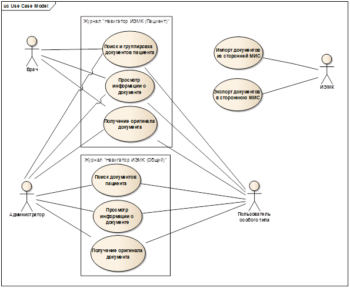

Интегрированная электронная медицинская карта  (далее ИЭМК) предназначена для ведения электронной истории болезни пациентов на региональном уровне.

* Эпикриз стационара
* Амбулаторный эпикриз
* Направление
* Протокол консультации
* Протокол инструментального исследования
* Протокол лабораторного исследования
* Медицинская справка о допуске к управлению транспортными средствами
* Эпикриз оказания скорой и неотложной помощи
* Заборы био-материала
* Прививки
* Форма 025
* Профосмотры
* Допдиспансеризация
* Заключения комиссии
* Карта лечения
* Осмотры ФТО
* Дневной стационар
* Осмотры врачей в отделении стационара 
* Осмотры врачей в приемном покое
* Резюме анестезиолога
* Сестринские карты 
* Патологоанатомия
* Заключение ВК
* Заключение заведующего
* Скорая помощь
* Трансфузиология
* Ресурсы
* Лист назначений
* Отмена назначения
* Диета
* Протоколы манипуляций

 

Поддержание ИЭМК пациента в актуальном состоянии обеспечивается за счет [[импорта документов пациента из сторонних МИС|Импорт документов]]. Для документов типа Направление предусмотрена возможность [[экспорта по запросу сторонней МИС|Экспорт документов]].

Для удобства использования  в навигаторе ИЭМК предусмотрен поиск документов пациента по ряду параметров  с возможностью просмотра печатной формы заголовка  документа и получения оригинала документа в формате pdf. Кроме того в навигаторе ИЭМК предусмотрена возможность группировки документов пациента по специальности сотрудника, типу документа, ЛПУ и по медицинской организации.

** **

**Диаграмма вариантов использования**

****

 

