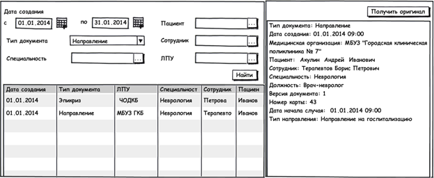
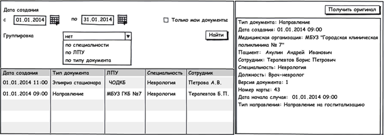

Просмотр информации о документе, а также получение оригинала документа в формате pdf предусмотрено из журналов "Навигатор ЭМК (Общий)" и  "Навигатор ЭМК (Пациент)". 

Журнал Навигатор ИЭМК (Общий) предназначен для просмотра всех опубликованных в ИЭМК документовЖурнал Навигатор ИЭМК (Пациент) предназначен для просмотра опубликованных в ИЭМК документов конкретного пациента (если вход в навигатор ИЭМК осуществлен через ЭМК пациента в МИС Медик+).  

Журнал Навигатор ИЭМК (Общий) содержит перечень всех опубликованных в ИЭМК документов. Источниками журнала являются документы [Заголовок](http://confluence.infinnity.lan/pages/viewpage.action?pageId=49774631).

Журнал визуально состоит из 2 панелей:

* 1 панель предназначена для отображения табличной части журнала, его фильтров. По умолчанию табличная часть журнала должна быть отсортирована по колонке Дата создания, документы с наиболее актуальной датой создания отображаются в начале списка.
* 2 панель предназначена для отображения печатной формы заголовка выбранного документа с возможностью получения оригинала документа формате pdf.

**Внешний вид журнала:**

****

**Колонки журнала**

|**Наименование колонки**|**Источник колонки**|
|Дата создания|Date из документа Заголовок|
|Тип документа|DocumentType из документа Заголовок (В случае, если DocumentType = "Амбулаторный эпикриз", в колонке необходимо отображать "Форма 025")|
|ЛПУ|MedicalOrganization из документа Заголовок. DisplayName: ShortName из документа "Мед. организация", при этом отображать необходимо Краткое наименование организации из справочника 1.2.643.5.1.13.2.1.1.178|
|Специальность|Speciality из документа Заголовок|
|Сотрудник|MedicalWorker из документа Заголовок. DisplayName: LastName+ FirstName+MiddleName из документа "Сотрудник"|
|Пациент|Patient из документа Заголовок. DisplayName: LastName+ FirstName+MiddleName+BirthTime из документа "Пациент"|

**Фильтры журнала**

|**Название**|**Тип данных**|**Дополнительные условия**|**Комментарий**|
|Дата создания с|DateTime|---|---|
|Дата создания по|DateTime|---|---|
|Тип документа|Object |Справочник [Локальный справочник DocumentTypeForFilter](http://knowledge:8081/pages/viewpage.action?pageId=49251702)|---|
|Специальность|Object |Справочник 1.2.643.5.1.13.2.1.1.181|DisplayName: Название записи из справочника|
|ЛПУ|Object |Справочник, источником которого выступают документы Мед.организация|DisplayName: FullName|
|Пациент|Object |Справочник [[Журнал пациентов|Журнал "Пациенты"]] (Региональный реестр пациентов)|DisplayName: LastName+ FirstName+MiddleName из документа Пациент|
|Сотрудник|Object |Справочник, источником которого выступают документы Сотрудник|DisplayName: LastName+ FirstName+MiddleName из документа Сотрудник|

* Фильтры должны располагаться на отдельной панели поскольку должна быть предусмотрена возможность их свернуть

** **

**Кнопки журнала**

|**Расположение**|**Кнопка**|**Видимость**|**Действие**|
|Action Bar (для 2-ой панели журнала).|Получить оригинал|Всегда|В отдельной вкладке приложения открывается неструктурированная часть документа  в виде печатной формы в формате pdf|

Журнал Навигатор ИЭМК (Пациент) содержит перечень всех опубликованных в ИЭМК документов для конкретного пациента (в случае, если вход в навигатор ИЭМК осуществлен через ЭМК пациента в МИС Медик+). Источниками журнала являются документы [Заголовок](http://confluence.infinnity.lan/pages/viewpage.action?pageId=49774631) для выбранного пациента.

Журнал визуально состоит из 2 панелей:

* 1 панель предназначена для отображения табличной части журнала, его фильтров и группировок. По умолчанию табличная часть журнала должна быть отсортирована по колонке Дата создания, документы с наиболее актуальной датой создания отображаются в начале списка.
* 2 панель предназначена для отображения печатной формы заголовка выбранного документа с возможностью получения оригинала документа формате pdf.

**Внешний вид журнала:**

 

**Колонки журнала**

|**Наименование колонки**|**Источник колонки**|
|Дата создания|Date из документа Заголовок|
|Тип документа|DocumentType из документа Заголовок (В случае, если DocumentType = "Амбулаторный эпикриз", в колонке необходимо отображать "Форма 025")|
|ЛПУ|MedicalOrganization из документа Заголовок. DisplayName: ShortName из документа "Мед. организация" при этом отображать необходимо Краткое наименование организации из справочника 1.2.643.5.1.13.2.1.1.178|
|Специальность|Speciality из документа Заголовок|
|Сотрудник|MedicalWorker из документа Заголовок. DisplayName: LastName+ FirstName+MiddleName из документа "Сотрудник"|

**Фильтры журнала**

|**Название**|**Тип данных**|**Автозаполнение**|**Особенности**|
|Дата создания с|DateTime|---|---|
|Дата создания по|DateTime|---|---|
|Только мои документы|Boolean|---|Позволяет фильтровать документы, в заголовке которых MedicalWorker – авторизованный сотрудник|

* Фильтры должны располагаться на отдельной панели поскольку должна быть предусмотрена возможность их свернуть

**Группировки журнала**

|**Название**|**Тип данных**|**Автозаполнение**|**Особенности**|
|Группировка|Справочник (нет, по специальности, по ЛПУ, по типу документа)|Нет|---|

**Кнопки журнала**

|**Расположение**|**Кнопка**|**Видимость**|**Действие**|
|Action Bar (для 2-ой панели журнала).|Получить оригинал|Всегда|В отдельной вкладке приложения открывается неструктурированная часть документа  в виде печатной формы в формате pdf|

**Команды журнала**

|**Расположение**|**Команда**|**Видимость**|**Действие**|
|Под фильтрами журнала (для 1-ой панели журнала).|Группировка |Всегда|При изменении значения в поле Группировка (ComboBox) осуществляется группировка документов табличной части журнала по указанному параметру (по специальности, по ЛПУ). Группы должны быть отсортированы в алфавитном порядке.|

