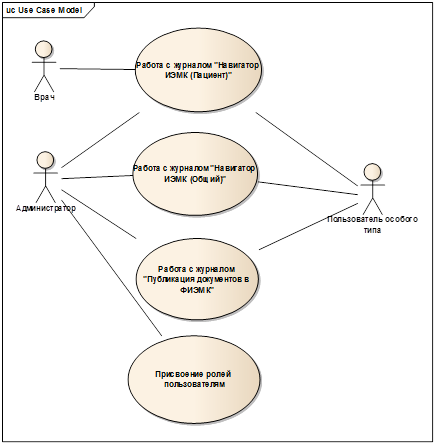

Название конфигурации: Ehr

# Дерево Требований проекта

## Региональный реестр пациентов (РРП)

Добавление пациента из сторонней МИС Валидация на заполнение обязательных полейПоиск по пациентамПередача информации по пациенту в стороннюю МИС по запросуОбновление данных по пациенту## Региональная ИЭМК

Аутентификация и авторизация пользователяРегистрация организации на сервисеРегистрация медицинского работника на сервисеИдентификация пациента на сервисеПубликация медицинских документов (1 уровень формализации)Обновление опубликованных документовУдаление опубликованных документов## Навигатор ИЭМК

Поиск по заголовкам опубликованных документовПросмотр опубликованных документовПросмотр структурированной заголовочной части документаВозможность просмотра неструктурированного тела документа (с обращением на сервер создавшей документ организации)Группировка опубликованных документов (по организации, по пациенту, по медицинскому работнику, по дате)## Интеграция с ФИЭМК  

Ручная публикация документов первого уровня формализации из региональной ИЭМК в ФИЭМК# **Нормативно-правовые акты**

ИЭМК учитывает требования следующих международных стандартов и документов по внедрению ЕГИСЗ:

Health Level Seven (HL) - стандарт обмена, управления и интеграции электронной медицинской информацииОписание элементов стандартизированных электронных медицинских. Часть 1. СЭМД. Заголовок документаОписание стандартизованных электронных медицинских документов (СЭМД)**Термины и определения**

|**Термин**|**Определение**|
|ВК|Врачебная комиссия|
|ЕГИСЗ|Единая государственная информационная система здравоохранения|
|ИЭМК|Интегрированная электронная медицинская карта|
|ЛПУ|Лечебно-профилактическое учреждение|
|МИС|Медицинская информационная система|
|СЭМД|Стандартизованный электронный медицинский документ|
|ФИЭМК|Федеральная интегрированная электронная медицинская карта|
|ФТО|Физио-терапевтическое отделение|

# Диаграмма вариантов использования

