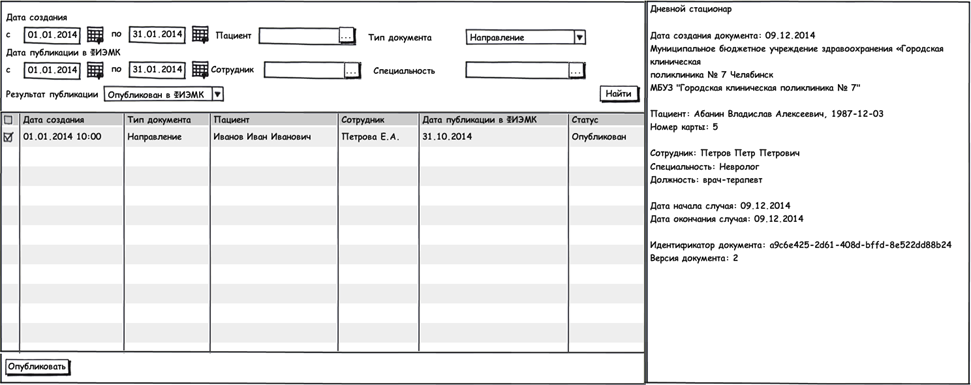

В системе предусмотрена возможность ручной публикации СЭМД первого уровня формализации (публикация заголовка документа в структурированном виде и тела в неструктурированном) в ФИЭМК из специализированного журнала (Публикация документов в ФИЭМК).

Публикация предусмотрена для следующих типов документов:

* Эпикриз стационара
* Амбулаторный эпикриз
* Направление. В качестве направления могут выступать направления на госпитализацию, направления на консультацию, направления на лабораторную и инструментальную диагностику (направления на обследование).

При импорте из сторонней МИС для каждого документа в ИЭМК  формируется соответствующий заголовок, причем для перечисленных типов документов (поле DocumentType в заголовке имеет значение "1- Эпикриз стационара", "2-Амбулаторный эпикриз" "3-Направление") заголовок помимо основного журнала документов попадает в журнал Публикация документов в ФИЭМК с возможностью дальнейшей публикации в ФИЭМК. 

Журнал Публикация документов в ФИЭМК содержит перечень всех документов, которые могут быть опубликованы в ФИЭМК. Такими документами являются:

* Эпикриз стационара
* Амбулаторный эпикриз
* Направление. В качестве направления могут выступать направления на госпитализацию, направления на консультацию, направления на лабораторную и инструментальную диагностику (направления на обследование).

 Источниками журнала являются документы Заголовок для которых поле DocumentType имеет значение "1- Эпикриз стационара", "2-Амбулаторный эпикриз" "3-Направление", а также документ "Публикация в ФИЭМК"

Документ "Публикация в ФИЭМК" предназначен для хранения данных публикации документов в ФИЭМК.

|**Наименование**|**Тип данных**|**Заголовок**|**Описание**|**Дополнительные условия**|**Комментарий**|
|PublicationDate|DateTime|Дата публикации|Дата публикации документа в ФИЭМК|---|---|
|PublicationError|String|Ошибка публикации|Ошибка публикации документа в ФИЭМК|---|---|
|PublicResult  |Object|Статус|Статус документа|Справочник Federal[[PublicResult|Справочники ИЭМК 2.0]]|DisplayName: Name1-Публикация в ФИЭМК невозможна - не заполнены обязательные поля в документах Заголовок, "Пациент", "Сотрудник", "Мед. организация", необходимые для публикации в ФИЭМК или тип документа, не соответствует типам документов, которые могут быть опубликованы в ФИЭМК.2-Не опубликован - отображает неопубликованные документы (PublicationDate и PublicationError не заполнены)3-В процессе публикации - отправлен запрос на публикацию документа, но callback не получен4-Опубликован -  отображает документы, которые опубликованы успешно (поле PublicationDate заполнено, PublicationError -не заполнено)5-Ошибка публикации - отображает документы, опубликованные с ошибкой (заполнены поля PublicationDate и PublicationError)|
|HeaderId|Uuid|Идентификатор заголовка|Идентификатор заголовка|---|---|

Валидация на обязательность полей:

|Поля|Обязательность|
|----|--------------|
|PublicResult  |Обязательно|

 Журнал визуально состоит из 2 панелей:

* 1 панель предназначена для отображения табличной части журнала, его фильтров и кнопок. По умолчанию табличная часть журнала должна быть отсортирована по колонке Дата создания, документы с наиболее актуальной датой создания отображаются в начале списка. Кроме того по умолчанию табличная часть журнала должна быть отфильтрована по ЛПУ авторизованного сотрудника.
* 2 панель предназначена для отображения печатной формы выбранного документа с просмотром неструктурированного контента в формате pdf.

**Внешний вид журнала:**

** **

**Колонки журнала**

|**Наименование колонки**|**Источник колонки**|
|---|Тип поля Флаг, колонка предназначена для выбора одного или нескольких документов. Предназначен для множественной публикации документов в ФИЭМК|
|Дата создания|Date из документа Заголовок|
|Тип документа|DocumentType документа Заголовок|
|Пациент|Patient документа Заголовок. DisplayName - LastName+FirstName+MiddleName из документа "Пациент"|
|Сотрудник|MedicalWorker документа Заголовок. DisplayName - LastName+ FirstName+MiddleName из документа "Сотрудник"|
|Дата публикации в ФИЭМК|PublicationDate документа Публикация документов в ФИЭМК|
|Статус|PublicResult документа Публикация документов в ФИЭМК|

 

**Фильтры журнала**

|**Название**|**Тип данных**|**Дополнительные условия**|**Комментарий**|
|Дата создания с|DateTime|---|---|
|Дата создания по|DateTime|---|---|
|Тип документа|Object|Справочник 1.2.643.5.1.13.2.1.1.646|DisplayName: "Наименование электронного медицинского документа"Выводить только  3 значения из справочника:* Эпикриз стационара
* Амбулаторный эпикриз
* Направление

|
|Пациент|Object |Справочник [[Журнал пациентов|Журнал "Пациенты"]] (Региональный реестр пациентов)|---|
|Сотрудник|Object |Документы "[[Сотрудник|Сотрудник (Practitioner)]]"|DisplayName:LastName+ FirstName+MiddleName из документа "Сотрудник"|
|Дата публикации в ФИЭМК с|DateTime|---|---|
|Дата публикации в ФИЭМК по|DateTime|---|---|
|Результат публикации|Object | Справочник Federal[[PublicResult|Справочники ИЭМК 2.0]]|1-Публикация в ФИЭМК невозможна - не заполнены обязательные поля в документах Заголовок, "Пациент", "Сотрудник", "Мед. организация", необходимые для публикации в ФИЭМК или тип документа, не соответствует типам документов, которые могут быть опубликованы в ФИЭМК.2-Не опубликован - отображает неопубликованные документы (PublicationDate и PublicationError не заполнены)3-В процессе публикации - отправлен запрос на публикацию документа, но callback не получен4-Опубликован -  отображает документы, которые опубликованы успешно (поле PublicationDate заполнено, PublicationError -не заполнено)5-Ошибка публикации - отображает документы, опубликованные с ошибкой (заполнены поля PublicationDate и PublicationError)|

** **По умолчанию журнал должен быть отфильтрован по текущему ЛПУ

**Кнопки журнала**

|**Расположение**|**Кнопка**|**Видимость**|**Действие**|
|Action Bar. Также кнопки доступны из контекстного меню.|Опубликовать|Всегда, за исключением случая, если документ уже опубликован (поле "Дата публикации" заполнено, поле "Ошибка не заполнено", строка выделена зеленым цветом)|Формирование запроса на отправку в ФИЭМК документа и данных пациента в соответствии с правилами формированияОтправка документа и данных пациента в ФИЭМК В случае успешной публикации документа в журнале указывается дата публикации.В случае ошибки публикации документа или ошибки при формировании документа в журнале указывается дата публикации, в печатной форме -текст ошибки|

 

**Цветовое кодирование:**

Красный - при статусе 1-Публикация в ФИЭМК невозможна 

Зеленый – при статусе 4-Опубликован

Желтый - при статусе 3-В процессе публикации

Розовый - при статусе 5-Ошибка публикации

Публикация документов из ИЭМК в ФИЭМК осуществляется в рамках обмена сообщениями и СЭМД, удовлетворяющими следующим требованиям:

Структура сообщений, обеспечивающих передачу клинического документа, соответствует требованиям   интеграционного профиля IHE XDS.b и HL7 v.2.5;Сообщение содержит определённый синтаксис и комплекс структур для обеспечения передачи СЭМД в формате документа HL7 CDA R2;Спецификация клинического документа задается с помощью  шаблона СЭМД;Клинический документ является полным информационным объектом, с полностью определёнными компонентами. Он может содержать текст, изображения, звук и другое мультимедийное содержание, а так же ссылки на мультимедийные данные, расположенные на других доступных ресурсах;Сообщения строго типизированы по назначению. Типы сообщений:* Запрос/передача СЭМД;
* Запрос/передача персональных данных пациента;

Передача электронных сообщений между ИЭМК и ФИЭМК осуществляется посредством web-сервисов. При этом:

* Web-сервисы выполняют роль точки доступа в ФИЭМК;
* Web-сервисы ФИЭМК публикуются через подсистему Интеграция Прикладных Систем (ИПС) системы ЕГИСЗ;
* Доступ к web-сервисам осуществляется по защищенному каналу;
* На уровне ИПС осуществляется авторизация и аутентификация МИС  и  авторизация пользователя ЕГИСЗ посредством ЕСИАиА;
* Результат обработки сообщения передается web-сервисом обратно в  ИЭМК через ИПС.

Структура сообщений, СЭМД и веб-сервисы описаны в документах "Сценарии взаимодействия ИЭМК с внешними системами v1.1", "Требования к МИС по обеспечению взаимодействия с системой ведения ИЭМК", "Комплект спецификаций без IHE v 1 2", "Комплект спецификаций c IHE v 2 6", "Описание СЭМД Часть 1. Заголовок документа. v1.2", опубликованных на официальном сайте [http://egisz-docs.rosminzdrav.ru/](http://egisz-docs.rosminzdrav.ru/) 

Для отправки СЭМД в ФИЭМК необходимо:

Со стороны конфигурации ИЭМК выгрузить данные о пациенте, сотруднике, мед. организации, документе  из документов Пациент, Сотрудник, Мед. организация, Заголовок в формате JSON. (структура JSON модели - [http://knowledge:8081/pages/viewpage.action?pageId=39485448](http://knowledge:8081/pages/viewpage.action?pageId=39485448)). При этом необходимо присваивать значения некоторых полей по умолчанию ввиду их отсутствия в документах Пациент, Сотрудник, Мед. организация, ЗаголовокСо стороны конфигурации сопоставить справочники, используемые в документах со справочниками  ФИЭМК, произвести соответствующие изменения.Со стороны конфигурации ФИЭМК сформировать CDA документ и подписать его ЭЦП.Со стороны конфигурации ФИЭМК сформировать запрос на передачу СЭМД и персональных данных пациента. Со стороны конфигурации ФИЭМК передать запрос посредством веб-сервисов ФИЭМК**Выгрузка данных**

**Данные о медицинском работнике**

Данные о медицинском работнике формируются из документа Сотрудник, при этом сотрудник должен соответствовать значению поля Сотрудник (MedicalWorker) соответствующего  документа Заголовок.

|**Наименование поля в заголовке**|**Наименование поля в модели данных JSON (**[**Модель данных медицинского работника**](http://knowledge:8081/pages/viewpage.action?pageId=39485454)**)**|
|Id|Id, UniqueNumber **MedicalWorkerId****, ****AuthenticatorPersonId********для модели документа Эпикриз выписной, **** ****MedicalWorkerId****  ****для модели документа Направление, Амбулаторный эпикриз**|
|LastName|LastName **AuthenticatorLastName для модели документа Эпикриз выписной**|
|FirstName|FirstName **AuthenticatorFirstName для модели документа Эпикриз выписной**|
|MiddleName|MiddleName **AuthenticatorMiddleName для модели документа Эпикриз выписной**|
|IdentityCards|IdentityCards|
|Snils|Requisites|
|Inn|Requisites|
|Addresses|Addresses|
|ContactInformation|* Phones – если Value = телефон,
* Emails - если Value =e-mail

|

**Данные  о пациенте**

Данные о пациенте формируются из документа Пациент, при этом пациент должен соответствовать значению поля Пациент (Patient) соответствующего документа Заголовок.

|**Наименование поля в заголовке**|**Наименование поля в модели данных JSON (**[**Модель данных пациента**](http://knowledge:8081/pages/viewpage.action?pageId=39485454)**)**|
|Id|Id, UniqueNumber, **PatientId для модели документа Эпикриз выписной, Направление, Амбулаторный эпикриз**|
|LastName|LastName|
|FirstName|FirstName|
|MiddleName|MiddleName|
|Sex|Sex|
|Snils|Requisites|
|Inn|Requisites|
|Citizenship|Citizenship|
|BirthTime|BirthTime|
|Birthplace|Birthplace|
|IsDeceased|IsDeceased|
|DeceasedTime|DeceasedTime|
|ResidenceType|ResidenceType|
|SocialStatus|SocialStatus|
|MaritalStatus|MaritalStatus|
|Language|Language|
|ContactInformation|* Phones – если Value = телефон,
* Emails - если Value =e-mail

|
|Addresses|Addresses|
|IdentityCards|IdentityCards|
|Policies|Policies|
|Job| |
|/JobCode|JobCode|
|/JobTitleName|JobTitleName |
|/OrganizationName|OrganizationName |
|Relationships|Relationships|
|Privilege|**Privilege**|
|.../IssueDate|.../IssueDate|
|.../ExpiryDate|.../ExpiryDate|
|.../Group|.../Group|

**Данные о медицинской организации**

Данные о медицинской организации формируются из документа Медицинская организация, при этом медицинская организация должна соответствовать значению поля Медицинская организация (MedicalOrganization) соответствующего документа Заголовок.

|**Наименование поля в заголовке**|**Наименование поля в модели данных JSON (Модель данных медицинской организации)**|
|PublicId|Id, PublicId, RegisterCode, Code **OrganizationId для модели данных пациента и мед. работника****DocumentOwner, AuthenticatorId для модели данных документа Эпикриз выписной****DocumentOwner для модели данных документа Направление, Амбулаторный эпикриз**|
|FullName|FullName       **DocumentOwnerName для модели данных документа Эпикриз выписной, Направление, Амбулаторный эпикриз**|
|ShortName|ShortName|
|Addresses|Addresses|
|ContactInformation|* Phones – если Value = телефон,
* Emails - если Value =e-mail

|
|Website|Website|
|Requisites|Requisites|

**Данные о документе**

Данные о документе берутся из документа Заголовок. В зависимости от типа документа (Амбулаторный эпикриз, Направление, Эпикриз стационара выписной) набор полей для формирования СЭМД будет отличаться.

|**Наименование поля в заголовке**|**Наименование поля в модели данных JSON (Эпикриз выписной)**|
|OriginalId|DocumentId|
|Date|Date|
|MedicalOrganization|Для определения соответствующего документа Мед. организация|
|Patient|Для определения соответствующего документа Пациент|
|MedicalWorker|Для определения соответствующего документа Сотрудник|
|Speciality|**Specialities для модели данных Мед. работник**|
|Post|AuthenticatorCode **Posts для модели данных Мед. работник**|
|DocumentVersionNumber|DocumentVersionNumber|
|CaseNumber|CaseNumber|
|EventStartDate|HospitalizationIssueDate|
|EventEndDate|HospitalizationExpiryDate|
|DispositionCode|HospitalizationDispositionCode|
|WhoDelivered|.../WhoDelivered|
|LengthOfStay|.../NumberOfDays|
|HospitalizationInThisYear|.../HospitalizationInThisYear|
|TimeAfterBegining|.../TimeAfterBegining|
|PrintView|NonXmlBody|

|**Наименование поля в заголовке**|**Наименование поля в модели данных JSON (Амбулаторный эпикриз****)**|
|OriginalId|DocumentId|
|Date|Date|
|MedicalOrganization|Для определения соответствующего документа Мед. организация|
|Patient|Для определения соответствующего документа Пациент|
|MedicalWorker|Для определения соответствующего документа Сотрудник|
|Speciality|**Specialities для модели данных Мед. работник**|
|Post|**Posts для модели данных Мед. работник**|
|DocumentVersionNumber|DocumentVersionNumber|
|CaseNumber|CaseNumber|
|EventStartDate|EventStartDate|
|EventEndDate|EventEndDate|
|DispositionCode|AmbulanceDispositionCode|
|PrintView|NonXmlBody|

|**Наименование поля в заголовке**|**Наименование поля в модели данных JSON (Направление)**|
|OriginalId|DocumentId|
|Date|Date|
|MedicalOrganization|Для определения соответствующего документа Мед. организация|
|Patient|Для определения соответствующего документа Пациент|
|MedicalWorker|Для определения соответствующего документа Сотрудник|
|Speciality|**Specialities для модели данных Мед. работник**|
|Post|**Posts для модели данных Мед. работник**|
|DocumentVersionNumber|DocumentVersionNumber|
|EventStartDate|IssueDate|
|DirectionType|DirectionType|
|PrintView|NonXmlBody|

 

**Значения по умолчанию**** **

|**Параметр**|**Эпикриз стационара выписной**|**Амбулаторный эпикриз**|**Направление**|
|AuthenticatorParticipant (Роль в оказании медицинской помощи. Элемент локального справочника 1.2.643.5.1.13.2.7.1.30)|Лечащий врач|Лечащий врач|Лечащий врач|
|Confidentiality (Уровень конфиденциальности документа. Элемент локального справочника 2.16.840.1.113883.5.25)|N|N|N|
|TermsOfCare(Условия оказания мед. помощи. Элемент справочника 1.2.643.5.1.13.2.1.1.103)|1-Стационарная медицинская помощь|2-Амбулаторная помощь|---|

** **

**Сопоставление классификаторов при формировании СЭМД для отправки в ФИЭМК**

Для получения корректных данных документа для передачи в ФИЭМК необходимо производить сопоставление справочников используемых в заголовке документа и справочников для формирования СЭМД. 

Для заголовков, у которых DocumentType имеет значение 3-Направление необходимо производить сопоставление  справочников  LocalDirectionType (справочник заголовка, поле DirectionType) и DirectionType (справочник СЭМД для ФИЭМК **1.2.643.5.1.13.2.7.1.2**). В документе, выгружаемом на ФИЭМК необходимо указывать значение из справочника DirectionType. |**LocalDirectionType**|**DirectionType (1.2.643.5.1.13.2.7.1.2****)**|
|1 - Госпитализация|1- Госпитализация|
|2 - Лабораторный анализ|2- Обследование|
|3 - Консультация|3- Консультация|
|4 - Инструментальное исследование|2- Обследование|

2.  Для заголовков, у которых DocumentType имеет значение 1- Эпикриз стационара необходимо производить сопоставление справочников V012 (справочник заголовка, Outcome для которого DL_USLOV = 1, поле HospitalizationDispositionCode) и 1.2.643.5.1.13.2.1.1.542 (справочник СЭМД для ФИЭМК). В документе, выгружаемом на ФИЭМК необходимо указывать значение из справочника 1.2.643.5.1.13.2.1.1.542

|**V012**|**1.2.643.5.1.13.2.1.1.542**|
|1 - Выздоровление|1-выписан|
|2 - Улучшение|1-выписан|
|3 - Без перемен|1-выписан|
|4 - Ухудшение|1-выписан|

3. Для заголовков, у которых DocumentType имеет значение  2-Амбулаторный эпикриз необходимо производить сопоставление  справочников V012 (справочник заголовка, Outcome для которого DL_USLOV = 3, поле AmbulanceDispositionCode) и 1.2.643.5.1.13.2.1.1.688 (справочник СЭМД для ФИЭМК). В документе, выгружаемом на ФИЭМК необходимо указывать значение из справочника 1.2.643.5.1.13.2.1.1.688

|**V012**|**1.2.643.5.1.13.2.1.1.688**|
|1 - Выздоровление|1 - выздоровление|
|2 - Ремиссия|3- без перемен|
|3 - Улучшение|2- улучшение|
|4 - Без перемен|3- без перемен|
|5 - Ухудшение|4- ухудшение|
|6 - Осмотр|3- без перемен|

Перед публикация заголовка документа в ФИЭМК производятся следующие действия:

Разрешение ссылок на справочники с приведением значений к стандартному виду с полями Code, CodeSystem, CodeSystemNameЗначения из массива ContactInformation помещаются в поля Phones и EmailsПолю PublicId организации присваивается значение PublicId.IdИз значения СНИЛС удаляются пробелы и дефисыЗначения полей заголовка Speciality и Post копируются в соответствующие поля медицинского работникаЗначения полей Snils и Inn пациента и медицинского работника копируются в коллекцию RequisitesДля значения поля DocumentType заголовка документа используется значение из справочника (присваивается CodeSystem = "1.2.643.5.1.13.2.1.1.646", CodeSystemName = "Система электронных медицинских документов")Полю NonXmlBody заголовка присваивается значение PrintViewОбъединение данных о медицинском работнике, пациенте, организации и заголовке по следующим правилам:  
 patient.Organization = organization  
 header.Patient = patient  
 header.Author = medicalWorker  
 header.Author.Organization = organization;  
  
  
  
 

 

 

 

  
  

