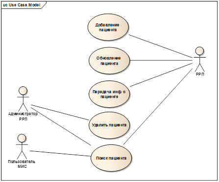

В рамках проекта ИЭМК 2.0 предусмотрено ведение регионального реестра пациентов (далее РРП). РРП предназначен для хранения актуальных данных пациента вне зависимости от того в какой МИС он был зарегистрирован и проходит обслуживание. РРП позволяет аккумулировать данные пациентов из любых МИС, обслуживающих ЛПУ по Челябинской области.

В РРП предусмотрена передача данных пациента по запросу, поскольку РРП может являться дополнительным источником данных о пациенте для сторонних МИС.

Поддержание РРП в актуальном состоянии обеспечивается за счет добавления и обновления данных пациента из сторонних МИС. Добавление и обновление данных пациента в РРП инициируется при поступлении запроса на добавление/обновление данных пациента в РРП. Добавления и обновление данных пациента в РРП возможно только при наличии у пациента СНИЛС.

Для удобства использования в РРП предусмотрен поиск пациента по ряду параметров  в специализированном журнале с возможностью подробного просмотра данных пациента.

РРП не предусматривает изменение данных пациента

 

 **Диаграмма вариантов использования** 

