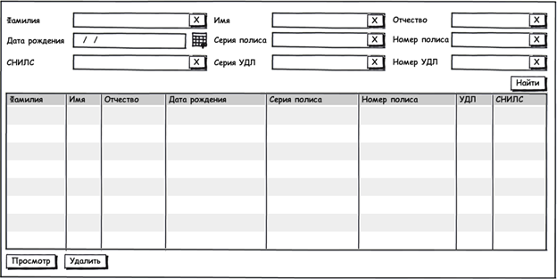

Журнал Пациенты предназначен для поиска, просмотра и удаления информации о пациенте. Журнал содержит перечень всех пациентов, опубликованных в региональном реестре пациентов за весь период времени за исключением удаленных пациентов.

 **Внешний вид журнала Пациенты**

**Колонки журнала**

|**Наименование колонки**|**Источник колонки**|
|Фамилия|LastName  **документа Пациент**|
|Имя|FirstName **документа Пациент**|
|Отчество|MiddleName **документа Пациент**|
|Дата рождения|BirthTime **документа Пациент**|
|Серия полиса|Series из сложного типа **Policy **документа Пациент|
|Номер полиса|Number из сложного типа **Policy документа Пациент**|
|СНИЛС|Value из сложного типа **Requisite документа Пациент, где **Type = 3 (СНИЛС)|
|УДЛ|Series + Number из сложного типа **IdentityCard******документа Пациент|

В дальнейшем необходимо предусмотреть возможность присваивать пациентам статусы (Опубликован, Помечен на удаление, Удален) с возможностью фильтрации. 

**Фильтры журнала**

|**Название**|**Тип данных**|**Автозаполнение**|**Особенности**|
|Фамилия|String|---|---|
|Имя|String|---|---|
|Отчество|String|---|---|
|Дата рождения|DateTime|---|---|
|Серия полиса|String|---|---|
|Номер полиса|String|---|---|
|СНИЛС|String|---|Маска ввода 111-111-111 11|
|Серия УДЛ|String|---|---|
|Номер УДЛ|String|---|---|

** **

**Кнопки журнала**

|**Расположение**|**Кнопка**|**Видимость**|**Действие**|
|Action Bar. Также кнопки доступны из контекстного меню.|Просмотр|Всегда|Открывает документ Пациент на просмотр|
|Удалить|Доступна только администратору системы|Пользователю будет выведено сообщение Вы действительно хотите удалить пациента <ФИО пациента + СНИЛС>?. В случае положительного ответа пациент удаляется из системы. Журнал "Пациенты" обновляется.|
|Найти|Всегда|Выводит перечень пациентов, соответствующих заданным параметрам|

**Валидации журнала**

|**Команда**|**Правило**|**Сообщение**|
|Найти|Если фильтр Фамилия заполнен, то он должен содержать не менее 2 символов|Если фильтр Фамилия заполнен , то он должен содержать не менее 2 символов|
|Если фильтр Имя заполнен, то он должен содержать не менее 2 символов|Если фильтр Имя заполнен , то он должен содержать не менее 2 символов|
|Если фильтр Отчество заполнен, то он должен содержать не менее 1 символа|Если фильтр Отчество заполнен, то он должен содержать не менее 1 символа|
|Если фильтр Номер полиса заполнен, то он должен содержать не менее 4 символов|Если фильтр Номер полиса заполнен, то он должен содержать не менее 4 символов|

