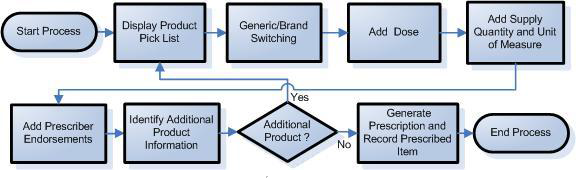

# Создание лекарственного назначения

 

Получить подробную документацию о всех доступных сервисах конфигурации можно по адресу:

http://<servername>:<port>/systemconfig/standardapi/metadata/helpconfiguration/?query={%22id%22:%22dmd%22}

|№|Сценарий|Рекомендации|
|-|--------|------------|
|1|Display Product Pick List|#### Отображение списка продуктов для выбора

В начале сценария пользователю для выбора показывается список результатов поиска по [[AMP|ActualProduct]] (Actual Medicinal Products) и [[VMP|VirtualProduct]] (Virtual Medicinal Products).Пользователю необходимо предоставить возможность поиска продукта по 4 возможным критериям:Generic Drug Name ([[VirtualProduct]].VirtualTherapeuticMoietyId.DisplayName)Brand Name ([[ActualProduct]].SupplierId.DisplayName)Generic Product Name ([[VirtualProduct]].Name)Actual Product Name ([[ActualProduct]].Name)Согласно рекомендациям, необходимо обеспечивать поиск как AMP так и по VMP. Соответственно, имеет смысл сделать переключатель AMP/VMP на форме продуктов для выбора.По умолчанию в загруженной форме списка элементов для выбора необходимо загружать первую страницу данных AMP/VMP, в зависимости от положения переключателя.В зависимости от этого выполнять один из нижеследующих запросов:см. документацию, запрос:"Получение постраничного списка данных справочника ActualProduct""Получение постраничного списка данных справочника VirtualProduct"Согласно рекомендациям, на форме журнала продуктов для выполнения подбора данных должны присутствовать фильтры. Поскольку в данный момент мы не сможем отрендерить другие фильтры, используем только полнотекстовый фильтр, пример см. в документации, запросы:"Получение данных справочника ActualProduct по части наименования (FullTextSearch запрос)""Получение данных справочника VirtualProduct по части наименования (FullTextSearch запрос)"В зависимости от положения переключателя выполняем следующие запросы:##### Переключатель в положении AMP

|№ критерия|Реализация|
|----------|----------|
|Generic Drug Name|Поиск не может быть выполнен|
|Brand Name|Поиск выполняется по полю SupplierId.DisplayName|
|Generic Product Name|Поиск выполняется по полю VirtualProductId.DisplayName |
|Actual Product Name|Поиск выполняется по полю Name|

##### Переключатель в положении VMP

|№ критерия| |
|----------|-|
|Generic Drug Name|Поиск выполняется по полю VirtualProduct.VirtualTherapeuticMoietyId.DisplayName|
|Brand Name|Поиск не может быть выполнен |
|Generic Product Name|Поиск выполняется по полю Name|
|Actual Product Name|Поиск выполняется по полю ActualProducts.$.DisplayName , где $ номер каждого элемента коллекции ActualProducts|

Ввод данных при этом выполняется в одно поле, но, в зависимости от введенных данных поиска, поиск вернет записи, отфильтрованные полнотекстовым поиском по тому или иному полю |
|2|Generic/Brand Switching|#### Переключение между AMP / VMP

Если на предыдущем шаге пользователь выбрал VMP, он может переключиться на AMP. В этом случае ему необходимо предоставить возможность выбрать AMP из списка препаратов, соответствующих ранее выбранному VMPДля этого следует выполнить запрос (см.документацию):"Получение данных справочника ActualProduct по соответствующему идентификатору VirtualProduct"Также можно переключиться c AMP на VMP. Для этого следует выполнить запрос (см.документацию)"Получение данных справочника VirtualProduct по соответствующему идентификатору ActualProduct"В общем случае, существуют дополнительные обстоятельства, ограничивающие возможность замены VMP на AMP и обратно, однако текущая реализация не позволяет пока их учитывать. Поэтому позволяем пользователю осуществлять переключение в любой момент|
|3|Add Dose|#### Добавление лекарственного назначения

На данном шаге создаем лекарственное назначение для ранее выбранного AMP/VMP. Эта сущность представляет собой отдельный документ ([[Medication Administration|MedicationAdministration]]), хранящий ссылку на пациента, которому назначен препарат.|
|4|Add Supply Quantity and Unit of Measure|Добавление количества и указание единицы измеренияНа данном шаге пользователь может выбрать VMPP (Virtual Medicinal Product Pack), соответствующий VMP для выбранного AMP, но только такой VMPP, для которого существует хотя бы один AMPP (Actual Medicine Product Pack)Доступные VMPP для выбранного VMP можно получить с использованием запроса:#### пока не добавлено, просто позволяем выбрать любую VMPP из списка Virtual Packs у VirtualProduct

|
|5|Add Prescriber Endorsements|#### Подтверждение выписки

В Великобритании, как и в России, существуют препараты, при выписке которых врач должен подтвердить, что он в курсе, что эти препараты входят в особые списки. В описании упаковки (AMPP) присутствует информация о назначении упаковки существующего лекарственного средства ([[ActualProductPack]].[[Prescribing|ActualProductPackPrescribing]]), ее и нужно отобразить пользователю на шаге подтверждения.|
|6|Identify Additional Product Information|#### Предоставление дополнительной информации по продукту

Находится внутри выбранного VMPК дополнительной информации относится:* ControlCategory (контроль за оборотом наркотикосодержащих средств и т.п)
* FP10 MDA Form (признак того, что для данного лекарства должна быть заполнена форма FP10 MDA)
* IsPersonallyAdministered (признак персональной ответственности за препарат)

|
|7|Additional Product|#### Добавить еще один продукт к назначению

Открыть заново форму подбора AMP/VMP|
|8|Generate Prescription and Record Prescribed Item|#### Сгенерировать назначение и сохранить

Запросы:"Сохранение документа назначения в хранилище","Чтение документа назначения из хранилища""Удаление документа назначения из хранилища"|

