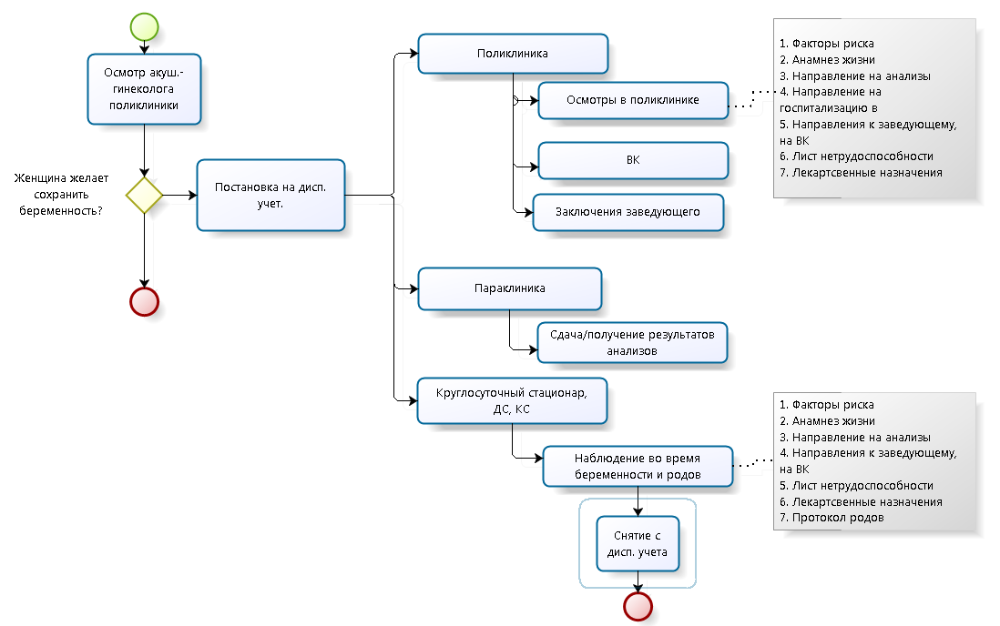

Подсистема предназначена для автоматизации процесса ведения беременности с момента постановки на учет до момента родов и снятия с учета в женской консультации.

## Нормативные акты:

Ведение беременности регламентируется следующими нормативными документами:

* Приказ Минздрава России от 01.11.2012 N 572н (ред. от 17.01.2014) "Об утверждении Порядка оказания медицинской помощи по профилю "акушерство и гинекология
* Приказ от 28.12.2000 г. 457 "О совершенствовании пренатальной диагностики в профилактике врожденных и наследственных заболеваний у детей" 
* Приказ Министерства здравоохранения и социального развития РФ от 28 ноября 2005 г. N 701 "О родовом сертификате"

## Описание процесса

В наглядном виде процесс ведения беременности представлен на рис. 1.

 

Процесс ведения беременности инициализируется постановкой на диспансерный учет, который осуществляется в рамках осмотра акушера-гинеколога поликлиники при установлении факта беременности и  желании женщины сохранить беременность.

 В рамках диспансерного учета по беременности проводятся осмотры в рамках которых:

Лечащий врач:

* Ведет индивидуальную карту беременной, роженицы и родильницы
* Ведет обменную карту/диспансерную книжку, которая находится на руках пациента
* Учитывает факторы риска во время беременности
* Выдает направления на осмотры профильных специалистов, заведующего, ВК,  анализы, госпитализацию
* Дает рекомендации по лечению, назначает лекарственные средства
* Выдает справки для работодателя: о наличии беременности, о переводе беременной на другую работу, о постановке на учет в ранние сроки беременности.
* Выдает родовой сертификат
* Выдает листы нетрудоспособности

Пациент:

* Посещает осмотры акушера-гинеколога и профильных специалистов согласно графику, установленному лечащим врачом (здесь и далее под лечащим врачом понимается врач, у которого данный пациент состоит на диспансерном учете по беременности).
* Проходит инструментальное и лабораторное исследование
* Госпитализируется в стационар при наличии показаний, а также наблюдается во время родов и в послеродовом периоде до выписки из родильного отделения

Осмотры, проводимые во время диспансерного учета могут проходить непосредственно в поликлинике или же в рамках патронажного наблюдения в случае, если пациентом не соблюдается график посещения лечащего врача и в количестве 2-3 раз после выписки пациента из родильного отделения.

При нормальном течении беременности предусмотрено следующее количество посещений врачей специалистов:

 

|**Врач**|**Осмотр**|
|Врач-акушер-гинеколог|не менее 7 раз|
|Врач-терапевт|не менее 2 раз|
|врач-стоматолог|не менее 2 раз|
|врач-оториноларинголог|не менее 1 раза (не позднее 7-10 дней после первичного обращения в женскую консультацию)|
|врач-офтальмолог|не менее 1 раза (не позднее 7-10 дней после первичного обращения в женскую консультацию)|
|другие врачи-специалисты|по показаниям, с учетом сопутствующей патологии.|

 

Периодичность посещения лечащего врача при нормальном течении беременности представлена на рис. 2.

 

В период ведения беременности помимо документов осмотров, анализов, результатов ВК, смотров заведующих, КС, включая протокол родов, ДС и СД оформляются документы, перечисленные в табл. 2 

|**Документ**|**Когда оформляется**|**Форма документа, характеристика**|**Есть ли необходимость формировать в МИС**|
|Справка о наличии беременности|При обращении в женскую консультацию по факту подтверждения беременности при необходимости|Заполняется в произвольной форме|Да, в форме отчета|
|Заключение о переводе беременной на другую работу|При обращении в женскую консультацию по факту подтверждения беременности при необходимости|Форма  №084/у, может отличаться для каждой МО.Должно содержать конкретные указания на то, какие именно производственные факторы являются для работницы неблагоприятными.|Да, в форме отчета|
|Справка о постановке на учет в первые 12 нед.|Выдается одновременно с листком нетрудоспособности по беременности и родам (на 30 нед или на 28 нед. при многоплодной беременности).|Заполняется в произвольной форме в  женской консультации либо другой МО поставившей на учет.|Да, в форме отчета|
|Инд. карта беременной и родильницы  |Оформляется с даты постановки на учет, хранится в женской консультации|Форма  №111/у, может отличаться для каждой МО. Содержит данные о наблюдении беременности. |Да, в форме отчета|
|Факторы риска по беременности|При первой явке, на 22 нед, на 34 нед, на 38 нед.|Шкала оценки факторов риска перинатальной патологии. Представляет из себя документ, в который вносятся дополнения  в зависимости от срока беременности.Факторы риска учитываются при ведении беременности, а также  при определении способа родовспоможения в зависимости для уменьшения вероятности болезни или смерти матери или новорожденного до или после родов выше, чем обычно|Да, в форме документа|
|Обменная карта|Оформляется с даты постановки на учет, ведется наравне с инд. картой беременной, роженицы и родильницы. Выдается на руки пациентке на сроке 23-25 нед. (в некоторых МО выдается на руки с первой явки)|Форма №113/у, может отличаться для каждой МО.Состоит из 3 отрывных талонов:* Первый талон хранится в истории родов.
* Второй талон "Сведения родильного дома, родильного отделения больницы о родильнице" заполняется в акушерском стационаре перед выпиской родильницы и выдается ей для передачи в женскую консультацию.
* Третий талон "Сведения родильного дома, родильного отделения больницы о новорожденном" заполняется в детском отделении акушерского стационара перед выпиской новорожденного и выдается матери для передачи его в детскую поликлинику. На основании сведений обменной карты родильного дома, родильного отделения больницы 113/у заполняется история развития ребенка, форма №112/у.

|Да, в форме отчета|
|Родовой сертификат |Выдается на 30 нед.|Форма строгой отчетности, изготовление осуществляется ФСС. Является защищенной полиграфической продукцией уровня "В" Состоит из 6 талонов:* первая часть - корешок родового сертификата для подтверждения выдачи родового сертификата;
* вторая часть - талон №1 для оплаты женской консультации на поликлиническом этапе
* третья часть - талон №2 родового сертификата  для оплаты помощи, оказываемой во время родов в родильных домах
* четвертая часть - родовый сертификат, служащий подтверждением оказания медицинской помощи женщинам в период беременности и родов учреждениями здравоохранения;
* пятая часть - талон №3-2 родового сертификата для оплаты за вторые шесть месяцев диспансерного наблюдения ребенка;
* шестая часть - талон №3-1 родового сертификата для оплаты услуг за первые шесть месяцев диспансерного наблюдения ребенка.

|Нет|
|Лист нетрудоспособности по беременности и родам|На 30 нед. или на 28 нед. при многоплодной беременности|См. раздел [[Листы нетрудоспособности|33. Листки нетрудоспособности]]|Да, в форме документа|

