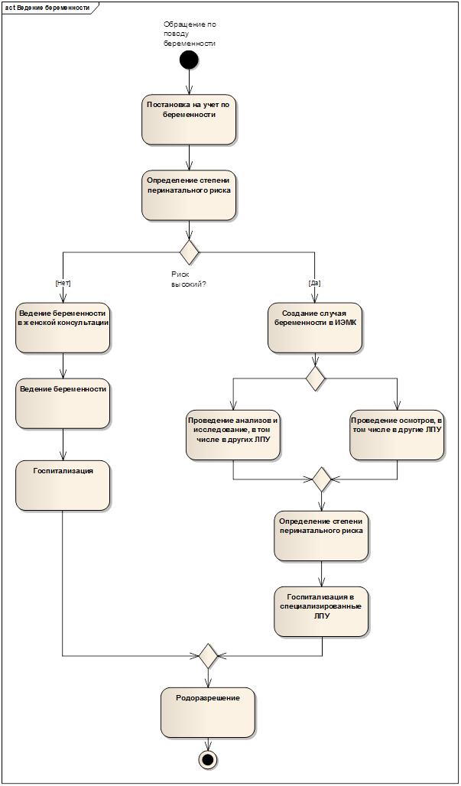
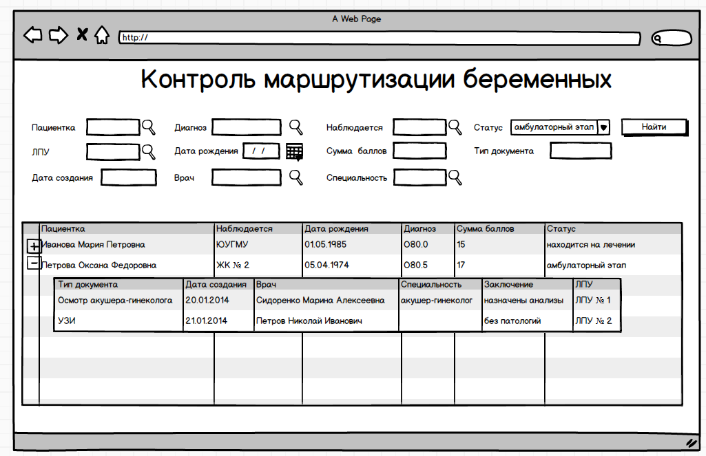

---
layout: default
title: 2. Разработка конфигурации (общее описание БП)
position: 1
categories: 
tags: 
---

Модуль предназначен для выполнения следующих функций:

Хранение в электронном виде с целью учета и мониторинга процесса сопровождения беременности данных по ИБ в едином реестреКонтроль отклонений в части оказания услуг беременным в зависимости от степени риска и уровня ЛПУГруппировка информации по оказанным услугам в ходе перемещения пациента между разными ЛПУ#### Схема процесса:

При первичном обращении беременной женщины осуществляется постановка ее на диспансерный учет. Оценку степени риска проводят при первой явке, на 22 нед, на 34 нед, на 38 нед..

Постановка на диспансерный учет по беременности при высокой степени риска перинатальной патологии рождает случай. Данный случай попадет в интегрированную электронную медицинскую карту в тот момент, когда в документе "Осмотр акушера гинеколога" был установлен флаг "Высоко рисковая беременность" . Все документы, созданные в рамках диспансерного учета по беременности, объединяются в один случай. Доступ к  данному случаю могут иметь прочие лечебно-профилактические учреждения, которые занимаются вопросом ведения беременности, а именно ЛПУ 2 и 3 категории.

Все документы, собранные в единый случай позволяют отследить качество оказанной медицинской помощи в рамках беременности, а так же полноту и своевременность оказанной помощи. На основании показаний в документах принимается решение о госпитализации пациентки. При этом решение о направлении на госпитализации видят специализированные стационарные учреждения, которые ответственны за  ведение беременных с высокой степенью перинатального риска.

 

**Основание для отнесения беременности к высоко рисковой:**

Установлен флаг Высоко рисковая беременность в документе Осмотр акушера-гинеколога

### Журнал Контроль маршрутизации беременных

Журнал предназначен для хранения истории по случаю высоко рисковой беременности. Журнал иерархический, хранит в себе все документы по случаю.

Доступ к журналу должны иметь ЛПУ 2 и 3 категории.

Описание столбцов первого уровня иерархии:

|**Наименование колонки**|**Источник**|
|Пациентка|ФИО из ЭМК пациента|
|Наблюдается|ЛПУ, в которой была осуществлена постановка на диспансерный учет по беременности|
|Дата рождения|Из ЭМК пациента|
|Диагноз|Диагноз из документа Постановка на диспансерный учет|
|Сумма баллов|Заключение из документа Факторы риска перинатальной патологии|
|Статус||**Значение**|**Логика**|
|Амбулаторный этап|Постановка на диспансерный учет|
|Находится на лечении|Для пациентки создан документ Госпитализация. После того, как создан документ Выписка с диагнозом != О60-О80, статус  снова становится Амбулаторный этап|
|Родила|Для пациентки создан документ  Выписка с диагнозом из групп О60-О80|

|

 

Описание столбцов второго уровня иерархии:

|**Наименование колонки**|**Источник**|
|Тип документа|Тип созданного документа|
|Дата создания|Дата создания документа|
|Врач|Специалист, создавший документ|
|Специальность|Специальность врача, создавшего документ|
|Заключение|Заключение из документов специалистов|
|ЛПУ|ЛПУ, в котором был создан данный документ|

 

Фильтры журнала

|**Название**|**Комментарий**|
|Пациентка|Поиск осуществляется по базе пациентов|
|Диагноз|МКБ-10|
|Наблюдается|Справочник ЛПУ|
|Статус|Фильтруется по 3 статусам:- Амбулаторный этап- Находится на лечении- Родила|
|ЛПУ|Справочник ЛПУ|
|Дата рождения|Дата|
|Сумма баллов| |
|Тип документа| |
|Дата создания| |
|Врач|Справочник сотрудников|
|Специальность|Терминология специальностей|

 

 

#### **Документы:**

Документ "Оценка факторов риска перинатальной патологии".

Создается в момент постановки на диспансерный учет во время первого осмотра акушером-гинекологом. На весь случай беременности документ один, пополняется в течение беременности.

 

