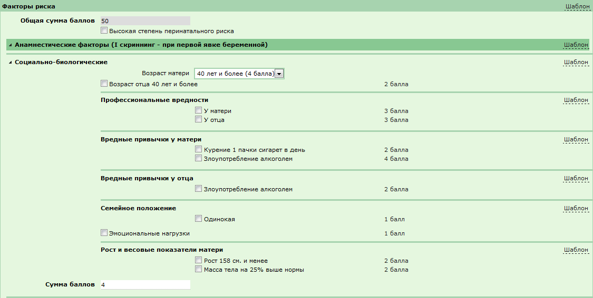
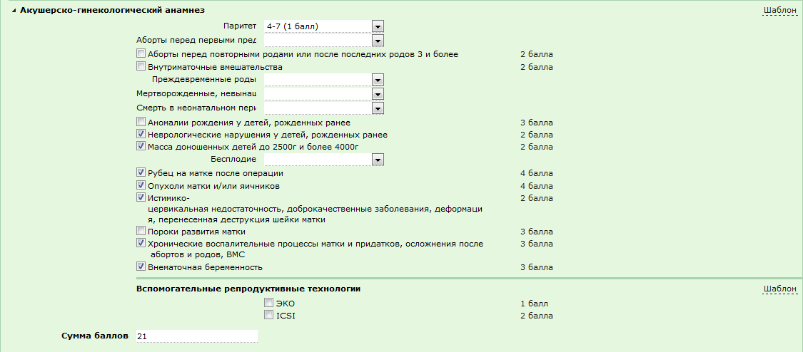
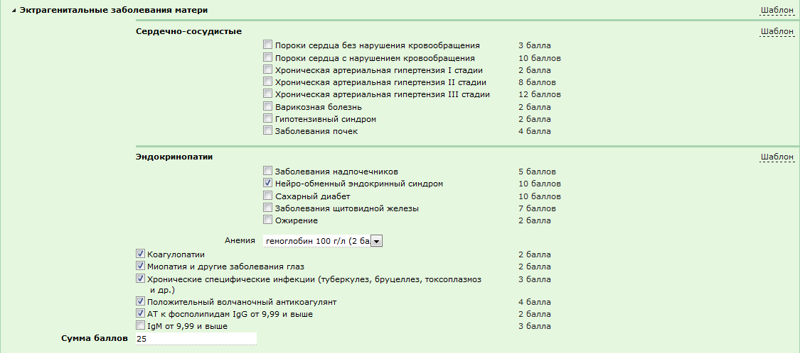
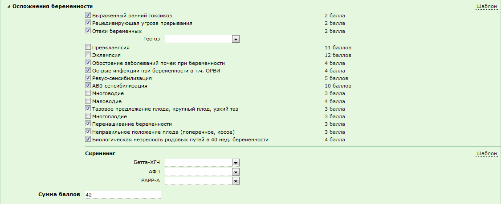
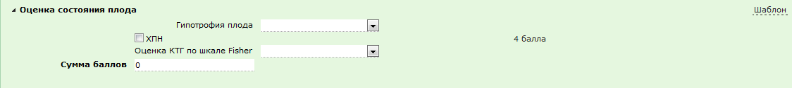
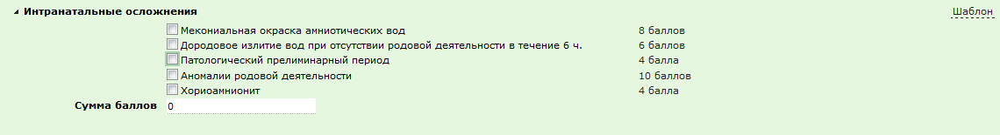
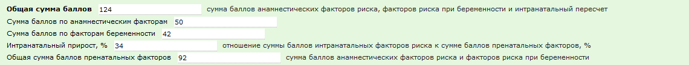

В документ "Осмотр акушера-гинеколога поликлиники" необходимо перед секцией "Заключение осмотра" добавить секцию "Факторы риска" состоящую из трех разделов:  "Анамнестические факторы (I скриннинг - при первой явке беременной)", "Факторы беременности (II скриннинг в 28, 32 недели, III скриннинг - в конце беременности)", " Интранатальные факторы (IV скриннинг - в родах)". При переходе в секцию по умолчанию должен быть развернут первый раздел, остальные свернуты. При переходе в новый раздел предыдущий сворачивается. При отметке флагом фактора риска происходит автоматический пересчет общей суммы баллов по разделу и общей суммы баллов.

**Описание секции "Факторы риска":**

[1] Общая сумма баллов  
*Тип поля:* Числовой, доступно только для чтения (название поля выделено жирным шрифтом)  
*Значение по умолчанию:* Подсчитывается общая сумма баллов по всем факторам**  
**[1] Высокая степень перинатального риска  
*Тип поля:* Флаг  
*Значение по умолчанию:* Не установлен*[1] Раздел " Анамнестические факторы (I скриннинг - при первой явке беременной) (подключен шаблон)*

[1] Социально-биологические (подраздел с возможностью сворачивания, подключен шаблон)[1] Возраст матери  
*Тип поля:* Выпадающий список со значениями: "риск отсутствует (0 баллов)", "18 лет и менее (2 балла)", "40 лет и более (4 балла)"  
*Значение по умолчанию:* Не установлено[1] Возраст отца 40 лет и более (2 балла)  
*Тип поля:* Флаг  
*Значение по умолчанию:* Не установлено[1] Профессиональные вредности (подключен шаблон)  
[1] У матери (2 балла)  
*Тип поля:* Флаг  
*Значение по умолчанию:* Не установлено

[1] У отца (2 балла)  
*Тип поля:* Флаг  
*Значение по умолчанию:* Не установлено

[1] Вредные привычки у матери (подключен шаблон)[1] Курение 1 пачки сигарет в день (2 балла)  
*Тип поля:* Флаг  
*Значение по умолчанию:* Не установлено

[1] Злоупотребление алкоголем (4 балла)  
*Тип поля:* Флаг  
*Значение по умолчанию:* Не установлено

[1] Вредные привычки у отца (подключен шаблон)[1] Злоупотребление алкоголем (2 балла)  
*Тип поля:* Флаг  
*Значение по умолчанию:* Не установлено

[1] Семейное положение (подключен шаблон)[1] Одинокая (1 балл)  
*Тип поля:* Флаг  
*Значение по умолчанию:* Не установлено

[1] Эмоциональные нагрузки (1 балл)  
*Тип поля:* Флаг  
*Значение по умолчанию:* Не установлено

[1] Рост и весовые показатели матери (подключен шаблон)[1] Рост 158 см. и менее (2 балла)  
*Тип поля:* Флаг  
*Значение по умолчанию:* Не установлено

[1] Масса тела на 25% выше нормы (2 балла)  
*Тип поля:* Флаг  
*Значение по умолчанию:* Не установлено

[1] Сумма баллов  
*Тип поля:* Числовое  
*Значение по умолчанию:* Подсчитывается сумма баллов по социально-биологическим факторам  
  

[1] Акушерско-гинекологический анамнез (подраздел с возможностью сворачивания, подключен шаблон)[1] Паритет  
*Тип поля:* Выпадающий список со значениями: "4-7 (1 балл)", "8 и более (2 балла)"  
*Значение по умолчанию:* Не установлено[1] Аборты перед первыми предстоящими родами  
*Тип поля:* Выпадающий список со значениями: "1 (2 балла)", "2 (3 балла)", "3 и более (4 балла)"  
*Значение по умолчанию:* Не установлено[1] Аборты перед повторными родами или после последних родов 3 и более (2 балла)  
*Тип поля:* Флаг  
*Значение по умолчанию:* Не установлено

[1] Внутриматочные вмешательства (2 балла)  
*Тип поля:* Флаг  
*Значение по умолчанию:* Не установлено

[1] Преждевременные роды  
*Тип поля:* Выпадающий список со значениями: "1 (2 балла)", "2 и более (3 балла)"  
*Значение по умолчанию:* Не установлено[1] Мертворожденные, невынашивание, неразвивающаяся беременность  
*Тип поля:* Выпадающий список со значениями: "1 (3 балла)", "2 и более (8 баллов)"  
*Значение по умолчанию:* Не установлено[1] Смерть в неонатальном периоде  
*Тип поля:* Выпадающий список со значениями: "1 (2 балла)", "2 и более (7 баллов)"  
*Значение по умолчанию:* Не установлено[1] Аномалии рождения у детей, рожденных ранее (3 балла)  
*Тип поля:* Флаг  
*Значение по умолчанию:* Не установлено

[1] Неврологические нарушения у детей, рожденных ранее (2 балла)  
*Тип поля:* Флаг  
*Значение по умолчанию:* Не установлено

[1] Масса доношенных детей до 2500г и более 4000г (2 балла)  
*Тип поля:* Флаг  
*Значение по умолчанию:* Не установлено

[1] Бесплодие  
*Тип поля:* Выпадающий список со значениями: "2-4 года (2 балла)", "5 лет и более (7 баллов)"  
*Значение по умолчанию:* Не установлено[1] Рубец на матке после операции (4 балла)  
*Тип поля:* Флаг  
*Значение по умолчанию:* Не установлено

[1] Опухоли матки и/или яичников (4 балла)  
*Тип поля:* Флаг  
*Значение по умолчанию:* Не установлено

[1] Истимико-цервикальная недостаточность, доброкачественные заболевания, деформация, перенесенная деструкция шейки матки (2 балла)  
*Тип поля:* Флаг  
*Значение по умолчанию:* Не установлено

[1] Пороки развития матки  (3 балла)  
*Тип поля:* Флаг  
*Значение по умолчанию:* Не установлено

[1] Хронические воспалительные процессы матки и придатков, осложнения после абортов и родов, ВМС (3 балла)  
*Тип поля:* Флаг  
*Значение по умолчанию:* Не установлено

[1] Внематочная беременность (3 балла)  
*Тип поля:* Флаг  
*Значение по умолчанию:* Не установлено

[1] Вспомогательные репродуктивные технологии (подключен шаблон)[1] ЭКО (1 балл)  
*Тип поля:* Флаг  
*Значение по умолчанию:* Не установлено

[1] ICSI (1 балл)  
*Тип поля:* Флаг  
*Значение по умолчанию:* Не установлено

[1] Сумма баллов  
*Тип поля:* Числовое  
*Значение по умолчанию:* Подсчитывается сумма баллов по акушерско-гинекологическому анамнезу  
  
[1]  Эктрагенитальные заболевания матери (подраздел с возможностью сворачивания, подключен шаблон)[1]  Сердечно-сосудистые (подключен шаблон)  
[1] Пороки сердца без нарушения кровообращения (3 балла)  
*Тип поля:* Флаг  
*Значение по умолчанию:* Не установлено

[1]  Пороки сердца с нарушением кровообращения (10 баллов)  
*Тип поля:* Флаг  
*Значение по умолчанию:* Не установлено

[1]   Хроническая артериальная гипертензия I стадии (2 балла)  
*Тип поля:* Флаг  
*Значение по умолчанию:* Не установлено

[1]   Хроническая артериальная гипертензия II стадии (8 баллов)  
*Тип поля:* Флаг  
*Значение по умолчанию:* Не установлено

[1]   Хроническая артериальная гипертензия III стадии (12 баллов)  
*Тип поля:* Флаг  
*Значение по умолчанию:* Не установлено

[1]   Варикозная болезнь (2 балла)  
*Тип поля:* Флаг  
*Значение по умолчанию:* Не установлено

[1]   Гипотензивный синдром (2 балла)  
*Тип поля:* Флаг  
*Значение по умолчанию:* Не установлено

[1]   Заболевания почек (4 балла)  
*Тип поля:* Флаг  
*Значение по умолчанию:* Не установлено

[1]  Эндокринопатии (подключен шаблон)[1] Заболевания надпочечников (5 баллов)  
*Тип поля:* Флаг  
*Значение по умолчанию:* Не установлено

[1] Нейро-обменный эндокринный синдром (10 баллов)  
*Тип поля:* Флаг  
*Значение по умолчанию:* Не установлено

[1] Сахарный диабет (10 баллов)  
*Тип поля:* Флаг  
*Значение по умолчанию:* Не установлено

[1] Заболевания щитовидной железы (7 баллов)  
*Тип поля:* Флаг  
*Значение по умолчанию:* Не установлено

[1] Ожирение (2 балла)  
*Тип поля:* Флаг  
*Значение по умолчанию:* Не установлено

[1] Анемия  
*Тип поля:* Выпадающий список со значениями: "гемоглобин 110 г/л (1 балл)", "гемоглобин 100 г/л (2 балла)", "гемоглобин 90 г/л (4 балла)"  
*Значение по умолчанию:* Не установлено

[1] Коагулопатии (2 балла)  
*Тип поля:* Флаг  
*Значение по умолчанию:* Не установлено

[1] Миопатия и другие заболевания глаз (2 балла)  
*Тип поля:* Флаг  
*Значение по умолчанию:* Не установлено

[1] Хронические специфические инфекции (туберкулез, бруцеллез, токсоплазмоз и др.) (3 балла)  
*Тип поля:* Флаг  
*Значение по умолчанию:* Не установлено

[1] Положительный волчаночный антикоагулянт (4 балла)  
*Тип поля:* Флаг  
*Значение по умолчанию:* Не установлено

[1] AT к фосполипидам IgG от 9,99 и выше (2 балла)  
*Тип поля:* Флаг  
*Значение по умолчанию:* Не установлено

[1]  IgM от 9,99 и выше  (3 балла)  
*Тип поля:* Флаг  
*Значение по умолчанию:* Не установлено

[1] Сумма баллов  
*Тип поля:* Числовое  
*Значение по умолчанию:* Подсчитывается сумма баллов по эктрагенитальным заболеваниям матери  
  

*[1] Раздел "Факторы беременности (II скриннинг в 28, 32 недели, III скриннинг - в конце беременности" (подключен шаблон)*

[1] Осложнения беременности (подраздел с возможностью сворачивания, подключен шаблон)[1] Выраженный ранний токсикоз (2 балла)  
*Тип поля:* Флаг  
*Значение по умолчанию:* Не установлено

[1] Рецедивирующая угроза прерывания (2 балла)  
*Тип поля:* Флаг  
*Значение по умолчанию:* Не установлено

[1] Отеки беременных (2 балла)  
*Тип поля:* Флаг  
*Значение по умолчанию:* Не установлено

[1] Гестоз  
*Тип поля:* Выпадающий список со значениями: "легкой степени (3 балла)", "средней степени (5 баллов)", "тяжелой степени (10 баллов)"  
*Значение по умолчанию:* Не установлено

[1] Преэклампсия (11 баллов)  
*Тип поля:* Флаг  
*Значение по умолчанию:* Не установлено

[1] Эклампсия (12 баллов)  
*Тип поля:* Флаг  
*Значение по умолчанию:* Не установлено

[1] Обострение заболеваний почек при беременности (4 балла)  
*Тип поля:* Флаг  
*Значение по умолчанию:* Не установлено

[1] Острые инфекции при беременности в т.ч. ОРВИ (4 балла)  
*Тип поля:* Флаг  
*Значение по умолчанию:* Не установлено

[1] Резус-сенсибилизация (5 баллов)  
*Тип поля:* Флаг  
*Значение по умолчанию:* Не установлено

[1] AB0-сенсибилизация (10 баллов)  
*Тип поля:* Флаг  
*Значение по умолчанию:* Не установлено

[1] Многоводие (3 балла)  
*Тип поля:* Флаг  
*Значение по умолчанию:* Не установлено

[1] Маловодие (4 балла)  
*Тип поля:* Флаг  
*Значение по умолчанию:* Не установлено

[1] Тазовое предлежание плода, крупный плод, узкий таз (3 балла)  
*Тип поля:* Флаг  
*Значение по умолчанию:* Не установлено

[1] Многоплодие (3 балла)  
*Тип поля:* Флаг  
*Значение по умолчанию:* Не установлено

[1] Перенашивание беременности (3 балла)  
*Тип поля:* Флаг  
*Значение по умолчанию:* Не установлено

[1] Неправильное положение плода (поперечное, косое) (3 балла)  
*Тип поля:* Флаг  
*Значение по умолчанию:* Не установлено

[1] Биологическая незрелость родовых путей в 40 нед. беременности (4 балла)  
*Тип поля:* Флаг  
*Значение по умолчанию:* Не установлено

[1] Скриннинг (подключен шаблон)[1] Бетта-ХГЧ  
*Тип поля:* Выпадающий список со значениями: "повышение уровня (3 балла)", "снижение уровня (4 балла)  
*Значение по умолчанию:* Не установлено

[1] АФП  
*Тип поля:* Выпадающий список со значениями: "повышение уровня (6 баллов)", "снижение уровня (8 баллов)  
*Значение по умолчанию:* Не установлено

[1] РАРР-А  
*Тип поля:* Выпадающий список со значениями: "повышение уровня (2 балла)", "снижение уровня (3 балла)  
*Значение по умолчанию:* Не установлено

[1] Сумма баллов  
*Тип поля:* Числовое  
*Значение по умолчанию:* Подсчитывается сумма баллов по осложнениям беременности  
  
[1] Оценка состояния плода (подраздел с возможностью сворачивания, подключен шаблон)  
[1] Гипотрофия плода  
*Тип поля:* Выпадающий список со значениями: "I степени (10 баллов)", "II степени (15 баллов)", "III степени (20 баллов)".  
*Значение по умолчанию:* Не установлено

[1] ХПН (4 балла)  
*Тип поля:* Флаг  
*Значение по умолчанию:* Не установлено

[1] Оценка КТГ по шкале Fisher W.M.  
*Тип поля:* Выпадающий список со значениями: ">7 баллов (4 балла)", "<7 и >6 баллов (8 баллов)", "<6 и >5 баллов (12 баллов)", "<5 и >4 баллов (16 баллов)", "<4 баллов (20 баллов)".  
*Значение по умолчанию:* Не установлено

[1] Сумма баллов  
*Тип поля:* Числовое  
*Значение по умолчанию:* Подсчитывается сумма баллов по оценке состояния плода  
  
*[1] Раздел " Интранатальные факторы (IV скриннинг - в родах)" (подключен шаблон)*

[1] Интранатальные осложнения (подраздел с возможностью сворачивания, подключен шаблон)  
[1]  Мекониальная окраска амниотических вод  (8 баллов)  
*Тип поля:* Флаг  
*Значение по умолчанию:* Не установлено

[1]  Дородовое излитие вод при отсутствии родовой деятельности в течение 6 ч. (6 баллов)  
*Тип поля:* Флаг  
*Значение по умолчанию:* Не установлено

[1]  Патологический прелиминарный период (4 балла)  
*Тип поля:* Флаг  
*Значение по умолчанию:* Не установлено

[1]  Аномалии родовой деятельности (10 баллов)  
*Тип поля:* Флаг  
*Значение по умолчанию:* Не установлено

[1]  Хориоамнионит (4 балла)  
*Тип поля:* Флаг  
*Значение по умолчанию:* Не установлено

[1] Сумма баллов  
*Тип поля:* Числовое  
*Значение по умолчанию:* Подсчитывается сумма баллов по интранатальным факторам  
  
*[1] – Раздел итоговых показателей выявленных факторов риска – *

[1] Общая сумма баллов, сумма баллов анамнестических факторов риска, факторов риска при беременности и интранатальный пересчет  
*Тип поля:* Числовое  
*Значение по умолчанию:* Подсчитывается сумма баллов по всем факторам[1] Сумма баллов по анамнестическим факторам  
*Тип поля:* Числовое  
*Значение по умолчанию:* Подсчитывается сумма баллов по всем факторам I скрининга[1]  Сумма баллов по факторам беременности  
*Тип поля:* Числовое  
*Значение по умолчанию:* Подсчитывается сумма баллов по всем факторам II скрининга[1]   Интранатальный прирост, %, отношение суммы баллов интранатальных факторов риска к сумме баллов пренатальных факторов, %  
*Тип поля:* Числовое  
*Значение по умолчанию:* Сумма по всем факторам III скрининга делится на сумму всех факторов I и II скрининга и умножается на 100[1]   Общая сумма баллов пренатальных факторов, сумма баллов анамнестических факторов риска и факторов риска при беременности  
*Тип поля:* Числовое  
*Значение по умолчанию:* Подсчитывается сумма баллов по всем факторам I и II скрининга  
  
 

 

