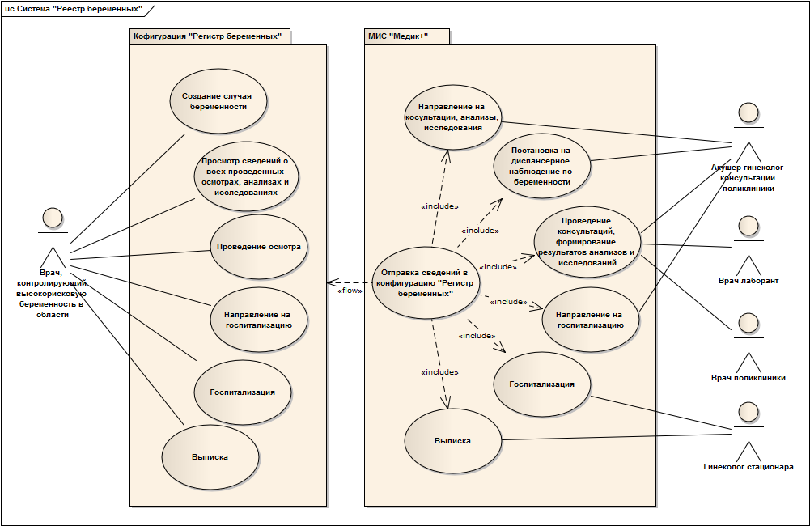
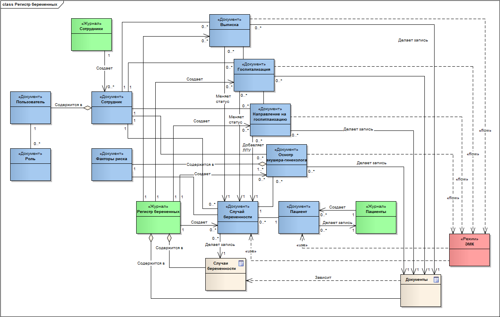

# Назначение и цели внедрения

## Назначения и цели

Конфигурация "Регистр беременных" предназначена для автоматизации ведения учета случаев беременности и консолидации сведений по всем случаям беременности в рамках области.

Цели внедрения системы:

* Ведение случаев беременности из самой конфигурации
* Получение и обработка сведений о случаях беременности из внешнего источника (МИС "Медик+")
* Предоставление наиболее важных сведений о состоянии здоровья пациентки в одном месте, в удобном виде

Назначения системы:

* Создание случая беременности как в самой конфигурации, так и при получении сведений о постановке пациентки на диспансерное наблюдение из МИС "Медик+".
* Ведение случая беременности пациентки (проведение осмотров акушером-гинекологом, направления на госпитализацию, госпитализация, выписка) как в самой конфигурации, так и в МИС "Медик+". При этом все клинические документы, созданные в рамках случая беременности пациентки в МИС "Медик+", должны быть доступны для просмотра из конфигурации.
* Определение степени перинатального риска беременности с возможностью последующего уточнения и присвоения признака высокого риска.
* Накопление и предоставление сведений о диагнозах, анамнезе, и клинических документах пациентки в режиме ЭМК, с возможностью добавления/удаления/изменения. 

## Описание основного бизнес-процесса

При обращении пациентки к врачу акушеру-гинекологу и выявлении у неё беременности, пациентку ставят на диспансерное наблюдение по случаю беременности. В рамках первого осмотра врач определяет степень перинатального риска согласно анамнестическим факторам (I скрининг) и осуществляет постановку и планирование диспансерного наблюдения. Далее в период с 28 до 32 недель врачом, в рамках осмотра, проводится дополнение факторов риска (II и III скрининги). Заключительный - IV скрининг осуществляется сразу после родов. На любом из этапов, независимо от количества набранных балов перинатального риска, врач может отнести беременность к случаю с высоким риском.

После снятия пациентки с диспансерного наблюдения врачом формируется направление на госпитализацию, в котором указывается планируемое ЛПУ. В результате этого осуществляется госпитализация пациентки в стационар. После родов пациентка выписывается и случай беременности считается закрытым. 

## Диаграмма вариантов использования

Диаграмма вариантов использования представлена на рисунке 1.

Рисунок 1 - Диаграмма вариантов использования системы "Регистр беременных"

## Диаграмма классов

Модель предметной области представлена в виде диаграммы классов на рисунке 2.

Рисунок 2 - Диаграмма классов конфигурации "Регистр беременных"

