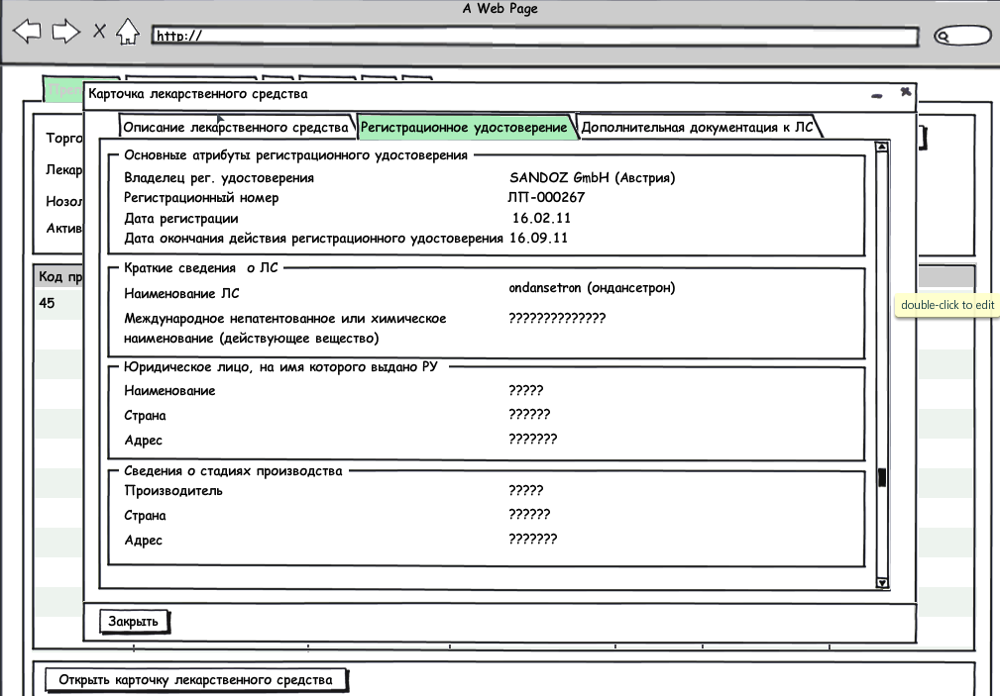
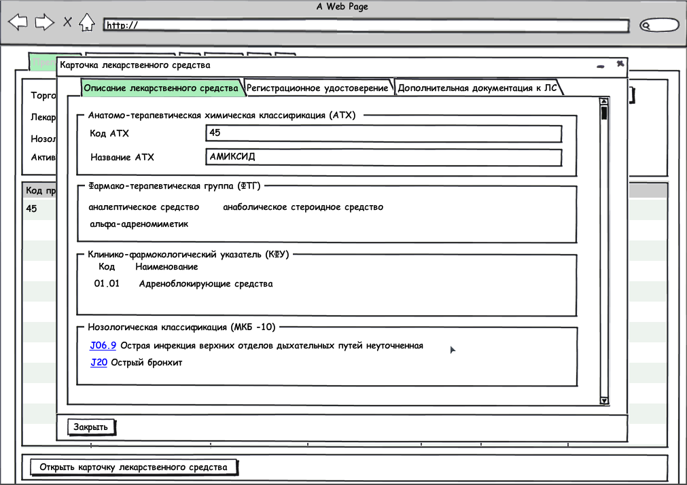
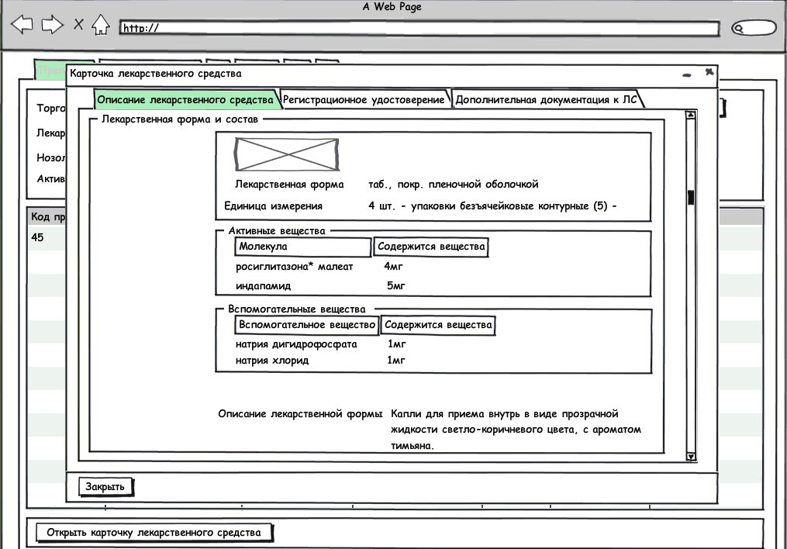
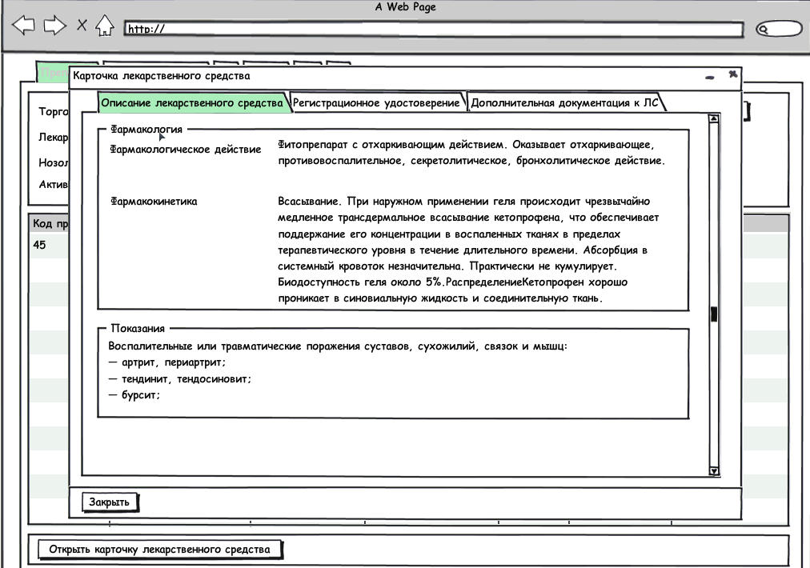
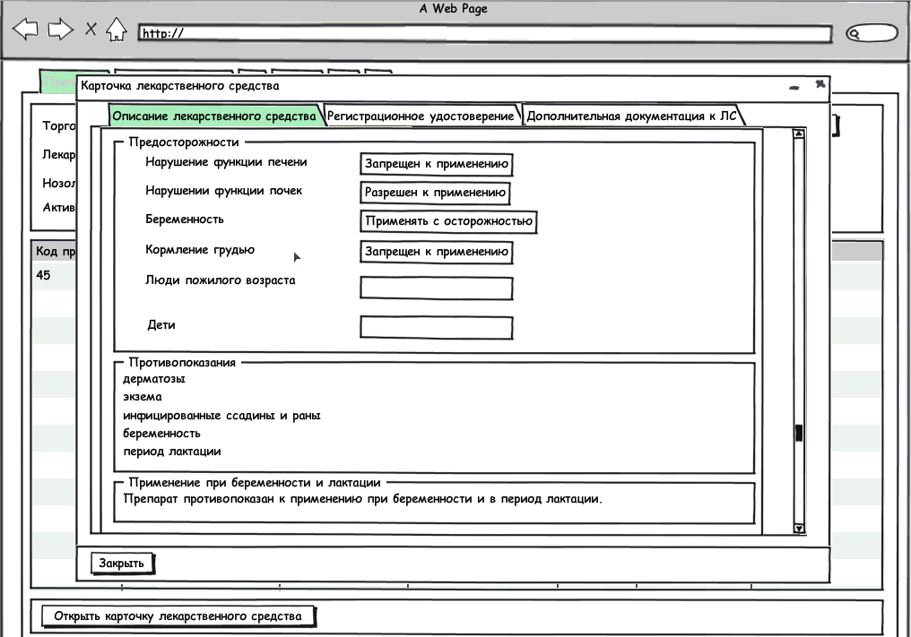
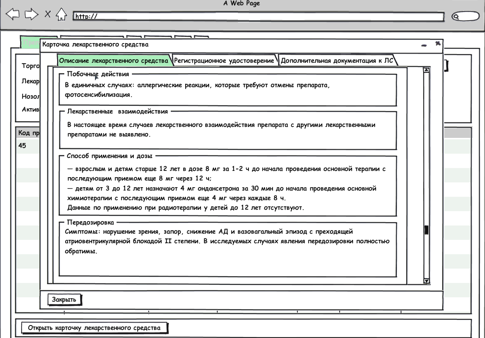
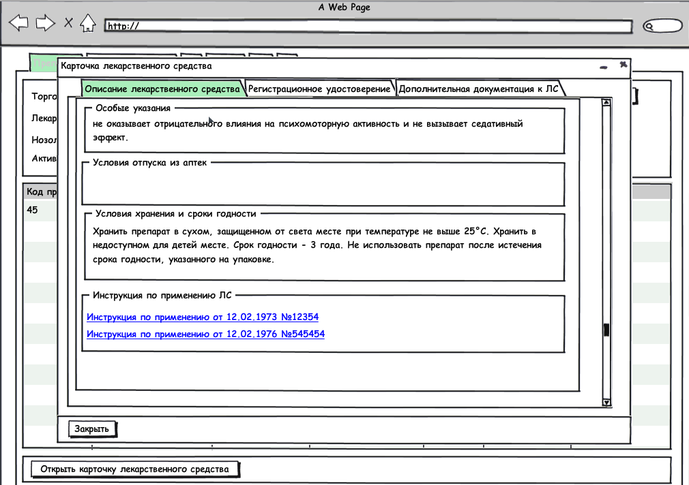

Документ содержит всю информацию о лекарственном средстве. В документе представлено подробное описание состава лекарственного средства, его принадлежность к различного рода классификациям, указан производитель и показания к применению данного препарата.

**Секция: Регистрационное удостоверение**

Блок: Основные атрибуты регистрационного удостоверения

* Владелец регистрационного удостоверения (текстовое поле)
* Дата регистрации (дата)
* Номер регистрации (текстовое)
* Дата окончания действия регистрационного удостоверения (дата)

Блок: Краткие сведения  о лекарственном средстве

* Торговое наименование ЛС (текстовое поле)

Блок: Юридическое лицо, на имя которого выдано регистрационное удостоверение

Юридическое лицо, на имя которого выдано РУ (таблица)

* Наименование (текстовое поле)
* Страна (текстовое поле)
* Адрес (Текстовое поле)

Сведения о стадиях производства (таблица)

* Производитель  (текстовое поле)
* Адрес (текстовое поле)
* Страна (Терминология)

**Секция: Описание лекарственного средства**

Блок: Анатомо-терапевтическая химическая классификация (АТХ)

Анатомо-терапевтическая химическая классификация (таблица)

* Код АТХ (Терминология)  
Автозаполнение: Заполняется автоматически соответствующим кодом из терминологии, если заполнено поле Название АТХ

* Название АТХ (Терминология)  
Автозаполнение: Заполняется автоматически соответствующим названием из терминологии, если заполнено поле Код АТХ

Блок: Фармако-терапевтическая группа (ФТГ)

*  Группа ФТГ (терминология)

Блок:  Нозологическая классификация (МКБ -10)

Нозологический указатель (МКБ-10) (таблица)

* Код (терминология)  
Автозаполнение: Заполняется автоматически соответствующим  кодом из терминологии, если заполнено поле Название

* Название (терминология)  
Автозаполнение: Заполняется автоматически соответствующим  названием из терминологии, если заполнено поле Код

Блок Клинико-фармакологическая группа

Клинико-фармакологическая группа(таблица

* Код(терминология)  
Автозаполнение: Заполняется автоматически соответствующим  кодом из терминологии, если заполнено поле Наименование
* Наименование(терминология)  
Автозаполнение: Заполняется автоматически соответствующим  названием из терминологии, если заполнено поле Код

Блок: Лекарственная форма и состав

Состав и форма выпуска (таблица)

* Лекарственная форма (терминология)
* Ед. измерения
* Активное вещество (таблица)  
  * Молекула(терминология)
  * Количество вещества(текстовое поле)

* Вспомогательные вещества (таблица)  
  * Вспомогательное вещество(терминология)
  * Количество вещества(текстовое поле)

* Описание лекарственной формы (терминология)

Блок Фармакология

* Фармакологическое действие (текстовое поле)
* Фармакокинетика (текстовое поле)

Блок предосторожности

* Нарушение функций почек (текстовое поле)
* Нарушение функции печени (текстовое поле)
* Беременность (текстовое поле)
* Кормление грудью (текстовое поле)
* Люди пожилого возраста (текстовое поле)
* Дети (текстовое поле)

Блок Показания

* Показания (текстовое поле)

Блок  Противопоказания

* [1..*] Противопоказания (текстовое поле)
* Применение при беременности и лактации (текстовое поле)

Блок Побочные действия

* Побочные действия (текстовое поле)

Блок Лекарственные  взаимодействия

* Взаимодействие(текстовое поле)

Блок Способ применения и дозы

* Способ применения и дозы (текстовое поле)

Блок Передозировка

* Передозировка (последствия для организма) (текстовое)

Блок Особые указания

* Особые указания (текстовое поле)

Блок Условия отпуска из аптек

* Условия отпуска из аптек (текстовое поле)

Блок Условия хранения

* Условия  хранения (текстовое поле)

Блок Срок годности

* Срок хранения (текстовое поле)

Блок: Инструкция по применению ЛС

Инструкция по применению ЛС (таблица)

* Год (числовое, год)
* Дата (дата)
* Название документа (терминология)

Должен быть прикреплен документ: инструкция по применению

 

 

