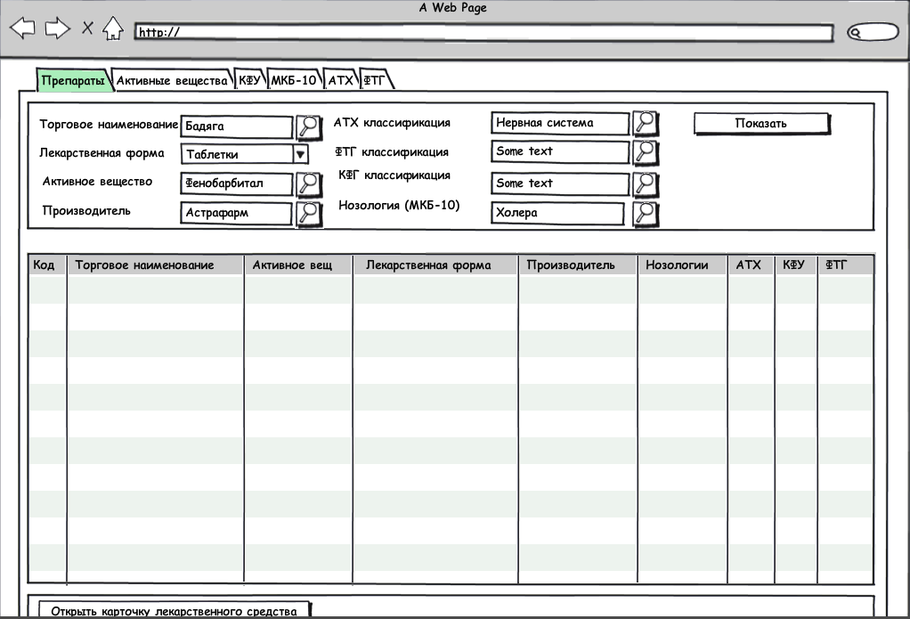

Журнал предназначен для получения информации о лекарственных средствах.

**Журнал содержит следующие поля:**

  * Идентификатор продукта (код)
  * Торговое наименование ЛС
  * Активное вещество
  * Лекарственная форма
  * Производитель
  * Анатомо-терапевтическая химическая классификация (АТХ)
  * Фармако-терапевтическая группа (ФТГ)
  * Клинико-фармакологическая группа (КФУ)
  * Нозология

**Фильтровать можно по следующим полям:**

* Торговое наименование
* Лекарственная форма
* Активное вещество
* Производитель
* АТХ классификация
* ФТГ классификация
* КФУ классификация
* Нозология

** Команды журнала:**

* **Добавить. **При нажатии на кнопку Добавить открывается новый документ Карточка лекарственного средства. Команда доступна всегда для выбранной записи
* **Редактировать. **При нажатии на кнопку Редактировать открывается  документ Карточка лекарственного средства. Команда доступна всегда для выбранной записи
* **Удалить. **При нажатии на кнопку Удалить лекарственное средство удаляется из справочника лекарственных средств. Команда доступна всегда для выбранной записи 

 

 

 

