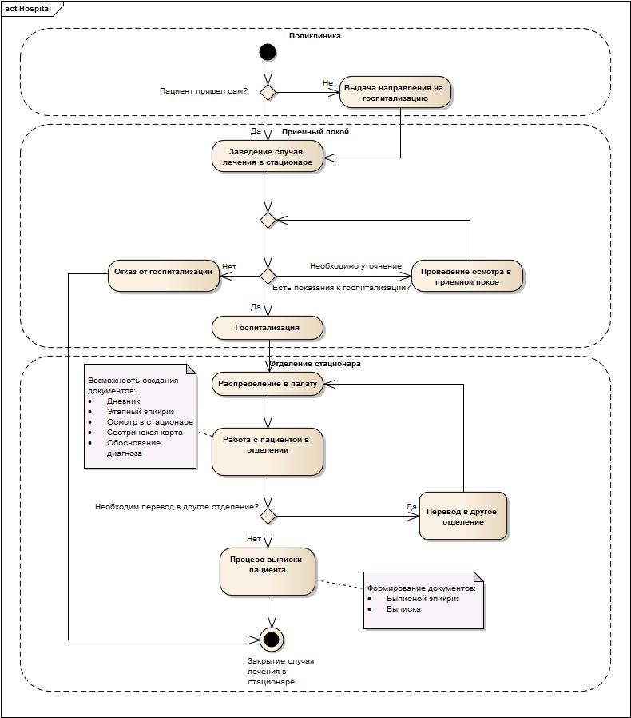
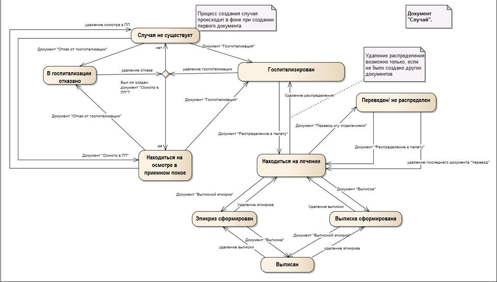

---
layout: default
title: Стационар
position: 8
categories: 
tags: 
---

Подсистема "Стационар" состоит из модулей:

* Приёмный покой
* Отделение стационара
* Коечный фонд

Лечение в стационаре проводится в рамках "случая лечения в стационаре".

Случай заводится при первом обращении пациента в приемный покой и закрывается при формировании документов: "Выписка", "Отказ от госпитализации". Случай создается в фоновом режиме при создании первого документа в отделении "Приемный покой" ("Осмотр в приемном покое", "Отказ от госпитализации" или "Госпитализация"). Все последующие документы привязываются к случаю.

Укрупненная Activity Diagram:

# WorkFlow процесса

 

 

