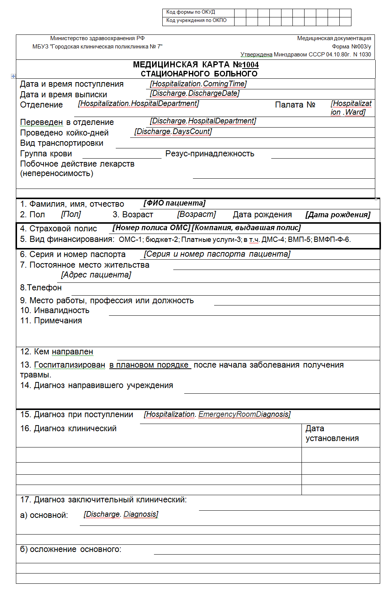
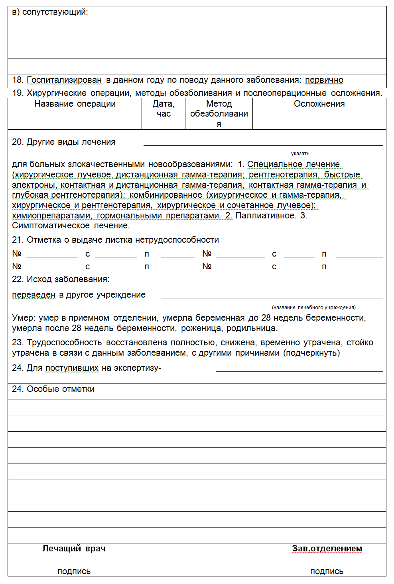

Отчет строиться по 2 документам: [["Госпитализация"|Документ Госпитализация]],[[ "Выписка"|Документ "Выписка"]]

Формат А4.

Печать отчета возможна из документа [["Выписка"|Документ "Выписка"]]

Внешний вид отчета:

 

