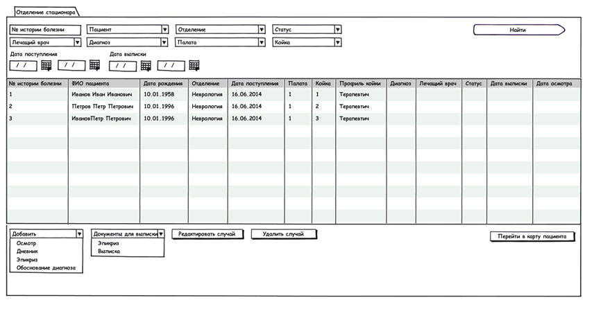

# Отделение стационара (HospitalDepartment)

Приложение "Отделение стационара" - это второй этап. 

|Приложение|Вкладка|
|----------|-------|
|Стационар: Отделение стационара(Hospital: HospitalDepartment)|Журнал "Отделение стационара" - главная страница приложения|

**На текущий момент:**

После того, как был создан документ "Госпитализация", работа со случаем лечения в стационаре переходит в приложение "Отделение стационара". 

Т.к. в документе "Госпитализация" происходит распределение пациента в палату и на койку, то начальный статус пациента "Находится на лечении".

# Функционал:

Проведение сестринских осмотров (отдельный журнал)Выписка пациента# Журнал "Отделение стационара"

Примерный внешний вид

**Колонки журнала:**

* № истории болезни
* ФИО пациента
* Дата рождения
* Отделение
* Дата поступления
* Палата
* Койка
* Диагноз
* Лечащий врач
* Статус

**Фильтры журнала:**

|Название|Тип данных|Автозаполнение|Особенности|
|--------|----------|--------------|-----------|
|№ истории болезни|String|нет|нет|
|Статус |"Находится на лечении", "Выписан"|"Находится на лечении"|нет|
|Пациент |[Справочник "Пациенты"](http://confluence.infinnity.lan/pages/viewpage.action?pageId=49250389)|нет|нет|
|Отделение|[Справочник "Отделения"](http://confluence.infinnity.lan/pages/viewpage.action?pageId=49250352)|Автозаполняется отделением текущего врача|нет|
|Дата поступления |Period|нет|нет|
|Диагноз|Справочник "МКБ 10" 1.2.643.5.1.13.2.1.1.641|нет|нет|
|Палата|[[Справочник "Палаты"|Документ "Палата"]]|нет|нет|

**Кнопки журнала:**

|Статус документа "Случай лечения в стационаре"|Доступные кнопки|
|----------------------------------------------|----------------|
|Находится на лечении|ВыписатьРедактировать случайУдалить случайПерейти в карту пациента|
|Выписан|Редактировать случайУдалить случайПерейти в карту пациента|

**  
**

|Расположение|Кнопка|Условия видимости|Действие|Начальное состояние|Конечное состояние|
|Область представления|Выписать|Выбрана строка в журнале|На новой странице приложения открывается документ "Выписка"|"Находится на лечении"|"Выписан"|
|Action Bar|Редактировать случай|Выбрана строка в журнале|На новой странице приложения открывается документ "случай лечения в стационаре"|В зависимости от созданных документов|В зависимости от созданных документов|
|Удалить случай|Выбрана строка в журнале|1. Появляется сообщение Вы действительно хотите удалить случай № истории болезни, ФИО пациента, статус?Да\Нет2. При ответе Да, случай удаляется (Документ Случай + все связанные документы)3. При ответе Нет, сообщение закрывается.|В зависимости от созданных документов|Случая не существует|
|Перейти в карту пациента|Выбрана строка в журнале| В отдельном приложении открывается ЭМК пациента, чей случай был выбран| | |

 

**  
**

 

