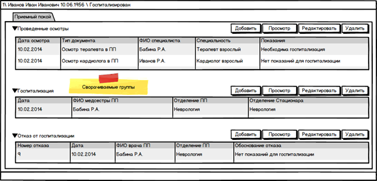

# Документ Случай лечения в стационаре (HospitalTreatmentCase)

Данный документ является контейнером, который хранит информацию обо всех документах, созданных в рамках случая. Создается фоном при создании первого документа в приемном покое.

# Примерный внешний вид документа:

# Структура:

ЗаголовокТело документа:  * Сворачиваемая группа Приемный покой (по умолчанию все группы развернуты):    * Сворачиваемая группа Проведенные осмотры

|Колонка|Поле в документе Осмотр в приемном покое|
|Дата осмотра|Общая информация -> Дата и время осмотра|
|Тип документа| |
|ФИО специалиста|Общая информация -> Врач приемного покоя|
|Специальность|Общая информация -> Специальность|
|Показания|Заключение осмотра -> Стационарное лечение -> Показания |

 

*   *     * Сворачиваемая группа Госпитализация

|Колонка|Поле в документе Госпитализация|
|Дата|Общая информация -> Дата и время поступления|
|ФИО медсестры приемного покоя|Общая информация -> Медсестра приемного отделения|
|Отделение Приемного покоя|Общая информация -> Отделение Приемного покоя|
|Отделение стационара|Поступление в стационар -> Отделение стационара|

 

*   *     * Сворачиваемая группа Отказ от госпитализации

|Колонка|Поле в документе Отказ от госпитализации|
|Номер отказа от госпитализации|Общая информация -> Номер отказа от госпитализации|
|Дата|Общая информация -> Дата и время регистрации отказа|
|ФИО врача приемного покоя|Общая информация -> сотрудник приемного отделения|
|Отделение Приемного покоя|Общая информация -> Отделение Приемного покоя|
|Обоснование отказа|Отказ от госпитализации -> Обоснование отказа -> Обоснование отказа |

Кнопки

(Логика кнопок аналогична логике кнопок в журнале):

Доступны всегда:

* Добавить – открывает новый документ в ЭМК пациента.

Доступны при выбранной строке:

* Редактировать – открывает выбранный документ на редактирование в ЭМК пациента
* Удалить – выводит сообщение подтверждение, удаляет выбранный документ
* Просмотр – открывает документ на просмотр в ЭМК пациента

# Поля документа

|Название поля|Из какого документа заполняется|
|Заголовок документа:|
|Номер истории болезни|Документ ГоспитализацияПоле Номер истории болезни|
|ФИО пациента| |
|Дата рождения пациента| |
|Статус случая ("Находится на осмотре в приемном покое", "Госпитализирован", "в госпитализации отказано")| |
|Тело документа|
|Информация обо всех документах, созданных в рамках случая (таблицы)| |
|Поля, необходимые для построения журнала|
|Отделение приемного покоя|Последний документ, созданного в рамках случая в приемном покое.Поле Отделение приемного покоя|
|Дата поступления|Документ ГоспитализацияПоле Дата и время поступления|
|Заключение врача приемного покоя|Последний документ Осмотр в приемном покоеБлок Стационарное лечение, поле Показания|
|Обоснование отказа|Документ Отказ от Госпитализации.Поле Обоснование отказа|
|Отделение стационара|Документ Госпитализация.Блок Поступление в стационар, поля Отделение стационара|

# Валидация перед открытием документа:

|Команда|Правило|Сообщение|
|Новый случай (любая кнопка) – после выбора пациента|Нельзя добавлять новый случай, если у пациента есть незакрытый случай лечения в стационаре|Вы не можете создать новый случай лечения в стационаре, т.к. у пациента [ФИО], [Дата рождения] есть незакрытый случай лечения в стационаре со статусом [Статус] в отделение [Отделение приемного покоя], номер истории болезни: [Номер истории болезни (если есть)].|
|Добавить|Документ Госпитализация не может быть создан, если в рамках текущего случая существует документ Отказ от госпитализации|Вы не можете госпитализировать пациента [ФИО], [Дата рождения], т.к. в рамках текущего случая лечения в стационаре был сформирован документ Отказ от госпитализации номер  [Номер отказа от госпитализации] от [Дата отказа от госпитализации].|
|Документ Отказ от госпитализации не может быть создан, если в рамках текущего случая существует документ Госпитализация|Вы не можете сформировать документ Отказ от госпитализации пациенту [ФИО], [Дата рождения], т.к. в рамках текущего случая лечения в стационаре был сформирован документ Госпитализация. Номер истории болезни: [Номер истории болезни] от [Дата госпитализации].|
|Документ Осмотр в приемном покое не может быть создан, если в рамках текущего случая существует документ Госпитализация или документ Отказ от госпитализации| Вы не можете сформировать документ Осмотр в приемном покое пациенту [ФИО], [Дата рождения], т.к. в рамках текущего случая лечения в стационаре был сформирован документ Госпитализация. Номер истории болезни: [Номер истории болезни] от [Дата госпитализации]. \ Отказ от госпитализации номер  [Номер отказа от госпитализации] от [Дата отказа от госпитализации].|
|Удалить|Нельзя удалять документ Осмотр в приемном покое, если в рамках текущего случая существует документ Госпитализация или документ Отказ от госпитализации|Вы не можете удалить документ Осмотр в приемном покое пациента [ФИО], [Дата рождения], т.к. в рамках текущего случая лечения в стационаре был сформирован документ Госпитализация. Номер истории болезни: [Номер истории болезни] от [Дата госпитализации]. \ Отказ от госпитализации номер  [Номер отказа от госпитализации] от [Дата отказа от госпитализации].|
| |Нельзя удалять документ Госпитализация, если в рамках текущего случая существуют документы, которые были созданы позже в отделении стационара|Вы не можете удалить документ Госпитализация номер [Номер истории болезни] от [Дата госпитализации] пациента [ФИО], [Дата рождения], т.к. пациент уже находится на лечении в стационаре.|

