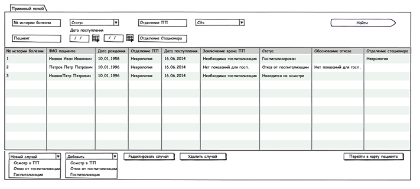
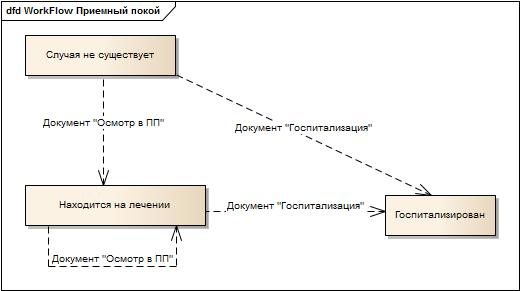
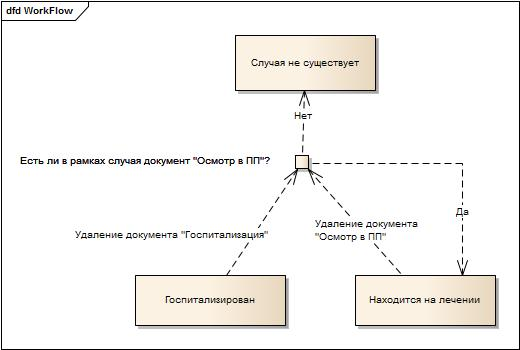

Красным шрифтом выделен функционал, который в текущей версии не будет реализован

Приложение Приемный покой - это первый этап. На данном этапе создается случай лечения в стационаре.

|Приложение|Вкладка|
|----------|-------|
|Стационар: Приемный покой(Hospital: EmergencyRoom)|Журнал "Приемный покой" - главная страница приложения|

# Журнал Приемный покой

 Журнал содержит список всех [[случаев лечения в стационаре|Документ Случай лечения в стационаре]].

 Создание нового документа "Случай лечения в стационаре" происходит в фоне при создании документов: новая "Госпитализация", новый "Осмотр в приемном покое", новый "Отказ от госпитализации".

 При этом случаю автоматически присваивается соответствующий статус.

  Конечный статус случая в приложении - "Госпитализирован".

Смена статуса документа (текущая реализация - без "Отказа от госпитализации"):

Создание:

Удаление:

**Колонки журнала:**

* № истории болезни
* ФИО пациента
* Дата рождения
* Отделение приемного покоя
* Дата поступления
* Заключение врача приемного покоя
* Статус
* Обоснование отказа
* Отделение стационара 

**Фильтры журнала:**

|Название|Тип данных|Автозаполнение|Особенности|
|--------|----------|--------------|-----------|
|№ истории болезни|String|нет|нет|
|Статус |"Находится на осмотре в приемном покое", "Госпитализирован", "В госпитализации отказано"|нет|нет|
|Отделение приемного покоя |[Справочник "Отделения"](http://confluence.infinnity.lan/pages/viewpage.action?pageId=49250352)|нет|нет|
|Пациент |[[Справочник "Пациенты"|Ведение журнала "Пациенты"]]|нет|нет|
|Отделение стационара |[Справочник "Отделения"](http://confluence.infinnity.lan/pages/viewpage.action?pageId=49250352)|нет|нет|
|Дата поступления |Period|нет|нет|

****Кнопки журнала:****

|Статус документа "Случай лечения в стационаре"|Доступные команды|
|----------------------------------------------|-----------------|
|Нет случая|Новый случай:* Осмотр в приемном покое
* Госпитализация
* Отказ от госпитализации

|
|Находится на осмотре|Добавить:* Осмотр в приемном покое
* Госпитализацию

Редактировать случайУдалить случайПерейти в карту пациента|
|Госпитализирован|Редактировать случайУдалить случайПерейти в карту пациента|
|В госпитализации отказано|Редактировать случайУдалить случайПерейти в карту пациента|

****  
****

|Расположение|Кнопка|Видимость|Действие|Начальное состояние|Конечное состояние|
|Область представления       |Новый случай (PopupButton): |Всегда|1.В диалоговом окне открывается журнал выбора пациентов.2.После выбора пациента, открывается выбранный документ в ЭМК.3. После сохранения документа автоматически создается документа [[Случай лечения в стационаре»|Документ Случай лечения в стационаре]]| | |
|-        Осмотр в приемном покое |Случая не существует|Находится на осмотре в приемном покое|
|-        Госпитализация |Случая не существует|Госпитализирован|
|-        Отказ от госпитализации|Случая не существует|В госпитализации отказано|
|Добавить (PopupButton):|Выбрана строка в журнале+ статус Находится на осмотре в приемном покое |1.В отдельном окне открывается  выбранный документ в ЭМК пациента, чей случай был выбран.2. После сохранения документа меняется статус случая| | |
|-        Осмотр в приемном покое |Находится на осмотре в приемном покое |Находится на осмотре в приемном покое |
|-        Госпитализация |Госпитализирован|
|-        Отказ от госпитализации|В госпитализации отказано|
| Action Bar |Редактировать случай|Выбрана строка в журнале|Открывается документ случай|В зависимости от созданных документов|В зависимости от созданных документов|
|Удалить случай|Выбрана строка в журнале + по данному случаю не было создано документов в рамках режима Отделение стационара|1. Появляется сообщение Вы действительно хотите удалить случай № истории болезни, ФИО пациента, статус?Да\Нет2. При ответе Да, случай удаляется (Документ Случай + все связанные документы)3. При ответе Нет, сообщение закрывается.|В зависимости от созданных документов|Случая не существует|
|Перейти в карту пациента|Выбрана строка в журнале|В отдельном окне открывается ЭМК пациента, чей случай был выбран| | |

****  
****

****  
****

