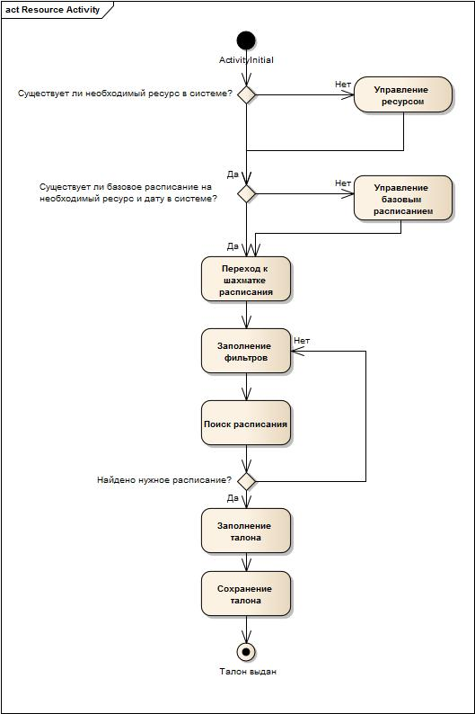

Подсистема занятости ресурсов предназначена для обеспечения планирования загруженности ресурсов.

Планирование занятости ресурсов обеспечивает запись пациентов на различные услуги, согласно составленному расписанию распределения ресурсов. Расписание создается на каждый ресурс, на котором можно проводить процедуры (например, аппарат УЗИ №1, стол для массажа № 5, аппарат для проведения МРТ 3021 и т.д.).

Назначение подсистемы:

* Управление расписанием работы ресурсов
* Наглядное отображение расписания работы ресурсов
* Запись пациентов на услуги, предоставляемые ресурсом

 

В данной методике не рассмотрены вопросы:

1)      Внесение исключений из базового расписания ресурсов

2)      Возможность продления базового расписания ресурсов

3)      Печать талонов

4)      Выдача дополнительных талонов

5)      Живая очередь

6)      Возможность указать рекомендуемую длительность приема

7)      Квотирование талонов по отделениям

8)      Возможность указать в талоне документ-основание

9)      Выдача талонов на ресурс из документов Направление на исследование\анализ, Осмотр и т.д.

10)  Цветовое кодирование

 

#### Диаграмма деятельности процесса

 

