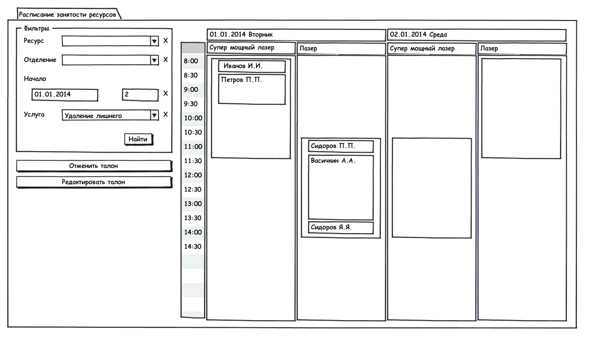

---
layout: default
title: Расписание занятости ресурсов
position: 
categories: 
tags: 
---

Через данный режим осуществляется выдача талонов на услуги.

Примерный вид журнала:

Журнал содержит следующие блоки:

**Блок фильтров**:

* Ресурс (журнал ресурсов)
* Отделение (справочник отделений)
* Начало (дата начала отображения расписания) – по умолчанию – текущая дата
* Количество дней отображения расписания (число).
* Услуга (справочник услуг)

Команда блока:

* **Найти**. Отфильтровывает таблицу расписания согласно заданным параметрам

Если в блоке фильтров заполнено поле Ресурс, то в поле Услуга отображаются только те услуги, которые привязаны к текущему ресурсу.

Если задан только фильтр Услуга, отображается расписание всех ресурсов, к которым привязана данная услуга.

**Блок команд:**

* **Отменить талон **(команда отменяет талон, при этом соответствующий слот освобождается).
* **Редактировать талон** (открывает талон на редактирование).

** **

**Блок Таблица расписания:**

Блок представлен в виде таблицы.

Шапка:  

-        Выбранные даты (дата\день недели)

-        Выбранные ресурсы

Расписание отображается монолитной областью, выделенной цветом.

Выдача талона:

Левой кнопкой мыши нажать на область расписанияВ диалоговом окне откроется журнал пациентовПосле выбора пациента в диалоговом окне открывается документ Талон на ресурсВ талоне указывается время начала приема и длительность приемаПосле сохранения талона, он отображается в области расписания (Фамилия И.О.). Ширина талона в области расписания зависит от продолжительности приема.При наведении мышкой на талон  выводится справочная информация (тип приема, дата, время, название ресурса, кабинет, отделение, пациент).Редактировать талон:

Выбрать нужный талонНажать кнопку Редактировать талонВ диалоговом окне откроется текущий документ Талон на ресурсОтменить талон:

Выбрать нужный талонНажать на кнопку Отменить талонТалон исчезает из расписания. Место освобождается. 

