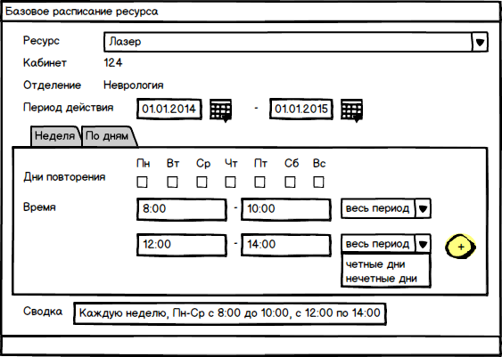
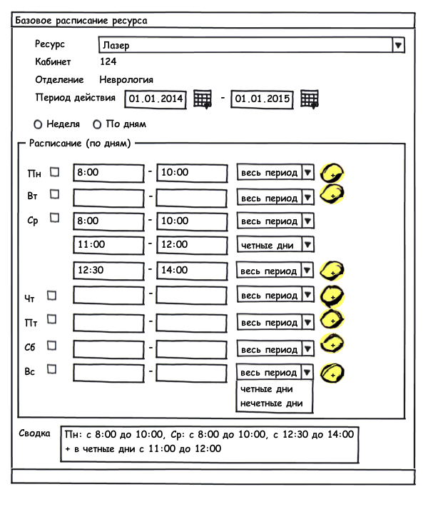

---
layout: default
title: Управление базовым расписанием ресурсов
position: 
categories: 
tags: 
---

Чтобы для ресурса отображалось расписание в шахматке, необходимо создать документ Базовое расписание ресурса.

|Приложение|Вкладка|
|----------|-------|
|Регистратура|Не является главной страницей приложения, но вкладка "Базовое расписание" закреплена, без возможности ее закрыть|

#### Документ Базовое расписание ресурса (ResourceBaseSchedule)

В данном документе происходит составление базового расписания работы ресурсов. Существует возможность составить расписание как по неделям, с указанием конкретных дней работы (в этом случае время работы будет одинаково для всех указанных дней), так и по дням.

**Поля:**

|Наименование|Тип Данных|Заголовок|Описание|Множественность|Видимость|Автозаполнение|
|------------|----------|---------|--------|---------------|---------|--------------|
|Resource|[[Элемент справочника "Ресурсы"|Управление ресурсом]]|Ресурс |Наименование ресурса, на который создается базовое расписание|[1..1]| | |
|Room|[Элемент справочника "Кабинет"](http://confluence.infinnity.lan/pages/viewpage.action?pageId=49250358)|Кабинет |Кабинет, в котором расположен данный ресурс|[1..1]|readonly|Автоматически заполняется кабинетом из документа "Ресурс".|
|Department|[Элемент справочника "Отделения"](http://confluence.infinnity.lan/pages/viewpage.action?pageId=49250352)|Отделение |Отделение, в котором расположен данный ресурс|[1..1]|readonly|Автоматически заполняется отделением из документа "Ресурс".|
|DateFrom|DateTime|Период действия с|Начало периода действия расписания|[1..1]| |Текущая дата|
|DateTo|DateTime|по|Окончание периода действия расписания|[1..1]| | |
|**Блок "Расписание"**|
|Вкладка "Неделя"|
| |CheckBox|Дни повторенияПн, Вт, Ср, Чт, Пт, Сб, Вс|Перечень дней, в которые будет действовать текущее расписание| | | |
|Time|Сложный тип: ScheduleTime|Время|Период времени, в которое будет действовать текущее расписание|[0..*]| | |
| |String|Сводка|Носит информативный характер, агрегирует выбранные диапазоны времени| |readonly|Заполняется автоматически.|
|Примерный вид документа:|
|Вкладка "По дням"7 дней недели (checkBox) + период дат для каждого дня + выпадающий список Условия повторения (весь период, четные дни, нечетные дни) + Знак + для добавления новой строки периода.По умолчанию присутствует 1 строка периода для каждого дня, при нажатии на +, появляется новая строка.|
||

 

 

Для управления документами Базовое расписание ресурса необходимо перейти в журнал Базовое расписание ресурсов

#### Журнал Базовое расписание ресурсов

Журнал позволяет задавать для ресурса базовое расписание работы на определенный период.

Поля:

* Ресурс
* Кабинет
* Отделение
* Дата начала действия расписания
* Дата окончания действия расписания
* Описание (поле Сводка)

Фильтры:

* Ресурс
* Кабинет
* Отделение
* Дата начала действия расписания (период)
* Дата окончания действия расписания (период - по умолчанию в начало периода ставиться текущая дата)

** **

**Команды журнала:**

Команды, доступные всегда:

* **Добавить. **В диалоговом окне открывается новый документ Базовое расписание ресурсов. Команда доступна всегда.

Команды, доступные для выбранной записи:

* **Редактировать.** Открывает документ Базовое расписание на редактирование.
* **Удалить**. Удаляет документ.

**Цветовое кодирование**

* Если дата окончания расписания меньше текущей даты, то строчка с расписанием подсвечивается серым.

**Валидация:**

Сохранение:

* Период действия по не может быть меньше периода действия с.
* В блоке Расписание не должно быть пересечения времени для одних и тех же дней недели.
* Если составляется расписание на неделю, должен был проставлен хотя бы один флаг дней повторений.
* Если в таблице расписание добавлено несколько строк, и в одной из них поле условие повторения выбрано весь период, то поле Время (с – по) не должно пересекаться с другой строкой данной таблицы
* Если в таблице расписание добавлено несколько строк и в каждой из них в поле условие повторения выбрано одинаковое значение, то поле Время (с-по) не должно пересекаться с другой строкой данной таблицы
* Нельзя создать документ, если для такого ресурса уже было создано расписание, срок его действия не истек и оно пересекается с созданным.

* Если на заведенное расписание уже были выданы талоны:  * Нельзя менять расписание так, чтобы выданные талоны не попадали в него.

Удаление:

* Нельзя удалять расписание, если на него были выданы талоны.

По данным из документов Базовое расписание ресурса строиться шахматка журнала Расписание занятости ресурсов. Любые изменения в документах базового расписания приводят к автоматическому изменению шахматки.

 

