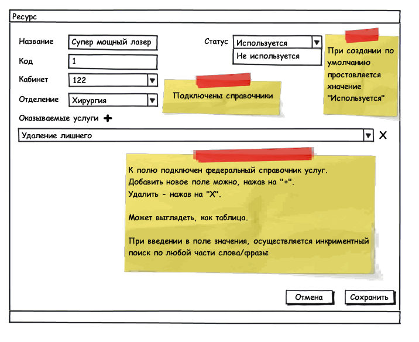

Для того чтобы можно было создавать расписание работы ресурсов (оборудования, кабинетов) необходимо создать документ Ресурс.

|Приложение|Вкладка|
|----------|-------|
|Паспорт ЛПУ|Журнал не является главной страницей приложения. Вкладка журнала закреплена без возможности ее закрыть.|

## Документ Ресурс (Resource)

Документ создается для каждого ресурса, на который необходимо завести расписание.

**Поля:**

|Наименование|Тип Данных|Заголовок|Описание|Множественность|Видимость|Автозаполнение|
|------------|----------|---------|--------|---------------|---------|--------------|
|Name|String|Название|Название ресурса|[1..1]| | |
|Code|String|Код|Код ресурса|[1..1]| | |
|Room|[[Элемент справочника "Кабинет"|Ведение журнала "Кабинеты"]]|Кабинет |Кабинет, в котором расположен данный ресурс|[1..1]| | |
|Department|[[Элемент справочника "Отделения"|Ведение журнала "Отделения"]]|Отделение |Отделение, в котором расположен кабинет|[1..1]|readonly|Автоматически заполняется отделением из документа "Кабинет".|
|Services|Элемент справочника 1.2.643.5.1.13.2.1.1.473|Оказываемые услуги|Перечень услуг, выполняемых данным ресурсом|[0..*]| | |
|UseStatus|[[Элемент локального справочника "Статус использования"|Используемые справочники]]|Статус |Статус ресурса, который показывает, используется ли данный ресурс в настоящее время|[1..1]| |1 - Используется|

 

Примерный вид документа:

 

**Валидация:**

|Команда|Правило|Сообщение|
|-------|-------|---------|
|Сохранить |Нельзя создать документ, если уже был создан документ с таким же кодом ресурса|Ресурс с кодом "Код" уже существует. Пожалуйста, измените код ресурса.|
|Нельзя создать документ, если уже был создан документ с таким же названием ресурса|Ресурс с название "Название" уже существует. Пожалуйста, измените название ресурса.|
|Проверка на заполненность обязательных полей|Поля: "Название поля" должны быть заполнены.|
|Удалить|Нельзя удалить ресурс, если для него когда-либо было создано расписание|Данный ресурс удалить невозможно, т.к. по нему уже было создано расписание. Если расписание не действует на текущий момент, вы можете поменять статус ресурса на "Не используется".|
|Сменить статус|Нельзя сменить статус на Не используется, если для ресурса создано действующие расписание|Невозможно сменить статус на "Не используется", т.к. на данный ресурс создано действующее расписание.|

 

Для того чтобы создать документ Ресурс необходимо перейти в журнал Ресурсы.

#### Журнал Ресурсы

Журнал содержит список всех ресурсов.

Поля:

* Код
* Название
* Отделение
* Кабинет
* Статус (предлагаю сделать checkbox, состояние которого можно будет менять непосредственно в журнале)
* Услуги

**Фильтры журнала:**

|Название|Тип данных|Автозаполнение|Особенности|
|--------|----------|--------------|-----------|
|Код|String|нет|нет|
|Название|String|нет|нет|
|Отделение|[[Справочник "Отделения"|Ведение журнала "Отделения"]]|нет|нет|
|Кабинет|[[Справочник "Кабинет"|Ведение журнала "Кабинеты"]]|нет|нет|
|Статус|[[Локальный справочник "Статус использования"|Используемые справочники]]|1 - Используется|нет|
|Услуги|Элемент справочника 1.2.643.5.1.13.2.1.1.473|нет|нет|

**Кнопки:**

|Расположение|Кнопка|Видимость|Действие|
|------------|------|---------|--------|
|Action Bar|Добавить|Всегда|Открывается новый документ Ресурс|
|Редактировать|Для выбранной записи|Открывает на редактирование выбранный документ "Ресурс"|
|Удалить|Для выбранной записи|Удаляет выбранный документ "Ресурс" (Перед удалением задается уточняющий вопрос "Вы действительно хотите удалить ресурс "Х"?")|
|Область представления|Сменить статус|Для выбранной записи|Меняет статус ресурса без открытия документа на редактирование |

 

 

