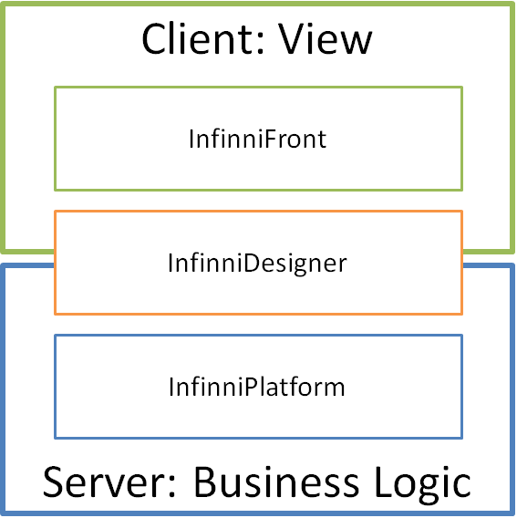

 

### Общее описание

В системе концептуально можно выделить три подсистемы:

* InfinniFront
* InfinniDesigner
* InfinniPlatform

 

InfinniFront отвечает за генерацию по метаданным визуальной части системы и обеспечение ее работоспособности.

InfinniPlatform отвечает за хостинг сервисов системы, уровень хранения данных, обеспечение работоспособности бизнес-логики.

InfinniDesigner отвечает за конфигурирование системы (клиентской и/или серверной части в зависимости от схемы лицензирования).

 

### Сертификация и лицензирование

Предполагается, что после установки системы, клиенту нужно будет зарегистрировать ее в нашем центре сертификации.

Будет несколько схем лицензирования, каждая из которых может включать или не включать вышеперечисленные подсистемы, отдельные компоненты или свойства этих подсистем.

Например, схемы лицензирования InfinniPlatform могут включать такие понятия, как "максимальное количество документов" или "максимальное количество документов, обрабатываемых в день".

 

