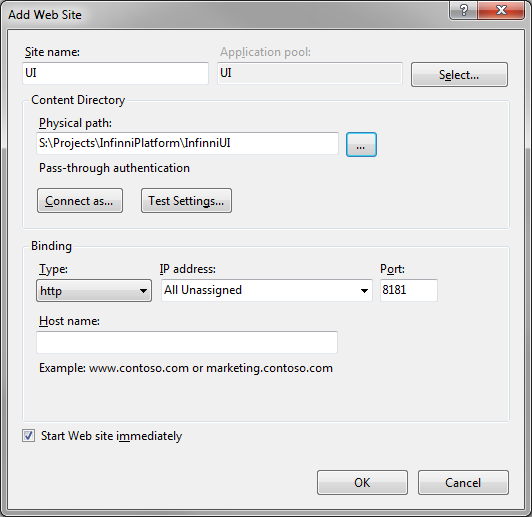

---
layout: default
title: Установка infinniUI
position: 
categories: 
tags: 
---

## Сборка InifinniUI

Установка клиента git (для Windows напр. /[https://msysgit.github.io/](https://msysgit.github.io/))Установка NodeJS ([http://nodejs.org/](http://nodejs.org/))Установка пакетов для сборки:  
>npm install grunt -g  
>npm install grunt-cli -g  
>npm install bower -g Установка зависимостей:  
>npm install  
>bower install Сборка (из каталога infinniui):  
>grunt build   
  
После каждого обновления из репозитория необходимо заново загрузить зависимости и собрать проект:

>bower install

>grunt build

 

 

Нужно создать новый веб-сайт. Порт - 8181, рабочая директория - дистрибутив InfinniUI. Не забыть отключить любую аутентификацию, кроме анонимной.

В настройках соответствующего приложения (в Application Pools) рекомендуется версию .NET-фреймворка указать как "No managed code" во избежание возникновения проблем.

# Хостинг на node-js

Запуск (из каталога infinniui):  
>npm start  
  
Будет запущен веб сервер на порту 8181. Номер порта можно изменить в файле gruntfile.js

 

 

* Приложение доступно по адресу [http://hostname:8181/launchers/main/#/Ehr](http://127.0.0.1:8181/launchers/main/#/Ehr)
* Изменение порта, на котором развернут UI: в файле  Gruntfile.js изменить значение port: '8181'
* Изменение адреса сервисов, к которым обращается UI: в файле app/confg.js изменяем значение  InfinniUI.config.serverUrl = '[http://localhost:9900](http://ic:9900)';. Адрес должен быть доступен с клиентских рабочих мест (JS-код, выполняемый в браузере пользователя, должен знать внешний IP-адрес и порт, по которым доступна запущенная платформа).

 

