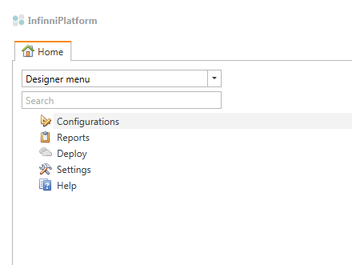
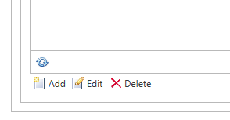
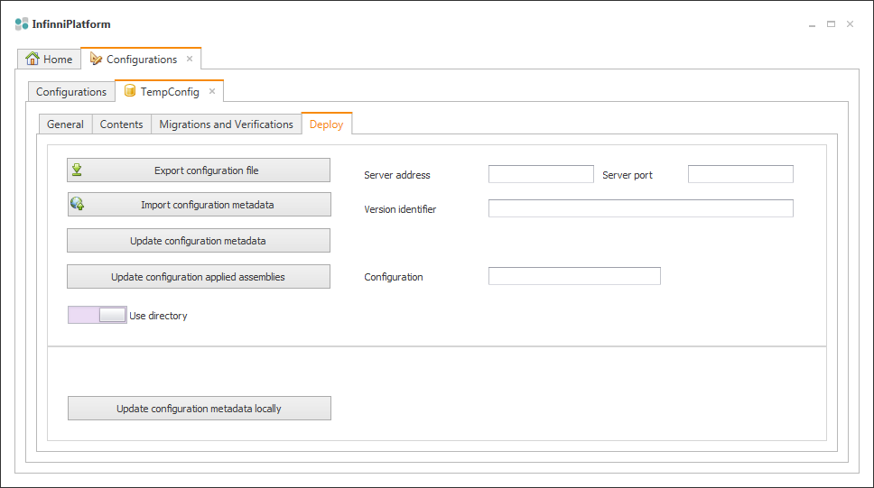
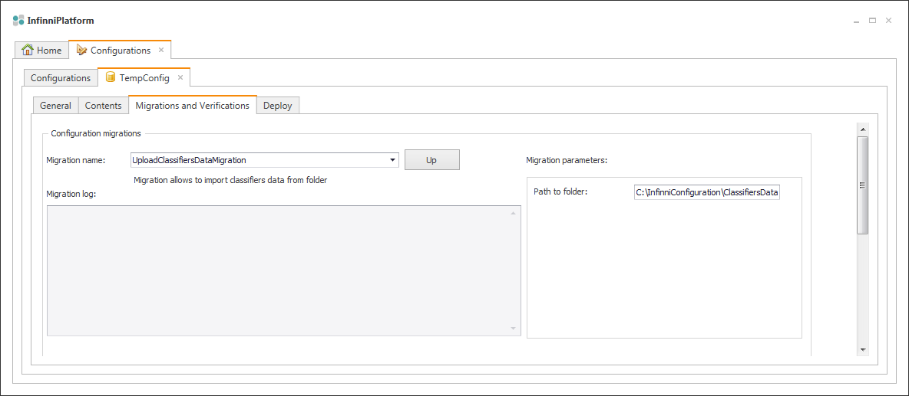
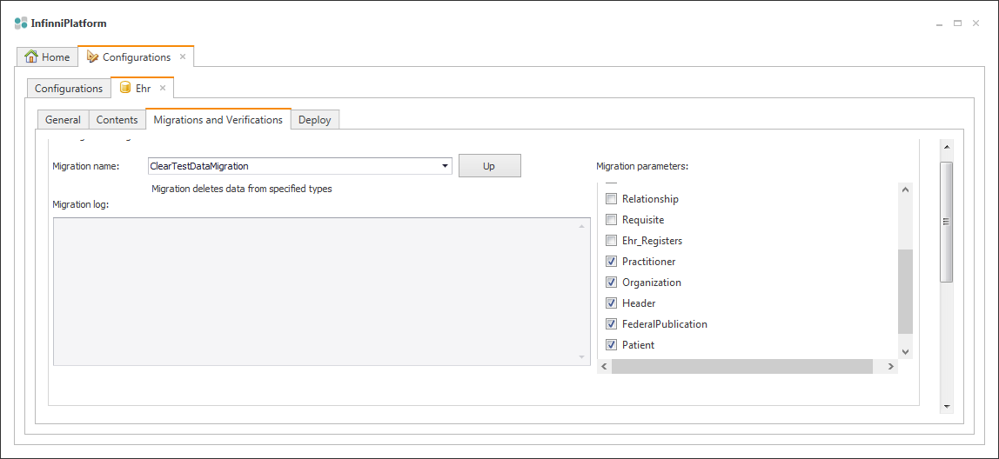

В данном разделе описан процесс установки и настройки прикладных конфигураций.

### 1. Запуск дизайнера

Приступить к установке прикладных конфигураций можно только после успешного развертывания платформы в соответствии с [[инструкцией.|Первичная установка и настройка сервера приложения]]

Установка конфигураций производится с использованием дизайнера InfinniPlatform.UserInterface.exe. Перед запуском дизайнера необходимо убедиться в том, что настройки InfinniPlatform.UserInterface.exe.config позволяют установить соединение с запущенным сервером.

```
<appSettings>
	<add key="AppServerName" value="localhost"/>
	<add key="AppServerPort" value="9900"/>
	<add key="AppServerScheme" value="http"/>
	<add key="AppServerCertificate" value="490966d6df5b95b5456e7079a0bf969f43620534"/>
	<add key="ConfigId" value="Designer" />
</appSettings>
```

После запуска дизайнера, дважды кликаем по пункту "Configurations":



В случае, если на сервере не установлено ни одной конфигурации, список конфигураций будет пуст. В этом случае необходимо добавить новую конфигурацию с произвольным именем, нажав кнопку Add.



После добавления новой конфигурации, выделяем её и нажимаем на кнопку "Edit" (переход в режим редактирования конфигурации).

В появившемся окне редактирования конфигураций переходим на вкладку "Deploy":



### 2. Импорт метаданных конфигураций

Импортировать метаданные конфигурации можно из zip-архива с конфигурацией, либо из директории, содержащей файлы конфигурации. Для переключения между двумя этими режимами используется переключатель Use directory/Use file. Рассмотрим процедуру на примере импорта конфигурации из директории. 

Нажимаем на кнопку "Update configuration metadata", предварительно введя идентификатор версии в поле "Version identifier". В появившемся диалоговом окне указываем на директорию с конфигурацией. Например, для конфигурации ИЭМК, необходимо указать путь к директории "Ehr.Configuration". 

### 3. Обновление прикладных сборок

После импорта метаданных конфигураций, необходимо обновить прикладные сборки. Для этого вводим в поле "Configuration" имя конфигурации (не путать с заголовком конфигурации) и нажимаем на кнопку "Update configuration applied assemblies". При этом прикладные сборки должны быть скопированы в папку "Assemblies", либо в произвольную папку, но при условии, что путь к этой папке прописан в конфигурационном файле сервера (имя настройки - "AppliedAssemblies").

Процедуру обновления прикладных сборок необходимо произвести для всех импортированных конфигураций.

### 4. Загрузка справочников

Для корректной работы необходимо в обязательном порядке импортировать конфигурации для работы со справочниками: "ClassifierLoader" и "ClassifierStorage" в полном соответствии с п.2.

Для загрузки данных справочников открываем любую загруженную конфигурацию на редактирование, после чего переходим на вкладку "Migrations and Verifications":



Далее выбираем миграцию "UploadClassifiersDataMigration" и в поле "Path to folder" вводим путь к папке со справочниками. Нажимаем на кнопку "Up" и ждем загрузки справочников (процесс может быть достаточно длительным).

### 5. Удаление тестовых данных из базы

Для очистки базы от тестовых данных нужно использовать миграцию "ClearTestDataMigration". 

Сначала переходим на редактирование конфигурации, из которой мы хотим удалить данные. Затем переходим на вкладку "Migrations and Verifications" и выбираем миграцию "ClearTestDataMigration".

Справа появится перечень таблиц, из которых нужно удалить данные. Галочками помечаются те таблицы, из которых будут удалены все данные в ходе выполнения миграции. Для запуска миграции нажимаем на кнопку "Up".



 

Рассмотрим пример настройки прикладных конфигураций на примере ИЭМК. Для корректной работы необходимы четыре конфигурации: Ehr, FederalEhr, ClassifierLoader и ClassifierStorage. 

Каждая конфигурация расположена в соответствующей директории: Ehr.Configuration, FederalEhr.Configuration, ClassifierLoader.Configuration и ClassifierStorage.Configuration. 

Необходимые прикладные сборки:

* Common.dll
* Ehr.dll
* FederalEhr.dll
* CryptoPro.Sharpei.ServiceModel.dll
* Classifiers.dll
* Excel.dll
* ICSharpCode.SharpZipLib.dll
* DotNetDBF.dll

Для корректной работы сервиса интеграции с ФИЭМК необходимо установить на сервере сертификат в соответствии с [[инструкцией|Установка сертификата ЭЦП для создания WCF сервиса с безопасностью на уровне сообщений]] и пробросить порт для приёма сообщений обратного вызова от ФИЭМК ( необходимо, чтобы сообщение приходящие на server: <**AppServerCallback**> port:<**AppPortCallback**> переадресовывались на server: <**AppServerName**> **port:<AppPort>** - жирным шрифтом выделены названия настроечных параметров из InfinniPlatform.ServiceHost.exe.config).

### 6. Переключение между тестовой и продуктивной средой публикации документов в ФИЭМК

Сервис публикации документов в ФИЭМК доступен в двух режимах: тестовый режим и продуктивный режим. Переход между этими режимами осуществляется посредством изменения настроек платформы, находящихся в файле "InfinniPlatform.ServiceHost.exe.config",

Описание настроек, значения которых необходимо изменить при переходе между тестовой и продуктивной средой, приведено в таблице:

 

|Параметр|Значение|Описание|
|RepositoryServiceAddress|[http://ips-test.rosminzdrav.ru:8080/52f0d9db3c8c0](http://ips-test.rosminzdrav.ru:8080/52f0d9db3c8c0)|Адрес сервиса репозитория документов ФИЭМК. Адрес продуктивной версии [http://ips.rosminzdrav.ru/52f3408e550d7](http://ips.rosminzdrav.ru/52f3408e550d7)|
|RegisterServiceAddress|[http://ips-test.rosminzdrav.ru:8080/52f0d98990786](http://ips-test.rosminzdrav.ru:8080/52f0d98990786)|Адрес сервиса регистра документов ФИЭМК. Адрес продуктивной версии [http://ips.rosminzdrav.ru/52f3404010635](http://ips.rosminzdrav.ru/52f3404010635)  
|
|PatientServiceAddress|[https://ips-test.rosminzdrav.ru:444/52d76ffc06419](https://ips-test.rosminzdrav.ru:444/52d76ffc06419)|Адрес сервиса регистра пациентов ФИЭМК. Адрес продуктивной версии [http://ips.rosminzdrav.ru/52dd1bfaca6c5](http://ips.rosminzdrav.ru/52dd1bfaca6c5)|

Для удобства редактирования конфигурационного файла, требуемые значения настоек приведены в качестве комментариев ниже текущих установленных значений: 

<add key="RepositoryServiceAddress" value="[http://ips-test.rosminzdrav.ru:8080/52f0d9db3c8c0](http://ips-test.rosminzdrav.ru:8080/52f0d9db3c8c0)" />  
 <!--<add key="RepositoryServiceAddress" value="[http://ips.rosminzdrav.ru/52f3408e550d7](http://ips.rosminzdrav.ru/52f3408e550d7)" />-->  
 <add key="RegisterServiceAddress" value="[http://ips-test.rosminzdrav.ru:8080/52f0d98990786](http://ips-test.rosminzdrav.ru:8080/52f0d98990786)" />  
 <!--<add key="RegisterServiceAddress" value="[http://ips.rosminzdrav.ru/52f3404010635](http://ips.rosminzdrav.ru/52f3404010635)" />-->  
 <add key="PatientServiceAddress" value="[https://ips-test.rosminzdrav.ru:444/52d76ffc06419](https://ips-test.rosminzdrav.ru:444/52d76ffc06419)" />  
 <!--<add key="PatientServiceAddress" value="[http://ips.rosminzdrav.ru/52dd1bfaca6c5/](http://ips.rosminzdrav.ru/52dd1bfaca6c5/)" />-->

После изменения значений настроек необходимо перезапустить службу InfinniPlatform.

 

 

