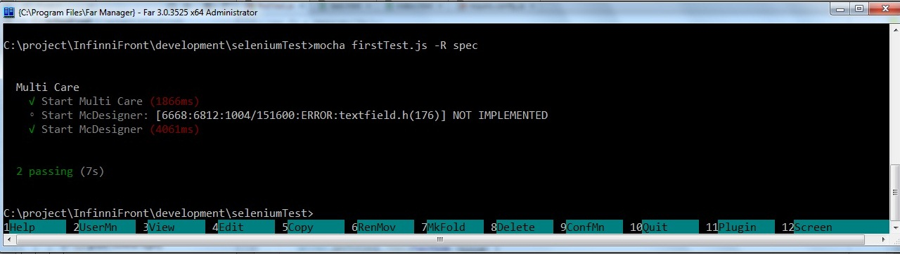

#### Установка необходимого ПО

Для тестирования веб-приложения с помощью Selenium WebDriver, на вашем компьютере должны быть установлены [Java](http://www.java.com/en/download/), [Node.js](http://nodejs.org/), [Selenium server](https://code.google.com/p/selenium/downloads/list)(скачайте standalone)  и [ChromeDriver](https://code.google.com/p/chromedriver/downloads/list).

Selenium-server-standalone и ChromeDriver нужно поместите либо в папку соответствующую системной переменной PATH, либо в папку с тестами.

Проследите, чтобы версии Selenium server  и ChromeDriver согласовались друг с другом.

###### *Установка Selenium server*

В папке проекта установите selenium-webdriver для Node.js:  
*npm install selenium-webdriver*  
Запустите selenium server:  
*java -jar selenium-server-standalone-{VERSION}.jar*###### * Mocha*

Для написания тестов удобно использовать библиотеку Mocha(о других способах тестирования можно прочесть [тут](http://www.browserstack.com/automate/node)).

Чтобы её установить запустите:              

 *         npm install -g mocha*

#### Создание и запуск тестов

Пример теста с использованием Selenium и Mocha:

```
var webdriver = require('selenium-webdriver');
var test = require('selenium-webdriver/testing');
var remote = require('selenium-webdriver/remote');
var assert = require('assert');
test.describe('Multi Care', function() {
    var driver, server;
    test.before(function() {
        driver = new webdriver.Builder().
            withCapabilities(webdriver.Capabilities.chrome()).
            build();
    });
    test.it('Start Multi Care', function() {
        driver.get("http://localhost:8080/mc/development/");
        driver.getTitle().then(function (title) {
           assert.equal("Multi Care",title,"It isn't MultiCare page");
        });
    });
    test.it('Start McDesigner', function() {
        driver.get("http://localhost:8080/mc/development/");
        driver.sleep(2000);
        driver.findElement(webdriver.By.className("iconMenu")).click();
        driver.sleep(200);
        driver.findElement(webdriver.By.className("iconCog")).click();
        driver.navigate().forward();
        driver.sleep(200);
        driver.getAllWindowHandles().then(function (windowHandles) {
            var newWindow = windowHandles[1];
            assert.ok(newWindow, "Page not found");
            driver.switchTo().window(newWindow);
            driver.sleep(1000);
            driver.getTitle().then(function (title) {
                assert.equal("McDesigner", title, "It isn't McDesigner page");
            });
        });
    });
    test.after(function() { driver.quit(); });
});
```

В данном примере запускаются 2 теста:

1 проверяет, что при запуске "http://localhost:8080/mc/development/" возникает страница с заголовком Multi Care,  
2 - что при выборе пункта меню Дизайнер, открывается страница McDesigner.

Перед запуском тестов инициализируется driver, при этом указывается, что используется браузер Google Chrome.

После проверки тестов браузер закрывается.

Для запуска теста введите в командной строке:

*mocha *название файла с тестом**

Кроме того,рекомендую добавить флаг* -R spec*, поскольку в этом случае результаты тестирования более наглядны:



О других опциях для библиотеки mocha можно почитать [тут](http://visionmedia.github.io/mocha/).

Дополнительные источники:

[Хабр: Использование Selenium WebDriver для автоматического тестирования веб-интерфейса Яндекс.Почты](http://habrahabr.ru/company/yandex/blog/173769/)[WebDriverJS Users Guide](https://code.google.com/p/selenium/wiki/WebDriverJs)[Документация Selenium](http://docs.seleniumhq.org/docs/) 

  


